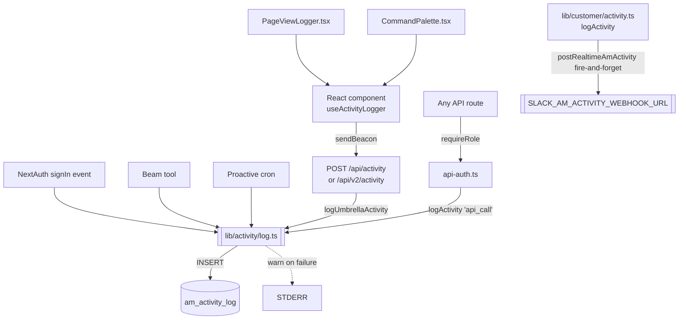
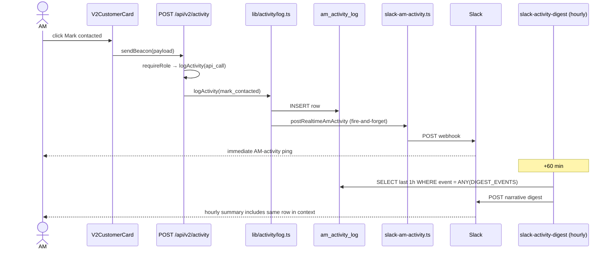
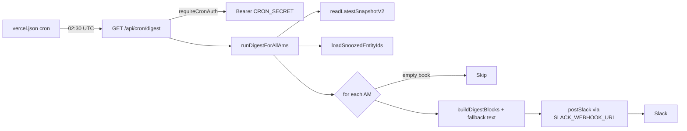

# Beacon — Activity Recording & Slack Notifications

Third companion to [`docs/beacon.md`](./beacon.md) (full platform reference) and [`docs/beam-keeper.md`](./beam-keeper.md) (Beam + Keeper deep dive). Grep-verified against the source tree at `/Users/siranjiththangavel/beacon` on `main` as of 2026-07-24.

---

## 0. TL;DR

**Activity.** Every user-visible surface uses the `useActivityLogger("<agent>")` hook (`components/hooks/use-activity-logger.ts`), which `navigator.sendBeacon`s JSON to `POST /api/activity` (or the Customer-Beacon legacy `/api/v2/activity`). That route calls `logUmbrellaActivity()` (`lib/activity/log.ts`) which INSERTs one row into the single `am_activity_log` Postgres table (Neon). Server-side, every `requireRole()` gate in `lib/customer/api-auth.ts` fires the same helper with `event_name = "api_call"`; NextAuth's `events.signIn` fires `sign_in`. Writes are fire-and-forget — a Postgres failure is `console.warn`-ed, never propagated.

**Slack.** Two transports (`postSlack` webhook + `postSlackDm` bot-token) with a few wrappers on top. Triggers split into **immediate** (`mark_contacted` / `note_saved` / `snooze_set` / `coaching_acted` → real-time AM-activity webhook; Post-Payment verdict → bot-token thread; Stage-A/D integrity + Keeper bootstrap + spend threshold → digest channel) and **cron-batched** (hourly `slack-activity-digest`, daily `digest`, daily/weekly Beam DMs, weekly `eval-weekly`, daily `health-alert` + `refresh-watchdog`).

Pipeline in one line: **user clicks → `logEvent(…)` → `POST /api/(v2/)activity` → `logUmbrellaActivity` → `am_activity_log` INSERT + fire-and-forget `postRealtimeAmActivity` → hourly `slack-activity-digest` cron replays the same row inside the per-AM narrative.**

---

## 1. Activity data model

Two tables. `am_activity_log` is the umbrella-wide analytics log; `am_actions` is the pre-existing customer-scoped write log that joins to `outcome_tracking`. They coexist because their schemas would corrupt each other's downstream joins.

### 1.1 `am_activity_log`

Original DDL is inlined at `lib/customer/activity.ts:16-26`. The only migration that touches it is `migrations/2026-05-22-umbrella-activity.sql` (Phase E-8 — umbrella-wide activity).

| Column | Type | Null | Default | Notes |
| --- | --- | --- | --- | --- |
| `id` | `BIGSERIAL` | NO | seq | PK. |
| `email` | `TEXT` | NO | — | Actor email (always the authenticated session email). |
| `role` | `TEXT` | YES | — | `admin` / `manager` / `am`. Nullable per `2026-05-22-umbrella-activity.sql` — non-Customer-Beacon users have no role. |
| `am_name` | `TEXT` | YES | — | AM ownership for `role = am`; `null` otherwise. |
| `agent` | `TEXT` | NO | `'customer'` | Added by `2026-05-22-umbrella-activity.sql`. One of `customer / performance / escalation / post-payment / miss-payment / negative-keyword / umbrella` (`lib/activity/types.ts:19`). |
| `event_name` | `TEXT` | NO | — | Freeform. Allowlisted in `lib/activity/types.ts:179-201` for the client endpoint but unenforced on the server helper. |
| `surface` | `TEXT` | YES | — | E.g. `v2_dashboard`, `performance_landing` (`lib/activity/types.ts:49-157`). |
| `entity_id` | `TEXT` | YES | — | Customer UUID when scoped. |
| `metadata` | `JSONB` | YES | — | Ad-hoc. Most used keys: `path` (api_call), `bizname`, `note_preview`, `choice`, `reason`, `days`. |
| `ts` | `TIMESTAMPTZ` | NO | `NOW()` | Insert time. |

Indexes (all from the same migration): `idx_am_activity_log_agent_ts` on `(agent, ts DESC)` — per-agent windowed reads for the digest cron; `idx_am_activity_log_email_agent_ts` on `(email, agent, ts DESC)` — per-user per-agent counts. The Phase E-11 "G1/G2" additions the brief asked about are the `agent` column and the `role` nullability; both live in this single migration. No views or matviews layer on top.

### 1.2 `am_actions` (sister table)

Predates the activity log (Phase 9). Created via the lazy-migration pattern in `lib/customer/postgres.ts` (`writeAmAction()` at line 144 runs `ALTER TABLE … ADD COLUMN IF NOT EXISTS` for the three later-added columns on every insert, then INSERTs). Shape: `id SERIAL`, `am_name TEXT`, `entity_id UUID`, `action_type TEXT` (`contacted_connected` / `contacted_noreach` / `snoozed` / `note_added` / `escalated`), `note TEXT`, `composite_at_action INT`, `reason_code TEXT`, `follow_up_date DATE`, `escalated_to TEXT`, `created_at TIMESTAMPTZ`. Read helpers: `readActionsNeedingOutcomeEval`, `readRecoveryStatsByAm`, `readPendingFollowUps`, `readRecentActions`, `readCustomerActions`, `entitiesContactedRecently`. Coaching-loop derivation (`lib/customer/coaching.ts:154-232`) also queries this table.

When an AM marks a customer contacted, both tables get a row: `am_actions` is awaited (customer-view truth), `am_activity_log` is fire-and-forget (analytics + digest).

---

## 2. The write path

### 2.1 Umbrella helper — `lib/activity/log.ts`

```ts
interface LogActivityInput {
  email: string;
  role?: "admin" | "manager" | "am" | null;
  am_name?: string | null;
  agent?: Agent;                       // defaults to "customer"
  event_name: AnyEvent | string;
  surface?: AnySurface | string | null;
  entity_id?: string | null;
  metadata?: Record<string, unknown> | null;
}
export async function logUmbrellaActivity(input): Promise<void>
```

Behavior: resolve `getSql()` (`lib/customer/postgres.ts:16`), silently return if `POSTGRES_URL` is unset (unit-locked in `lib/activity/log.test.ts` — six cases, all expect `undefined` and no throw), otherwise INSERT via parameterized Neon tagged template. Errors caught and `console.warn`-ed; promise never rejects.

### 2.2 Customer-Beacon shim — `lib/customer/activity.ts`

`logActivity()` (`lib/customer/activity.ts:79`) wraps `logUmbrellaActivity`, pins `agent: "customer"`, then fire-and-forget calls `postRealtimeAmActivity(input).catch(() => {})` — that's what turns a `mark_contacted` into an instant Slack ping.

**Which one?** Customer Beacon call sites use `logActivity()` (real-time Slack for free). Cross-agent server-side call sites use `logUmbrellaActivity()` directly. Client-side call sites use the hook — the `sendBeacon` transport is critical for events that fire on navigation-away.

### 2.3 Client hook — `useActivityLogger()`

`components/hooks/use-activity-logger.ts:43` exports `useActivityLogger(agent, endpoint = "/api/activity")`. Returns a memoized `(event_name, opts) => void`. Serializes payload, tries `navigator.sendBeacon` first (survives page unloads), falls back to `fetch(endpoint, { method: "POST", keepalive: true })`. No batching, no debouncing, no retry — one event = one POST. All exceptions swallowed. The Customer-Beacon shim (`lib/customer/hooks/use-activity-logger.ts`) hardcodes `agent = "customer"` and endpoint `/api/v2/activity` for back-compat.

### 2.4 Server-side call sites (direct)

- `lib/customer/auth-options.ts:145` — NextAuth `events.signIn` → `sign_in`.
- `lib/customer/api-auth.ts:113` — every `requireRole()` success → `api_call` with `metadata: { path }`.
- `app/(negative-keyword)/negative-keyword/api/create-ticket/route.ts:111,141,170` — `ticket_created` / `ticket_creation_failed`.
- `app/(negative-keyword)/negative-keyword/api/dismiss/route.ts:96` — `alert_dismissed`.
- `app/api/ai/facts/route.ts:81,111` — `fact_remembered`, `fact_forgotten`.
- `app/api/ai/ask/route.ts:362` — `claude_asked`.
- `lib/ai/proactive-beacon.ts:548,1009` — proactive cron telemetry.
- Every Beam tool in `lib/ai/tools/*.ts` — `beacon_ai:action:<tool>` on start / success / error.

### 2.5 `requireRole()` — the audit hydrant

`lib/customer/api-auth.ts:90-122`. Every authorized API request in the Customer Beacon surface passes through it and fires `void logActivity({ event_name: "api_call", metadata: path ? { path } : null, … })`. `path` comes from an `x-request-path` header injected by `middleware.ts`. Middleware doesn't run on `/api/health`, `/api/cron/*`, `/api/auth/*` — for those `getRequestPath()` returns `null` and metadata is empty. `/admin/usage`'s top-paths aggregate (`lib/customer/usage-queries.ts:141-163`) accordingly filters `metadata->>'path' IS NOT NULL`.

Fire-and-forget vs awaited: `requireRole` uses `void logActivity(...)`; the client endpoint returns 204 without awaiting (`app/api/activity/route.ts:94`). The only awaited call is the auth `signIn` event — the row must land before the redirect completes.

### 2.6 Ingestion diagram



---

## 3. What gets logged — event catalog

The union of every `event_name` string the code fires. `ALL_EVENT_NAMES` in `lib/activity/types.ts:179-201` lists 40 "known" names, but the column is unenforced TEXT and several call sites (Beam tools, brain-candidate validate, keeper voice-teach) use ad-hoc dotted names. The digest falls through to a generic label for unknown events (`slack-activity-digest/route.ts:290`).

| `event_name` | Fired by | Agent | Surface | Key metadata |
| --- | --- | --- | --- | --- |
| `sign_in` | `lib/customer/auth-options.ts:149` | customer | `auth` | — |
| `sign_in_rejected` | (typed only; signIn callback rejects before events run) | customer | — | — |
| `api_call` | `lib/customer/api-auth.ts:117`, `AgentErrorScreen.tsx:38`, `SectionErrorBoundary.tsx:86`, `app/error.tsx:30` | any | (none) | `{ path }` |
| `page_view` | `PageViewLogger.tsx:32`, `V2Dashboard.tsx:132`, `V2CustomerDetailClient.tsx:41` | any | agent-scoped | — |
| `refresh_clicked` / `filter_changed` / `sort_changed` / `am_switched` / `view_switched` | v2 dashboard toolbar / Post-Payment `DashboardClient.tsx:417` | customer / post-payment | agent surfaces | `{ filter, tier, signal, pod, verdict }` |
| `customer_opened` | `V2CustomerCard.tsx:546` | customer | `v2_dashboard` | `{ bizname, entity_id }` |
| `mark_contacted` (RT Slack) | `V2CustomerCard.tsx:358` | customer | `v2_customer_detail` | `{ bizname, choice, reason }` |
| `note_saved` (RT Slack) | `NotesField.tsx:112` | customer | `v2_customer_detail` | `{ bizname, note_preview }` |
| `snooze_set` (RT Slack) | `V2CustomerCard.tsx:247` | customer | `v2_dashboard` | `{ bizname, days }` |
| `one_on_one_opened` | 1:1 manager tab | customer | `v2_manager_1on1` | `{ am }` |
| `coaching_acted` (RT Slack) / `coaching_dismissed` | `V2CoachingLoops.tsx:116` + dismiss button | customer | `v2_coaching` | `{ metric }` |
| `report_generated` / `report_opened` / `recent_report_clicked` / `customer_searched` / `preview_closed` | `PerformanceLanding.tsx:64,241` + Performance report shell | performance | performance surfaces | `{ entity_id, query, customer_id }` |
| `search_submitted` | `EscalationsBrowser.tsx:301`, `EscalationForm.tsx:34` | escalation | `escalation_home/queue` | `{ query }` |
| `tab_switched` / `ticket_opened` / `queue_filter_changed` | escalation UI | escalation | escalation surfaces | `{ tab, ticket_id }` |
| `verdict_filter_changed` / `rerun_clicked` / `docx_opened` / `rerender_clicked` | Post-Payment dashboard + report | post-payment | post-payment surfaces | `{ verdict, bizname }` |
| `excel_exported` | Miss-Payment export | miss-payment | `miss_payment_home` | — |
| `alert_opened` / `ticket_created` / `ticket_creation_failed` / `alert_dismissed` | `app/(negative-keyword)/negative-keyword/api/{create-ticket,dismiss}/route.ts` | negative-keyword | `negative_keyword_alerts` | `{ alert_id, ticket_id, error }` |
| `sign_out` | umbrella launcher | umbrella | — | — |
| `launcher_card_clicked` | `LauncherCard.tsx:113` | umbrella | `launcher` | `{ agent_name }` |
| `command_palette_opened` / `command_palette_select` / `command_palette_compare` | `CommandPalette.tsx:190,242,377` | umbrella | `launcher` | `{ agent, biz_name, count }` |
| `claude_asked` / `claude_onboarding_completed` / `claude_feedback` | `app/api/ai/{ask,onboarding,feedback}/route.ts` | umbrella | — | `{ audience, biz_name }` |
| `suggestion_offered` / `suggestion_acted` | `app/api/ai/suggest/route.ts:102`, `SuggestedActions.tsx:116` | umbrella | — | `{ count, kind, label }` |
| `fact_remembered` / `fact_forgotten` / `fact_extracted` | `app/api/ai/facts/route.ts:81,111`, `app/api/ai/cron/extract-facts/route.ts:73` | umbrella | — | scope key |
| `beacon_ai:proactive:monday_briefing` / `beacon_ai:proactive:daily_digest` | `lib/ai/proactive-beacon.ts:548,1009` | customer | `v2_dashboard` | `{ status, top_5_entity_ids, changes_total }` |
| `beacon_ai:action:<tool>` (+ `:error`) | every tool in `lib/ai/tools/*.ts` | umbrella | — | tool-specific |
| `beacon_ai:action:{rate_limited, idempotent_replay, executed, exception}` | `app/(customer)/api/ai/action/execute/route.ts:336,373,436,467` | umbrella | — | tool, elapsed_ms |
| `brain_candidate:{confirm, edit_confirm, reject, reclassify, clear_review_flag}` | `app/(customer)/api/v2/brain/validate/[fact_id]/route.ts:118,149,170,219,246` | umbrella | — | fact id |
| `keeper:voice_teach:confirm` / `keeper:revert` | `app/(customer)/api/keeper/voice-extract/confirm/route.ts:204`, `app/(customer)/api/admin/keeper/revert/route.ts:103` | umbrella | — | fact id |
| `call_outcome:marked` / `call_outcome:cleared` | `app/(customer)/api/v2/customer/[entityId]/call-outcome/route.ts:89,138` | customer | `v2_customer_detail` | outcome |

**Total unique event_name strings actually fired in code: 47.** `ALL_EVENT_NAMES` covers 40; the extras are the ad-hoc dotted names. The umbrella `POST /api/activity` route rejects unknowns (`app/api/activity/route.ts:74`); the legacy `POST /api/v2/activity` and all server-side `logUmbrellaActivity()` call sites accept freeform strings.

---

## 4. The read path

Four consumers of `am_activity_log`; none JOIN it against other tables.

- **`/admin/activity` viewer.** `app/api/admin/activity/route.ts` — admin-only, 30d default window, `limit ≤ 500`, JSON or CSV. Filters (`user`, `agent`, `event`, `surface`, `from`, `to`) packed into a single JSONB placeholder to dodge Neon's tagged-template arity limit. Page 1 also computes three facet dictionaries (`agent_counts` / `event_counts` / `user_counts`) via one `GROUP BY agent, event_name, email`. Page shell at `app/admin/activity/page.tsx`; client table at `app/admin/activity/ActivityLogViewer.tsx`.
- **`/admin/usage` aggregates.** `lib/customer/usage-queries.ts` exposes `getUsageSummary` (DAU/WAU/MAU + 7d totals), `getDailyActivity(days)`, `getPerUserStats()` (per-email 30d rollup), `getTopPaths(limit)` (top `metadata->>'path'` on `api_call`), `getColdUsers(daysInactive)`, `getRecentEvents(limit)`. All reads bounded by time window, all return plain objects.
- **Hourly digest reader.** `app/(customer)/api/cron/slack-activity-digest/route.ts:375-390` — one query capped at 5000 rows: `SELECT … FROM am_activity_log WHERE ts > NOW() - INTERVAL '1 hour' AND event_name = ANY(${DIGEST_EVENTS}) ORDER BY agent ASC, COALESCE(am_name, email) ASC, ts ASC`. `DIGEST_EVENTS` (line 51-91) is a curated allowlist excluding noisy `api_call`.
- **1:1 prep / coaching.** `lib/customer/one-on-one.ts` and `lib/customer/coaching.ts` cite the activity log in comments but read `am_actions` for behavioral streaks and coverage — not `am_activity_log`.

---

## 5. Slack integration surface

| # | Path | Trigger | Channel/DM | Message shape | Env vars | Dedup? |
| --- | --- | --- | --- | --- | --- | --- |
| 1 | `lib/customer/slack-am-activity.ts::postRealtimeAmActivity` | `logActivity` when event ∈ `{mark_contacted, note_saved, snooze_set, coaching_acted}` | Incoming webhook (AM-activity channel) | Emoji + AM + biz + mrkdwn blockquote of note/reason | `SLACK_AM_ACTIVITY_WEBHOOK_URL` | None (intentional — digest replays it) |
| 2 | `app/(customer)/api/cron/slack-activity-digest/route.ts` | Hourly cron | Same webhook as #1 | Header + per-agent section + per-user chronological bullets, `<!date^…^{time}>` timestamps, `(×N)` collapse for repeats within 60s, cap 25/user with `(+N more)` | `SLACK_AM_ACTIVITY_WEBHOOK_URL`, `CRON_SECRET` | Cadence only |
| 3 | `lib/customer/slack-digest.ts::runDigestForAllAms` via `/api/cron/digest` | Daily 02:30 UTC | Incoming webhook (digest channel) — one message per AM | Block Kit: header ("AM's Beacon — N need a call today"), pod + RED + YELLOW context, divider, top-3 RED sections, "Open my planner →" button; all-clear branch renders a single-line message | `SLACK_WEBHOOK_URL`, `NEXT_PUBLIC_DASHBOARD_URL` / `DASHBOARD_URL`, `CRON_SECRET` | One post per AM per run; skip on empty book; snoozed customers filtered |
| 4 | `lib/ai/proactive-beacon.ts::runMondayBriefingForAllAms` via `/api/cron/beacon-ai/monday-briefing` | Monday 02:30 UTC | Bot DM (per AM) via `chat.postMessage` | Haiku-generated free-text briefing (top-5 + facts + miss-payment slice) | `SLACK_BOT_TOKEN`, `AM_SLACK_IDS`, `ANTHROPIC_API_KEY` | Typed skip statuses for empty book / no Slack id / no key |
| 5 | `lib/ai/proactive-beacon.ts::runDailyDigestForAllAms` via `/api/cron/beacon-ai/daily-digest` | Daily 02:30 UTC | Bot DM (per AM) | Haiku anomaly digest (score drops, tier flips, new tickets, new missed payments) | `SLACK_BOT_TOKEN`, `AM_SLACK_IDS`, `ANTHROPIC_API_KEY` | Quiet-day short-circuit; per-status telemetry rows in `am_activity_log` |
| 6 | `lib/post-payment/slack.ts::postCustomerReport` via `app/(post-payment)/post-payment/api/analyze/[customer_id]/route.ts` | Immediately after Post-Payment analyze (also from `rerender/[customer_id]`) | Bot token to `SLACK_CHANNEL_ID` (default `C0B2ECQMDR9`) — top + thread reply + optional docx upload | Verdict pill line + biz + AM + one-line + up to 5 flags + dashboard link; thread reply is the 39k-cap markdown; docx uploaded via `files.getUploadURLExternal` → PUT → `files.completeUploadExternal` | `SLACK_BOT_TOKEN`, `SLACK_CHANNEL_ID`, `NEXT_PUBLIC_APP_URL` / `VERCEL_URL` | Idempotent by customer_id at pipeline level; per-step `slack_starting/done/failed` in post-payment event log |
| 7 | `app/(customer)/api/cron/health-alert/route.ts` | 03:15 UTC daily | Incoming webhook (digest channel) | `:rotating_light: *Beacon — health check failed*` + per-probe failure line | `SLACK_WEBHOOK_URL`, `CRON_SECRET`, `VERCEL_URL` | `alerted` flag in `health_check_log` |
| 8 | `app/(customer)/api/cron/refresh-watchdog/route.ts` | 22:35 UTC daily (30 min after Stage B/C/D) | Incoming webhook (digest channel) | Per-stage refire outcomes + recompose ms + new snapshot ts; separate copies for `recovered` vs `recovery-incomplete` | `SLACK_WEBHOOK_URL`, `CRON_SECRET`, `VERCEL_URL` | Cadence only |
| 9 | `lib/ai/spend-log.ts::maybeFireDailyAlert` | Today's Anthropic spend crosses `$5` (`DAILY_SLACK_ALERT_THRESHOLD_USD`) | Incoming webhook (digest channel) | `:fire: *Anthropic daily spend crossed $X*` + running total + link | `SLACK_WEBHOOK_URL`, `VERCEL_URL` | **`beacon_anthropic_daily_alerts` PK `(alert_date, alert_threshold_usd)` with `ON CONFLICT DO NOTHING RETURNING`** |
| 10 | `lib/customer/refresh.ts` | Stage-A integrity `alert`s; Keeper bootstrap > 5 entities; Stage-D thrown exception | Incoming webhook (digest channel) | Text + Block Kit list of assertions or aborted phase | `SLACK_WEBHOOK_URL` (via `postSlack`) | None |
| 11 | `app/(post-payment)/post-payment/api/cron/retry-pending/route.ts` | Hourly; wedged-pending detector | Incoming webhook (digest channel) | Alert text noting the wedged customer(s) | `SLACK_WEBHOOK_URL` | In-run `wedgedAlertSent` flag |
| 12 | `app/(customer)/api/cron/brain/stale-prune/route.ts` | Daily 05:30 UTC; marked-count > 100 | Incoming webhook (digest channel) | `:eyes: *Keeper stale-prune marked N facts stale*` | `SLACK_WEBHOOK_URL`, `CRON_SECRET` | Threshold-gated |
| 13 | `app/(customer)/api/cron/keeper/enrich-from-metabase/route.ts` | Sunday 06:00 UTC; error-rate above threshold | Incoming webhook (digest channel) | `postSlack` text | `SLACK_WEBHOOK_URL`, `CRON_SECRET` | Threshold-gated |
| 14 | `app/(customer)/api/cron/beacon-ai/eval-weekly/route.ts` | Sunday 04:30 UTC; regression on rolling pass rate | Incoming webhook (digest channel) | Eval summary + regression note | `SLACK_WEBHOOK_URL`, `CRON_SECRET` | Result recorded in eval tables |

**Not present.** There's no Escalation-Beacon Slack post today — `lib/escalation/agent.ts` defines `slack_dm` / `slack_channel` as tool-response *schema types* the LLM emits for an operator to execute, but the code never actually posts them. Negative-Keyword also has no direct Slack post; the ticket-create route only writes to Linear + logs `ticket_created`. Both agents still show up in the hourly narrative because their events are on the `DIGEST_EVENTS` allowlist.

---

## 6. Real-time vs digest

**Real-time (fires on the request that produced the event):**
- `mark_contacted`, `note_saved`, `snooze_set`, `coaching_acted` → `postRealtimeAmActivity` (`lib/customer/activity.ts:91`).
- Post-Payment verdict → `postCustomerReport` inline in the analyze route (`route.ts:270`).
- Anthropic spend threshold → `maybeFireDailyAlert` inside `logSpend`.
- Stage-A/D integrity + Keeper bootstrap alerts → inline in `lib/customer/refresh.ts` while a stage cron executes.

**Cron-batched:** hourly `slack-activity-digest`; daily `digest`, `beacon-ai/daily-digest`, `health-alert`, `refresh-watchdog`, `brain/stale-prune`; weekly `beacon-ai/monday-briefing`, `beacon-ai/eval-weekly`, `keeper/enrich-from-metabase`.

**Dedup strategies actually implemented:** Postgres-level for Anthropic spend (`beacon_anthropic_daily_alerts` PK + `ON CONFLICT DO NOTHING RETURNING`); in-run flag for retry-pending wedged alerts; cadence-only for everything else. Real-time paths intentionally allow duplicates because the digest replays the same rows for context.

---

## 7. Slack composition

- **Real-time AM activity (`slack-am-activity.ts`).** Plain-text mrkdwn. `note_saved`: `:memo: *Sudha Goutami* saved a note for *SkinSpa NYC*` + Slack mrkdwn blockquote of the note text. `mark_contacted`: `:white_check_mark: *AM* marked *biz* contacted — *connected*` + optional reason blockquote. `snooze_set`: `:zzz: *AM* snoozed *biz* for *N days*`. `coaching_acted`: `:dart: *AM* acted on coaching loop` + `Metric: \`<key>\``.
- **Hourly narrative (`slack-activity-digest`).** Header `:bar_chart: *Beacon activity · last 1 hour*`, then per-agent sections (`:bulb: *Customer Beacon*`, `:bar_chart: *Performance Beacon*`, `:rotating_light: *Escalation Beacon*`, `:receipt: *Post-Payment Reviews*`, `:beacon: *Umbrella · launcher*`). Per user: `*Name* (email) — N actions` followed by bullets `      • <!date^unix^{time}|UTC-fallback> — <verb + object>` from `describeAction()` (`slack-activity-digest/route.ts:177-293`). Slack renders `<!date>` in the viewer's local timezone.
- **Daily per-AM planner (`slack-digest.ts`).** Block Kit — header + context (`{pod} · N RED · N watching · auto-scored by Claude`) + divider + top-3 RED sections (`*i. Company*\nnarrative\n_Nd silent · status_`) + actions block with "Open my planner →" button linking to `${DASHBOARD_URL}/v2?am=…`. All-clear branch: `:white_check_mark: *{AM} — all clear today*` + button.
- **Post-Payment verdict.** Top: `*✅ ICP — biz*` + `Customer ID: \`<cb>\` · AM: <name>` + optional one-liner + `*Key flags*` bullets (max 5) + `📊 <${APP_URL}/reports/<cb>|Open full report on dashboard>` + `_Full analysis in thread ↓_`. Thread reply = full evaluator markdown (`slice(0, 39000)`). Optional `.docx` upload via Slack's v2 file-upload flow.
- **Proactive Beam DMs.** Rendered end-to-end by Haiku (`claude-haiku-4-5-20251001`, overridable via `ANTHROPIC_PROACTIVE_MODEL`) from `buildMondayBriefingPrompt` / `buildDailyDigestPrompt` in `lib/ai/proactive-prompts.ts`. No hand-templated shape.

---

## 8. Slack transport

**Incoming webhook — `lib/customer/slack.ts::postSlack`.** Reads `SLACK_WEBHOOK_URL` (or `SLACK_AM_ACTIVITY_WEBHOOK_URL` in the AM-activity variant). POSTs `{ text, blocks? }` with **5s** `AbortSignal.timeout`. Returns `{ sent, status, error }`; missing env returns `{ sent: false, error: "SLACK_WEBHOOK_URL not configured" }`. Never throws.

**Bot token — `lib/slack-dm.ts::postSlackDm` + `lib/post-payment/slack.ts::callSlack`.** `SLACK_BOT_TOKEN` (`xoxb-…`) as bearer against `https://slack.com/api/chat.postMessage` with `channel = <slackUserId>` (Slack auto-opens/reuses the IM). `postSlackDm` timeout **8s**, parses `res.json()`, checks logical `json.ok`. Returns `{ ok, status, ts, channel, error }`. Post-Payment's `callSlack` throws on `!data.ok` so its caller can `try/catch` and write a `slack_failed` event to the post-payment log. File uploads use the two-step v2 flow (`files.getUploadURLExternal` → PUT → `files.completeUploadExternal`).

**Retry policy + rate limiting.** No automatic retries anywhere — the helpers return on the first non-2xx or first `json.ok === false`. Rate pacing exists in exactly one place: proactive-beacon crons sleep `SLACK_DM_INTERVAL_MS = 1_100 ms` between AM DMs (`lib/ai/proactive-beacon.ts:57,567`). Everything else relies on cron cadence + single-message-per-iteration to stay well under Slack's ~1/sec per-channel default. Failures are `console.warn`-logged; only `lib/customer/refresh.ts` tries dynamic `import('@sentry/nextjs')` on integrity alerts and Stage-D aborts (swallows the not-found case).

---

## 9. Slack channel routing

| Destination | Env-var wiring | Purpose | Fired by |
| --- | --- | --- | --- |
| **AM-activity channel** | `SLACK_AM_ACTIVITY_WEBHOOK_URL` (checked in `.env.local` + `.env.vercel.prod` as `https://hooks.slack.com/services/T07Q3QDF679/…`) | Real-time AM actions + hourly narrative | `postRealtimeAmActivity` + `slack-activity-digest` cron |
| **Ops / digest channel** | `SLACK_WEBHOOK_URL` (no default; deploy-time env) | Daily AM planner digest + all ops/health/watchdog/spend/integrity/keeper/eval alerts | `postSlack` from `lib/customer/slack.ts` |
| **Post-Payment channel** | `SLACK_CHANNEL_ID` (default `C0B2ECQMDR9`) via `SLACK_BOT_TOKEN` | Verdict thread + docx upload | `postCustomerReport` |
| **Per-AM DMs** | `AM_SLACK_IDS` map (`lib/customer/config.ts:273`, currently empty in code) via `SLACK_BOT_TOKEN` | Monday briefing + daily anomaly digest | `postSlackDm` |

`AM_SLACK_IDS` is empty on purpose — the note at `config.ts:264-272` explains workspace IDs aren't PII-safe to commit; proactive crons skip with `"skipped:no_slack_id"` status until it's populated at deploy time.

---

## 10. Cron cadence — Slack-adjacent subset

Sourced from `vercel.json`; full inventory in `docs/beacon.md` §6. All UTC.

| Cron path | Schedule | Slack destination |
| --- | --- | --- |
| `/api/cron/slack-activity-digest` | `0 * * * *` (hourly) | AM-activity channel |
| `/api/cron/digest` | `30 2 * * *` (02:30 UTC = 08:00 IST) | Digest channel |
| `/api/cron/beacon-ai/monday-briefing` | `30 2 * * 1` (Mon 02:30 UTC) | Per-AM DM |
| `/api/cron/beacon-ai/daily-digest` | `30 2 * * *` | Per-AM DM |
| `/api/cron/beacon-ai/eval-weekly` | `30 4 * * 0` (Sun 04:30 UTC) | Digest channel on regression |
| `/api/cron/health-alert` | `15 3 * * *` | Digest channel on failure |
| `/api/cron/refresh-watchdog` | `35 22 * * *` (30 min after Stage B/C/D) | Digest channel |
| `/post-payment/api/cron/retry-pending` | `0 * * * *` | Digest channel on wedge |
| `/api/cron/brain/stale-prune` | `30 5 * * *` | Digest channel > 100 marked |
| `/api/cron/keeper/enrich-from-metabase` | `0 6 * * 0` | Digest channel on error-rate |

Timezone convention: 02:30 UTC = 08:00 AM IST — the AM team is India-based, so the daily digest lands with their morning coffee. Post-Payment retries stay hourly because SLA windows are short.

---

## 11. Failure handling + observability

- **Slack post failure.** Every path either returns `{ sent: false, error }` (webhook helper) or catches inline and `console.warn`s with a route-scoped tag. None retry; none page-out. The Post-Payment analyze route additionally logs `slack_failed` into its own event table.
- **`logActivity` failure to write.** By contract: swallowed. `lib/activity/log.ts:60-72` catches, warns, returns. `lib/activity/log.test.ts` locks this with six cases.
- **How would an admin know an activity row was lost?** Not from any live UI signal. `refresh-watchdog` covers snapshot + `pipeline_state` staleness, not activity writes. Indirect signals: `/admin/usage` DAU going to zero, hourly digest cron JSON showing `posted: false`, or `[logUmbrellaActivity] failed to write activity row` warnings in function logs. Known observability gap.
- **Sentry.** All three configs wired (`sentry.client.config.ts`, `sentry.server.config.ts`, `sentry.edge.config.ts`). Only `lib/customer/refresh.ts` explicitly pushes `Sentry.captureException` on integrity alerts and Stage-D aborts; other paths rely on unhandled-route exception capture.

---

## 12. End-to-end examples

### Example A — AM marks a customer contacted

1. Click in `V2CustomerCard.tsx:358` calls `logEvent("mark_contacted", { surface: "v2_customer_detail", entity_id, metadata: { bizname, choice, reason } })`.
2. `useActivityLogger` `sendBeacon`s to `/api/v2/activity`.
3. Route (`app/(customer)/api/v2/activity/route.ts:55`): `getApiUser()` → `requireRole(user, "admin", "manager", "am")`. `requireRole` **also** fires its own `logActivity({ event_name: "api_call", metadata: { path: "/api/v2/activity" } })`.
4. Route validates event_name + surface, then `void logActivity(...)`.
5. `logActivity` → `logUmbrellaActivity` → INSERT into `am_activity_log`.
6. `logActivity` then fire-and-forgets `postRealtimeAmActivity(input)` → POST to `SLACK_AM_ACTIVITY_WEBHOOK_URL` → **immediate** message in the AM-activity channel.
7. Separately, the mutation route that owns the customer state does `writeAmAction(...)` into `am_actions` — that's what powers next-day outcome-recovery.
8. 60 min later, `slack-activity-digest` cron replays the row inside the hourly narrative. Real-time + digest coexist by design.

### Example B — Escalation triaged

1. Ops submits at `/escalation/triage` via `EscalationForm.tsx:34` → `log("search_submitted", { … })`.
2. Server route calls `lib/escalation/agent.ts` (Anthropic Sonnet triage). LLM emits `slack_dm` / `slack_channel` payloads as *tool-response schema*.
3. **The code does not post them.** No direct Slack for escalation today. Operator copy-pastes.
4. `EscalationsBrowser.tsx:301` fires `search_submitted`; opening a ticket fires `ticket_opened`.
5. Rows land under `agent: "escalation"`. On the next hourly digest they surface in the `:rotating_light: *Escalation Beacon*` section.

### Example C — Stage B refresh cron detects staleness

1. Vercel fires `GET /api/cron/refresh-watchdog` at 22:35 UTC.
2. `requireCronAuth` checks `Authorization: Bearer $CRON_SECRET`.
3. Parallel probes across `readPipelineStage("A"|"B"|"C"|"D", today)` + `readLatestSnapshotV2()`.
4. Stage B `ageHours > 25` → `stale = true`.
5. Loops `STAGE_RUN_ORDER = ["A","B","C","D"]`, sequentially POSTs to each stale stage's own cron with `Bearer $CRON_SECRET`.
6. After refires, calls `composeSnapshot()`.
7. Re-probes. Posts to `SLACK_WEBHOOK_URL` — recovered: `:white_check_mark: *Beacon — refresh watchdog recovered staleness*` + per-stage refire outcomes + recompose duration + new snapshot ts; not recovered: `:rotating_light: *Beacon — refresh watchdog could NOT fully recover*` + which stages failed + compose error.

### Sequence diagram — real-time + digest coexistence



### Digest cron flow



---

## 13. Env vars (grep-verified)

| Env var | In `.env.example`? | Consumed by | Purpose |
| --- | --- | --- | --- |
| `SLACK_WEBHOOK_URL` | No | `lib/customer/slack.ts` | Ops / digest channel webhook. |
| `SLACK_AM_ACTIVITY_WEBHOOK_URL` | No (set in `.env.local` + `.env.vercel.prod`) | `slack-am-activity.ts`, `slack-activity-digest` | AM-activity channel webhook. |
| `SLACK_BOT_TOKEN` | Yes (empty) | `lib/slack-dm.ts`, `lib/post-payment/slack.ts` | `xoxb-…` bot token for DMs + file uploads. |
| `SLACK_CHANNEL_ID` | Yes (default `C0B2ECQMDR9`) | `lib/post-payment/slack.ts`, post-payment diag | Post-Payment verdict channel. |
| `CRON_SECRET` | No (deploy-only) | `lib/customer/cron-auth.ts`, every `/api/cron/*` | Bearer that gates cron routes; watchdog re-fires with `x-zoca-cron-secret`. |
| `NEXT_PUBLIC_DASHBOARD_URL` / `DASHBOARD_URL` | No | `slack-digest.ts::plannerUrl` | "Open my planner →" base URL. Falls back to legacy `https://beacon-zoca.vercel.app` — production is `beacon-v2.vercel.app`. |
| `NEXT_PUBLIC_APP_URL` | Yes | `lib/post-payment/slack.ts` | Post-Payment "Open full report" link base. |
| `VERCEL_URL` | (auto) | `refresh-watchdog`, `health-alert`, `spend-log` | Fallback base URL. |
| `AM_SLACK_IDS` (in-code map) | — | `lib/customer/config.ts:273` | AM email → Slack user id. Empty in code; deploy-populated. |
| `ANTHROPIC_PROACTIVE_MODEL` | No | `lib/ai/proactive-beacon.ts:52` | Override Haiku model; default `claude-haiku-4-5-20251001`. |
| `ANTHROPIC_API_KEY` | Yes (empty) | Every LLM call site | Proactive crons need this to render bodies. |

No `ACTIVITY_*` or `WEBHOOK_*` prefixed env vars — activity settings are hardcoded in `lib/activity/types.ts` + `lib/activity/log.ts`.

---

## 14. Debugging + runbooks

- **"Slack digest didn't fire."** Check Vercel Cron log for `/api/cron/digest`. If `{ ok: true, sentCount: 0, slackConfigured: false }`, `SLACK_WEBHOOK_URL` is unset. Empty AMs are skipped with `reason: "empty book"`. If it didn't run at all, `CRON_SECRET` is likely missing — `cron-auth.ts:16-24` returns 503.
- **"`page_view` spam in the log."** `PageViewLogger` fires once per **mount**. If a shell key changes it remounts and re-logs. Check `metadata` to distinguish real page changes. The hourly digest collapses same event + entity within 60s to `(×N)` (`slack-activity-digest/route.ts:311-317`).
- **"Escalation Slack post didn't go out."** By design there is no such post — see §5 note and Example B. The LLM emits `slack_dm/channel` schema types but the code doesn't post them.
- **"Post-Payment verdict didn't reach Slack."** Check `SLACK_BOT_TOKEN` (needs `chat:write` + `files:write`). `SLACK_CHANNEL_ID` defaults to `C0B2ECQMDR9`. Look for `slack_failed` events for the specific `customer_id` in the post-payment log. `app/(post-payment)/post-payment/api/diag/health/route.ts` reports whether both env vars are set.
- **"Admin activity page is empty."** Check `POSTGRES_URL`. Check email is on `ADMIN_EMAILS` (`lib/customer/config.ts:312`). Time range default is 30d — override with `?from=…&to=…`. If table is empty, look for `[logUmbrellaActivity] failed to write activity row` warnings.
- **"Weird events in the admin viewer."** `event_name` is unenforced TEXT. Only `POST /api/activity` rejects unknowns (`app/api/activity/route.ts:74`); `/api/v2/activity` and every server-side call accept freeform strings. Beam tools use `beacon_ai:action:<tool>`; Keeper validate uses `brain_candidate:*`; call outcome uses `call_outcome:*`.
- **"Anthropic daily alert didn't fire even though we blew the budget."** Fires only when `logSpend` runs after the threshold is crossed, and only once per (date, threshold). If today's row was already claimed via `INSERT … ON CONFLICT DO NOTHING RETURNING`, subsequent `logSpend` calls silently skip. Inspect `beacon_anthropic_daily_alerts`. No re-arm.

---

## 15. File map appendix

**Activity subsystem**

| Path | Purpose |
| --- | --- |
| `lib/activity/log.ts` | `logUmbrellaActivity` — single-SOT INSERT. Fire-and-forget. |
| `lib/activity/types.ts` | `Agent` union + per-agent event/surface unions + `ALL_EVENT_NAMES` allowlist. |
| `lib/activity/log.test.ts` | Locks the fire-and-forget + no-DB fail-safe contract (6 cases). |
| `lib/customer/activity.ts` | Customer-Beacon shim; fires `postRealtimeAmActivity`. |
| `lib/customer/api-auth.ts` | `requireRole()` audit hydrant. |
| `lib/customer/auth-options.ts` | NextAuth `events.signIn` → `sign_in`. |
| `lib/customer/hooks/use-activity-logger.ts` | Client hook — Customer-Beacon back-compat wrapper. |
| `components/hooks/use-activity-logger.ts` | Client hook — umbrella-wide, `sendBeacon`-first. |
| `components/PageViewLogger.tsx` | `<PageViewLogger agent surface />` — one `page_view` per mount. |
| `components/CommandPalette.tsx` | Cmd+K → `command_palette_*`. |
| `app/api/activity/route.ts` | Umbrella POST endpoint. Strict allowlist. |
| `app/(customer)/api/v2/activity/route.ts` | Legacy Customer-Beacon POST. |
| `app/api/admin/activity/route.ts` | Admin-only paginated read + facets + CSV. |
| `app/admin/activity/page.tsx` + `ActivityLogViewer.tsx` | Viewer shell + client. |
| `lib/customer/usage-queries.ts` | Six aggregates for `/admin/usage`. |
| `lib/customer/postgres.ts` | `writeAmAction` + all `am_actions` / `outcome_tracking` helpers; lazy DDL. |
| `lib/customer/coaching.ts`, `lib/customer/one-on-one.ts` | Read `am_actions` for streaks + coverage. |
| `migrations/2026-05-22-umbrella-activity.sql` | Only migration on `am_activity_log`. |

**Slack subsystem**

| Path | Purpose |
| --- | --- |
| `lib/customer/slack.ts` | `postSlack` incoming-webhook helper (5s timeout, no retries). |
| `lib/slack-dm.ts` | `postSlackDm` bot-token DM helper (8s timeout, logical-ok check). |
| `lib/customer/slack-am-activity.ts` | Real-time AM activity poster + composer. |
| `lib/customer/slack-digest.ts` | Daily per-AM planner digest with Block Kit + pod line. |
| `lib/ai/proactive-beacon.ts` | Monday briefing + daily anomaly DMs. |
| `lib/post-payment/slack.ts` | Verdict top + thread + optional docx upload. |
| `lib/ai/spend-log.ts` | `logSpend` + `maybeFireDailyAlert` with PK-based dedup. |
| `app/(customer)/api/cron/slack-activity-digest/route.ts` | Hourly narrative digest cron. |
| `app/(customer)/api/cron/digest/route.ts` | Daily per-AM planner cron. |
| `app/(customer)/api/cron/beacon-ai/{monday-briefing,daily-digest,eval-weekly}/route.ts` | Beam-driven Slack crons. |
| `app/(customer)/api/cron/{health-alert,refresh-watchdog}/route.ts` | Ops health + pipeline staleness Slack. |
| `app/(customer)/api/cron/{brain/stale-prune,keeper/enrich-from-metabase}/route.ts` | Keeper Slack alerts. |
| `app/(post-payment)/post-payment/api/{analyze/[customer_id],cron/retry-pending}/route.ts` | Post-Payment verdict + wedged alerts. |
| `lib/customer/refresh.ts` | Stage-A/D integrity + Keeper-bootstrap alerts. |

Cross-links: data model + ERD → `docs/beacon.md` §4; cron system full inventory → `docs/beacon.md` §6; notifications & activity high-level summary → `docs/beacon.md` §10; Beam tool taxonomy + `beacon_ai:action:*` events → `docs/beam-keeper.md` §4.
