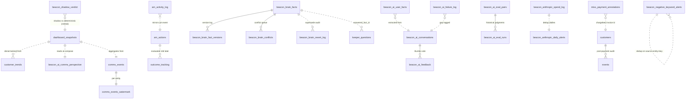
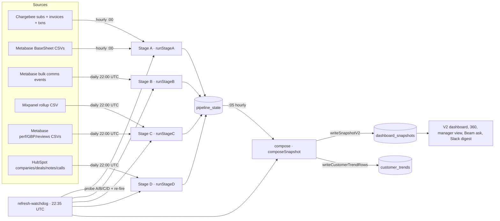

# Beacon platform — engineering reference

> Sibling doc: [`docs/beam-keeper.md`](./beam-keeper.md) covers the Beam copilot + Keeper fact store in depth. This doc covers everything else — the umbrella shell, six agents, data pipelines, cron system, integrations, deploy — and points out to `beam-keeper.md` wherever the AI/knowledge layer would otherwise duplicate.

---

## 0. TL;DR

Beacon is the umbrella Next.js 15 App Router monorepo that hosts every internal Zoca operating tool under one Google sign-in, one Watchfire brand register, one Vercel deploy. Six agents live inside as URL-invisible route groups (`app/(<agent>)/*`), each with its own routes, `_components/`, `api/`, and Slack/Linear/Chargebee/Metabase wiring, but every agent shares the root layout, session, launcher inbox, Cmd+K palette, freshness banner and the Beam/Keeper AI copilot. Auth is Google OAuth restricted to `zoca.com`/`zoca.ai` with a strict three-role allowlist (admin / manager / am) enforced at every mutation. Data lives in Postgres (Neon serverless) with pgvector for Keeper embeddings; hourly + nightly Vercel Crons refresh a four-stage pipeline (Chargebee subs → Metabase comms events → Mixpanel + performance scoring → HubSpot enrichment) that materializes a daily `dashboard_snapshots` row consumed by every AM dashboard.

The six agents:

- **Customer Beacon** (`app/(customer)/customer/*`) — AM disengagement scoring, per-customer 360, manager cross-book views, coaching loops.
- **Performance Beacon** (`app/(performance)/performance/*`) — per-customer growth/local-SEO reports (GBP profile clicks, keyword rankings, review activity).
- **Escalation Beacon** (`app/(escalation)/escalation/*`) — one-shot Anthropic-powered triage of an inbound complaint with a drafted reply and Linear ticket link.
- **Post-Payment Reviews** (`app/(post-payment)/post-payment/*`) — Chargebee `customer.created` → Sonnet ICP evaluator → Word doc + Slack post + docx blob.
- **Miss Payment Beacon** (`app/(miss-payment)/miss-payment/*`) — live Chargebee unpaid-invoice tracker with ACH status, AM ownership, per-invoice annotations.
- **Negative Keyword Beacon** (`app/(negative-keyword)/negative-keyword/*`) — 6-hourly per-entity Metabase pull → Haiku churn-risk classifier → one-click Linear "Retention Risk Alert" ticket creation.

Cross-cutting horizontal layer: **Beam** (Sonnet-driven copilot) + **Keeper** (per-customer canonical fact store with Voyage embeddings + hybrid FTS retrieval) — full spec in [`docs/beam-keeper.md`](./beam-keeper.md).

Stack (one line): **Next.js 14.2 App Router + TypeScript 5.6 + Tailwind 3.4 + Postgres (Neon serverless) + pgvector + Vercel Fluid Compute + Anthropic Sonnet 4.6 & Haiku 4.5 (opt-in Opus 4.6) + Voyage AI (voyage-3-lite embeddings, rerank-2.5-lite) + Chargebee + Metabase Dataset API + HubSpot CRM v3 + Slack + Linear + Fireflies + Google OAuth (NextAuth JWT) + Sentry**.

Architecture in one sentence: every agent renders inside a shared root layout that mounts a launcher inbox, Cmd+K command palette and Beam ask-panel (all scope-aware through `pathToScope`); reads flow off a nightly-materialized `dashboard_snapshots` JSONB row plus per-entity live Metabase/Chargebee/HubSpot on drill-down; every mutation logs to `am_activity_log` and, for high-signal events, posts to Slack.

---

## 1. Repo topology

### Top-level directories

| Path | Purpose |
| --- | --- |
| `app/` | Next.js App Router. Root layout (`layout.tsx`), launcher (`page.tsx`), six agent route groups (`(customer)`, `(performance)`, `(escalation)`, `(post-payment)`, `(miss-payment)`, `(negative-keyword)`), umbrella-wide routes (`app/api/*`, `app/admin/*`, `app/360/*`, `app/settings/*`, `app/compare/*`, `app/auth/*`). |
| `components/` | Shared React components. Route-group-agnostic UI (`BeaconMark`, `BeaconAmbient`, `BeaconPageShell`, `MaintenanceCurtain`, `CommandPalette`, `FreshnessIndicator`, `CalculationTooltip`, `SessionProvider`, `FaviconFlicker`, `KeyboardShortcuts`, `PageViewLogger`, `SectionErrorBoundary`, `AgentErrorScreen`, `AgentHeader`, `ZocaLogo`) plus the `ai/`, `keeper/`, `customer/v2/` subtrees. |
| `lib/` | Server-side domain code, grouped by agent (`lib/customer/`, `lib/report/` (perf), `lib/escalation/`, `lib/post-payment/`, `lib/miss-payment/`, `lib/negative-keyword/`) plus cross-agent modules (`lib/ai/`, `lib/brain/`, `lib/keeper/`, `lib/activity/`, `lib/command-palette/`, `lib/config.ts`, `lib/auth.ts`, `lib/metabase.ts`, `lib/slack-dm.ts`). |
| `migrations/` | Home-rolled SQL migration files, `YYYY-MM-DD-<name>.sql`, tracked in `schema_migrations(filename, applied_at)`. `migrations/post-payment/` is a parallel folder for the second Neon DB used by the post-payment agent. |
| `scripts/` | `migrate.mjs` (the runner), `wave-1.5-dry-run.mjs`, plus a `batcave/` and `lib/` for ops helpers. |
| `public/` | Static assets. Includes `public/kt/` — four HTML knowledge-transfer pages served publicly (`AM_KT.html`, `Manager_KT.html`, `Beacon.html`, `BeamKeeper.html`). |
| `hooks/` | Shared React hooks. |
| `types/` | Ambient `.d.ts` type augmentations (e.g. NextAuth session extensions). |
| `tests/` | Vitest test root + `tests/_stubs/server-only.ts` shim used by the `@` alias so unit tests can import `server-only`-guarded modules. |
| `docs/` | Documentation. This file, `beam-keeper.md`, `RUNBOOK.md`, `voyage-approval.md`. |
| `sentry.*.config.ts` + `instrumentation.ts` | Sentry wiring for browser / server / edge runtimes. |
| `vercel.json` | Region + cron table + per-route memory/duration budget overrides. |
| `next.config.js` | Next config + Sentry wrapper (soft-required — build survives without `@sentry/nextjs` installed). |
| `.eslintrc.json` | Enforces the cross-agent import ban (see next section). |
| `tailwind.config.ts` + `postcss.config.js` + `app/globals.css` | Watchfire palette + Georgia serif + flame/ember keyframes. |
| `.env.example` | Enumerated env vars per agent. |

### Route groups

Next.js App Router `(<name>)` folders don't affect URLs — they just group routes under a shared layout without changing the path. Beacon uses seven groups:

| Group | URL prefix under the group | Purpose |
| --- | --- | --- |
| `app/(customer)/` | `/customer`, `/customer/[entityId]`, `/customer/manager/*`, `/customer/monday`, plus `/api/v2/*`, `/api/cron/refresh/*`, `/api/cron/beacon-ai/*`, `/api/cron/brain/*`, `/api/cron/keeper/*`, `/api/cron/shadow-verdict/*`, `/api/cron/{outcome-backfill,health-alert,digest,sync-hubspot-locations,sync-health-card,slack-activity-digest,prune,refresh-watchdog}`, `/api/keeper/*`, `/api/debug/*`, `/api/health`, `/api/admin/{brain,keeper,shadow-verdict,anthropic-spend}`, `/api/customer/perspective/*`, `/api/ai/action/*` | Customer Beacon — the biggest agent by surface area, and where every cron that touches the customer signal pipeline lives. |
| `app/(performance)/` | `/performance`, `/performance/report/[entityId]`, plus `/performance/api/{metabase,preview,report}` (report includes `/docx`). | Performance Beacon — Metabase Dataset API pulls per entity, DOCX renderer for the printable report. |
| `app/(escalation)/` | `/escalation`, `/escalation/triage`, `/escalation/queue`, `/escalation/tickets`, `/escalation/escalations`, plus `/escalation/api/{customer,escalation,escalations,health,queue,tickets,webhook}`. | Escalation Beacon — search + single Anthropic call + Slack post + optional inbound webhook. |
| `app/(post-payment)/` | `/post-payment`, `/post-payment/reports/[customer_id]`, plus `/post-payment/api/{admin,analyze,cron,diag,rerender}`. | Post-Payment Reviews — Stripe/Chargebee webhook receiver + Sonnet ICP evaluator + report artefacts. |
| `app/(miss-payment)/` | `/miss-payment`, `/miss-payment/api/{annotations,invoices}`, `/api/cron/miss-payment-warm`. | Miss Payment Beacon — unpaid Chargebee invoice dashboard. |
| `app/(negative-keyword)/` | `/negative-keyword`, `/negative-keyword/api/{alerts,create-ticket,dismiss,tickets}`, `/api/cron/negative-keyword/refresh`. | Negative Keyword Beacon — 6-hourly refresh cron + AM alert dashboard + Linear ticket creator. |
| `app/(customer)/` (again, umbrella-owned) | `/api/customer-360`, `/api/customers/search-index`, `/api/inbox/today`, `/api/activity`, `/api/admin/{activity,keeper,knowledge}`, `/api/ai/{ask,cron,facts,feedback,memory,onboarding,suggest}`, `/api/auth/[...nextauth]` all live directly under `app/api/` at the umbrella level — not inside a group. | Cross-agent endpoints reached from every scope. |

The two locked agents (`performance`, `post-payment`) each have a group `layout.tsx` that reads `isAgentLocked(id)` from `lib/config.ts` and short-circuits to `<MaintenanceCurtain>` for page routes only — API routes are unaffected so Stripe webhooks and cross-agent calls keep working.

The ESLint rule at `.eslintrc.json` uses `no-restricted-imports` with four `patterns` groups (`app/(customer)/**`, `app/(performance)/**`, `app/(escalation)/**`, `app/(post-payment)/**`) to hard-block importing across route groups — any shared code has to live in `lib/` or `components/beacon/`.

### Tech stack (versions)

| Package | Version | Notes |
| --- | --- | --- |
| `next` | 14.2.35 | App Router. `serverActions.bodySizeLimit: "2mb"`. `experimental.instrumentationHook: true` for Sentry. |
| `react` | 18.3.1 | |
| `typescript` | 5.6.2 | `moduleResolution: "bundler"`, `strict: true`. Path alias `@/*` → repo root (mirrored in `vitest.config.ts`). |
| `tailwindcss` | 3.4.13 | Watchfire palette + Georgia serif. |
| `@anthropic-ai/sdk` | 0.30.1 | Sonnet + Haiku + optional Opus. `maxRetries` set per-call (4 for post-payment, 2 for perspective/classify). |
| `@neondatabase/serverless` | 0.10.4 | Every server route reads through `getSql()` in `lib/customer/postgres.ts`. |
| `@vercel/postgres` | 0.10.0 | Kept for legacy calls; the Neon serverless driver is the current default. |
| `@vercel/blob` | 1.0.0 | Post-payment stage-store — bundle JSON, eval JSON/MD, DOCX all landed here. |
| `@vercel/functions` | 1.5.0 | `waitUntil()` used by the Stage A cron to fan out targeted refresh in the background. |
| `@vercel/kv` | 2.0.0 | Legacy short-term cache — being retired in favor of Postgres. |
| `@sentry/nextjs` | 8.42.0 | Client / server / edge runtimes all wired. `beforeSend` strips auth headers and redacts `/api/ai/*` bodies. |
| `next-auth` | 4.24.14 | JWT strategy, single Google OAuth client. |
| `docx` | 9.5.0 | DOCX rendering for post-payment reports and performance reports. |
| `recharts` | 2.13.x | Charts across Customer + Performance. |
| `chart.js` + `react-chartjs-2` | 4.4.4 / 5.2.0 | Used specifically on the shadow-verdict admin page and some V2 sparkline variants. |
| `mammoth` | 1.8.0 | DOCX preview extraction. |
| `papaparse` | 5.4.1 | CSV parsing across every Metabase public CSV path (BaseSheet, comms, tickets, health card). |
| `xlsx-js-style` | 1.2.0 | Excel exports (mostly Miss Payment admin exports and Customer trends CSV downloads). |
| `csv-parse` | 5.5.6 | Server-side CSV parser used inside `lib/customer/metabase.ts`. |
| `vitest` | 2.1.8 | Unit tests. `tests/**/*.test.{ts,tsx}` plus co-located `lib/**/*.test.ts`. |
| `eslint` + `eslint-config-next` | 8.57.1 / 14.2.35 | With the `no-restricted-imports` cross-agent guard. |

### Build + deploy

- Vercel project name: **`beacon-v2`** — the `beacon-zoca.vercel.app` domain is a legacy alias and the newer `beacon-v2-delta.vercel.app` is the canonical prod URL. `vercel ls beacon` will hit the old dead project — always target `beacon-v2` or run `vercel --prod` from the repo root.
- Region: `iad1` (see `vercel.json`).
- Build script: `npm run vercel-build` = `node scripts/migrate.mjs && next build`. The migration runner runs on every deploy against `POSTGRES_URL`; if the env var is unset the runner is a no-op so local `npm run build` still works.
- Sentry wrapper wraps `next.config.js` inside a `try { require("@sentry/nextjs") }` — a fresh checkout without deps still builds.

---

## 2. Auth, roles, access

### Google OAuth

- Single OAuth client, provider `next-auth/providers/google`, JWT session strategy (no DB session table at the umbrella level).
- `signIn` callback runs `isAllowedEmail(user.email)` from `lib/config.ts`, which checks `ALLOWED_EMAIL_DOMAINS` (env-driven; defaults to `zoca.com,zoca.ai`).
- `jwt` callback additionally calls `getRoleForEmail()` and `resolveAmNameForEmail()`; if the email is in an allowlist the `role` and `am_name` claims are added. If it isn't, the sign-in still succeeds (they get session-only access to non-customer agents) but `role`/`am_name` stay null. Any failure inside role enrichment is swallowed — a Neon outage cannot block sign-in.
- Sign-in surface: `/auth/signin/page.tsx` — Watchfire-styled sign-in page rendered by NextAuth's `pages.signIn` override.
- Handler: `app/api/auth/[...nextauth]/route.ts` re-exports `NextAuth(authOptions)` as `GET` + `POST`.

### The three-role model (`lib/customer/config.ts`)

| Role | Emails today | Powers |
| --- | --- | --- |
| **admin** | `success@zoca.com`, `siranjith.t@zoca.com`, `rinitha.a@zoca.com` | Everything managers can do + admin surfaces (`/admin/activity`, `/admin/knowledge`, `/admin/beacon-ai-*`, `/admin/brain/*`, `/admin/keeper/*`, `/admin/shadow-verdict`, `/admin/anthropic-spend`). Cron trigger endpoints. |
| **manager** | `chetan.m`, `robin`, `ashish@zoca.{ai,com}`, `abhishek.j`, `siddhi.s`, `kripali@zoca.{ai,com}`, `saibal.p`, `vaibhav.v`, `shakti.s` (all `@zoca.com`/`@zoca.ai`) | Cross-AM read + write. AM picker visible. Manager view, 1-on-1 prep, all customer detail pages. |
| **am** | Anu / Atharv / Bikash / Hubern / Kanak / Nikita / Sakshi / Shruti / Sudha / Tanya (10 AMs, `.z@zoca.com` style) | Locked to their own book. `requireAmScope()` enforces `am_name == customer.am_name` on every mutation. |

Anyone signing in with a Zoca email NOT in any of these three lists is currently accepted at NextAuth's `signIn` callback (because non-customer agents don't need a role) but rejected at every `requireRole(user, "admin", "manager", "am")` call. That's the "strict allowlist" mode noted in the config file — the customer role gate does the exclusion.

### `getApiUser()` + `requireRole()` + `requireAmScope()` (`lib/customer/api-auth.ts`)

Every server route follows this shape:

```ts
export async function POST(req: Request) {
  const user = await getApiUser();
  const denied = requireRole(user, "admin", "manager", "am");
  if (denied) return denied;
  // ...for scoped routes:
  const denied2 = requireAmScope(user, customer.am_name);
  if (denied2) return denied2;
  // handler body
}
```

`requireRole()` also fires a fire-and-forget `logActivity()` row on every authorized request, with `metadata.path` captured from the `x-request-path` header injected by middleware (falls back to null on `/api/health`, `/api/cron/*`, `/api/auth/*` which bypass middleware). Return shape on denial is a `NextResponse({status:401 or 403})` — the handler just `return denied;` on the ternary.

There is no `middleware.ts` at the repo root. The `x-request-path` header is expected to be injected by Vercel's routing layer; the fallback path in `getRequestPath()` treats absence as null.

### Session storage + expiry

- JWT strategy — no DB rows for sessions. Token payload includes `email`, `name`, `picture`, `role`, `am_name`.
- The client accesses via `useSession()` (from NextAuth); the server side uses `getServerSession(authOptions)` and the typed helpers in `lib/customer/api-auth.ts`.
- Types augmented in `types/next-auth.d.ts` (union `role: "admin" | "manager" | "am"`, `am_name: string | null`).

### Per-agent access matrix

| Agent | Roles that see it |
| --- | --- |
| Launcher (`/`) | Any allowlisted Zoca email (redirected to `/auth/signin` otherwise). |
| Customer Beacon | admin + manager + am (AMs see their own book). |
| Performance Beacon | Any signed-in Zoca email — no customer role required. Currently locked behind `MaintenanceCurtain`. |
| Escalation Beacon | Any signed-in Zoca email. |
| Post-Payment Reviews | Any signed-in Zoca email. Currently locked behind `MaintenanceCurtain`. |
| Miss Payment | Any signed-in Zoca email (originally admin+manager only; opened 2026-06-12). |
| Negative Keyword | Any signed-in Zoca email; the API scopes AM rows to `owning_am_email == session.email`. |
| Cmd+K palette | Any signed-in Zoca email. |
| Beam AskPanel | Any signed-in Zoca email; per-scope tool subset governed by `lib/ai/tool-router.ts`. |
| `/admin/*` | admin only (checked in each page's server component). |
| KT pages (`/kt/*.html`) | Public — no auth. |

---

## 3. The umbrella shell

### Root layout (`app/layout.tsx`)

`<html><body>` scoped, `FaviconFlicker` mounted (drives Chrome-only favicon frame swaps to make the flame flicker even where SVG SMIL is ignored), then `SessionProvider` wraps `{children}` plus three global overlays:

1. `<CommandPaletteProvider>` — mounts `<CommandPalette>` on Cmd+K.
2. `<KeyboardShortcuts>` — registers `?`, `g` prefix nav, etc.
3. `<AskPanel>` — the Beam copilot dock. Its `pathname` derives the AiScope; renders on every agent surface and hides on `/auth/*` and `/admin/*`.

Metadata (favicons, OG card, Apple touch icon, manifest) is defined at the root; every agent inherits.

### Launcher (`app/page.tsx`)

The morning surface. Server component that:

1. `getServerSession(authOptions)` — redirects to `/auth/signin` if unauthenticated.
2. Renders `<BeaconAmbient>` (fixed-viewport flame + pulse ring backdrop) plus a top-right `<LauncherSignOut>`.
3. Center column (max-width 720px):
   - "TODAY" eyebrow + serif "Welcome back, {firstName}." headline.
   - `<SuggestedActions scope={{kind:"inbox"}}>` — Beam-generated recommendations strip.
   - `<InboxFeed>` — the day's aggregated queue across agents.
   - Below the inbox, a smaller "Or jump directly to" row of 6 `<LauncherCard>` tiles rendered from `AGENTS` in `lib/config.ts`. Locked agents render disabled and skip navigation.
   - Admin-only link row: Activity log, Knowledge base, Beam gaps, Keeper validate, Keeper reject rate, Beam calibration, Keeper rerank compare, Anthropic spend.

Both `BeaconAmbient` + `BeaconMark` are the two brand identifiers used everywhere.

### `BeaconPageShell` (`components/BeaconPageShell.tsx`)

The standard page frame. Used by Performance, Escalation, Post-Payment, Miss Payment, Negative Keyword and every admin surface. Adds the ambient flame layer behind everything, applies the `.beacon-page` typography scope (Georgia serif headings, `.brand-gradient-text`, `.live-dot` pulsing indicator) and a default `32px 40px 56px` padding. Content sits at z-index above the ambient. No max-width — content reaches the viewport edge like v1 Customer Beacon.

### `MaintenanceCurtain` (`components/MaintenanceCurtain.tsx`)

Full-page lock screen mounted by Performance + Post-Payment group layouts when their id is in the `LOCKED_AGENTS` set in `lib/config.ts`. Applies uniformly — admins included, no bypass. Unlocking is a config-flag flip. API routes stay reachable so webhooks + internal calls don't break.

### `CommandPalette` (`components/CommandPalette.tsx`)

Cmd+K modal. Fetches `/api/customers/search-index` on first open, caches for 5 minutes in a module-level variable. Recent picks live in `localStorage` under `beacon_palette_recents_v1`. ↑/↓ navigates results, Enter opens Customer Beacon for the row, Tab cycles through per-row agent buttons and Enter routes to that agent. Every open + selection fires an `am_activity_log` row via `useActivityLogger()`. Deep integration with `useCompareSelection()` — the palette is where multi-customer compare selection is assembled and the `/compare` navigation gets triggered.

Route table used by the palette:

| Agent | Route |
| --- | --- |
| Customer | `/customer/{entity_id}` |
| Performance | `/performance/report/{entity_id}` |
| Escalation | `/escalation?q={bizname}` |
| Post-Payment | `/post-payment/reports/{cb_customer_id}` |

### Inbox aggregator (`app/_components/InboxFeed.tsx`)

Reads `/api/inbox/today` — a cross-agent aggregator that returns today's queue: new RED customers, open escalation tickets, pending post-payment reviews (when unlocked), new miss-payment invoices, unresolved negative-keyword alerts. Each row links to the source agent.

### `FreshnessIndicator` + `CalculationTooltip`

`FreshnessIndicator` shows relative "3 min ago" with a color-coded dot (patina < 15 min, brass < 120 min, ember beyond). Updates every 30 s. Used on every dashboard shell. `CalculationTooltip` is an inline "?" with a parchment popover explaining metric composition (composite formula, sentiment adjustment, safety floor, etc.) — mounted next to the numbers on the V2 dashboard.

### KT pages (`public/kt/*.html`)

Four hand-written HTML pages served publicly:

- `AM_KT.html` — AM onboarding walkthrough.
- `Manager_KT.html` — manager-side spec.
- `Beacon.html` — platform-wide overview.
- `BeamKeeper.html` — Beam + Keeper deep-dive (mirror of the AM-facing chunks of `docs/beam-keeper.md`).

They live under `/kt/*` and bypass auth entirely — they're consumed by AMs sharing links.

---

## 4. Data model — full catalog

Every table Beacon owns, grouped by concern. Row column names and indexes come straight from the SQL migrations under `migrations/*.sql`.

### Customer signals + snapshots

**`dashboard_snapshots`** — one row per snapshot date holding the fully-composed V2 dashboard JSONB. Source: `lib/customer/postgres.ts::writeSnapshotV2`. Columns: `snapshot_date` (PK, DATE), `generated_at` TIMESTAMPTZ, `total_customers` INT, `total_high_risk` INT, `total_watch` INT, `total_medium` INT, `total_low` INT, `total_healthy` INT, `customer_data` JSONB (the whole SnapshotV2 shape), `data_sources_status` JSONB, `refresh_duration_ms` INT. `INSERT ... ON CONFLICT (snapshot_date) DO UPDATE` so re-runs are idempotent. Retention 90 days (`SNAPSHOT_RETENTION_DAYS`) — pruned by `/api/cron/prune`.

**`customer_trends`** (created lazily in `postgres.ts`) — one row per (`entity_id`, `snapshot_date`) with denormalized `am_name`, `pod`, `composite`, `stoplight`, `plan_amount`, `perf_flagged`. Written by `writeCustomerTrendRows()` after every compose so the trend endpoints don't have to unpack the whole snapshot blob. Three secondary indexes: `(am_name, snapshot_date DESC)`, `(pod, snapshot_date DESC)`, `(snapshot_date DESC)`.

**`am_actions`** (created out-of-band in Neon UI, then augmented in `postgres.ts` via idempotent `ALTER TABLE ... ADD COLUMN IF NOT EXISTS`) — every AM action: `mark_contacted`, `contacted_conn`, `contacted_vm`, `contacted_not_conn`, escalations, notes. Columns: `id`, `am_name`, `entity_id`, `action_type`, `note`, `composite_at_action`, `reason_code`, `follow_up_date`, `escalated_to`, timestamps. Read by `outcome-backfill` cron 14 days later to compute recovery rate.

**`outcome_tracking`** (`postgres.ts::ensureOutcomeTrackingTable`) — one row per (`action_id`, `days_after`) with `tier_at_action`, `tier_now`, `composite_at_action`, `composite_now`, `recovered` BOOL. Written by the `/api/cron/outcome-backfill` cron. Index `idx_outcome_tracking_evaluated (evaluated_at DESC)`.

**`health_check_log`** (`postgres.ts::ensureHealthLogTable`) — one row per probe run: `checked_at`, `ok`, `probes` JSONB, `error_count`, `alerted`. Written by `/api/cron/health-alert`. Index `(checked_at DESC)`.

**`hubspot_note_enrichment`** (`postgres.ts::ensureNoteEnrichmentTable`) — Haiku enrichment cache per HubSpot note. Columns: `note_id` PK, `enriched_at`, `sentiment` TEXT ('warm'/'neutral'/'frustrated'), `topics` JSONB[], `action_items` JSONB[]. Bulk-populated during Stage D refresh.

**`pinned_customers`** (`lib/customer/pinned-customers.ts::ensurePinnedSchema`) — PK `(am_name, entity_id)`, plus `customer_id`, `bizname`, `pinned_at`. Secondary index `(am_name)`.

**`snooze_tracking`** (`lib/customer/snooze.ts::ensureSnoozeSchema`) — PK `(am_name, entity_id)`, plus `customer_id`, `bizname`, `snoozed_until` TIMESTAMPTZ, `snoozed_at`, `reason`. Indexes on `(am_name)` and `(snoozed_until)`.

**`customer_notes`** (`lib/customer/customer-notes.ts::ensureNotesSchema`) — PK `(am_name, entity_id)`, plus `customer_id`, `bizname`, `note`, `updated_at`. Multi-AM notes on the same entity are supported (each AM has their own row).

**`customer_call_outcomes`** (`lib/customer/call-outcomes.ts::ensureCallOutcomesSchema`) — PK `entity_id` (only ONE outcome per entity, upsert-replace), `outcome` ('connected'/'vm'/'not_connected'), `marked_at`, `marked_by_email`, `marked_by_name`, `expires_at` (7-day TTL, computed in JS). Index on `(expires_at)`.

**`saved_views`** (`lib/customer/saved-views.ts::ensureViewsSchema`) — SERIAL PK, `(am_name, name)` UNIQUE, `filter_config` JSONB, timestamps. Index `(am_name)`.

**`one_on_one_log`** (`lib/customer/one-on-one.ts::ensureOneOnOneSchema`) — SERIAL PK, `am_name`, `manager_email`, `held_at`, `notes`, `action_items` JSONB[], `talking_points_used` JSONB[], `metrics_snapshot` JSONB. Index `(am_name, held_at DESC)`.

**`am_activity_log`** — created out-of-band in Neon (schema mirrored in `lib/customer/activity.ts` comments) then extended by `migrations/2026-05-22-umbrella-activity.sql`: added `agent TEXT NOT NULL DEFAULT 'customer'` and made `role` nullable. Columns: `id BIGSERIAL PK`, `email`, `role` (nullable), `am_name`, `agent`, `event_name`, `surface`, `entity_id`, `metadata` JSONB, `ts`. Indexes: `(agent, ts DESC)`, `(email, agent, ts DESC)`. This is the single write path for both customer-scoped `logActivity()` and umbrella `logUmbrellaActivity()` — the latter delegates to it.

**`beacon_tier_feedback`** (`migrations/2026-06-09-shadow-verdict.sql`) — UUID PK, `feedback_date` DATE, `entity_id` UUID, `am_email`, `observed_tier` ('RED'/'YELLOW'/'GREEN'), `is_accurate` BOOL, `reason`, timestamps. Unique on `(feedback_date, entity_id, am_email)` — one vote per day per AM per entity, re-vote overwrites. Index `(feedback_date DESC)`.

### Comms

**`comms_events`** (`migrations/2026-05-27-comms-events.sql`) — the operational cache. PK `(entity_id, channel, source_id)`. Columns: `entity_id` UUID, `channel` (CHECK 'chat'/'email'/'phone'/'sms'/'video'), `source_id` TEXT, `direction` (CHECK 'inbound'/'outbound'/'system'), `subtype`, `sender_name`, `body_available` BOOL, `created_at`, `ingested_at`. Indexes: `(entity_id, created_at DESC)`, `(created_at DESC)`, `(entity_id, channel)`. No message bodies stored — bodies re-fetched on demand from Metabase.

**`comms_events_watermark`** — PK `entity_id` UUID, `last_ingested_at`, `last_event_at`, `event_count_90d`. Powers the freshness banner on each customer card.

**`beacon_ai_comms_perspective`** (`migrations/2026-05-26-beacon-ai-comms-perspective.sql`) — the Haiku-derived comms perspective. PK `(entity_id, snapshot_date)`. Columns: `message_count`, `channel_mix` JSONB, `direction_mix` JSONB, `sentiment` TEXT ('warm'/'neutral'/'tense'/'escalating'), `sentiment_evidence` JSONB[], `topics` TEXT[], `substance_score` INT (0-100 CHECK), `initiator_pattern` TEXT, `response_latency_hours` NUMERIC, `conversation_arcs` JSONB[], `haiku_summary` TEXT, `computed_at`. Indexes: `(entity_id)`, `(computed_at DESC)`.

### Beam + Keeper

These are documented in depth in [`docs/beam-keeper.md`](./beam-keeper.md). Table inventory (all Wave 1/2/2b/3 rows from the same doc — full column lists live in `migrations/2026-06-04-beacon-brain-wave-1.sql` onwards and are covered by the sibling doc):

- `beacon_brain_facts` — the fact store (4-bucket taxonomy: identity / operational / behavioral / concerns). Adds through `value_numeric`, `embedding vector(512)` (was 1024, migrated 2026-07-17), `search_tsv tsvector` (GENERATED STORED), `superseded_by` UUID + `ranking_score`, `derived_from` UUID + `needs_parent_review`, `is_stale` + `marked_stale_at`, `citation_count` + `last_cited_at`.
- `beacon_brain_fact_versions` — append-only history of every material change.
- `beacon_brain_conflicts` — Haiku-flagged disagreement queue.
- `beacon_brain_revert_log` — audit for the self-service supersede-rollback flow.
- `keeper_questions` — the outbound question bank the AM strip shows above the Beam chat input.
- `beacon_ai_docs` — the knowledge base (FTS via GENERATED STORED tsvector; scope tags for cross-agent visibility).
- `beacon_ai_user_facts` — distilled per-user preferences learned from conversation history.
- `beacon_ai_conversations` — every user↔Beam turn cross-scope.
- `beacon_ai_feedback` — thumbs vote + confidence tier + optional reason.
- `beacon_ai_eval_pairs` + `beacon_ai_eval_runs` — the Haiku-as-judge eval harness + historical run log.
- `beacon_ai_failure_log` — Beam's own `<gap: category — description>` markers logged for admin triage.

See `docs/beam-keeper.md` for the full column-level specification and read-path/retrieval logic.

### Escalation

Escalation Beacon does not own dedicated Postgres tables. Its state:

- **Live data at read time** — Metabase BaseSheet (customer identity + AM), Metabase per-entity comms feed (chat/email/phone/video/sms), Chargebee customer/subscription/invoice, Metabase Linear tickets CSV.
- **Triage output** — persisted only in the response payload and (optionally) in `am_activity_log` via `event_name='escalation_triaged'`.
- **Webhook receiver** — `POST /escalation/api/webhook` gated by `WEBHOOK_SHARED_SECRET`.

### Post-Payment

Runs against a **separate Neon project** wired to `POST_PAYMENT_POSTGRES_URL`, not the umbrella `POSTGRES_URL`. The runner at `scripts/migrate.mjs` targets `POSTGRES_URL` and therefore skips `migrations/post-payment/*.sql` unless pointed manually.

**`customers`** (`lib/post-payment/db/schema.sql`) — one row per Chargebee customer since the floor date. Columns: `cb_customer_id` PK, email/name/biz fields, `cb_created_at`, `cb_channel`, `cb_payment_method`, `stripe_customer_id`, `stripe_created_at`, `timestamp_mismatch_h`, `timestamp_mismatch_flag`, subscription block (`sub_id`, `sub_status`, `sub_item_price_ids`, `sub_billing_period`, `sub_billing_period_unit`, `sub_total_cents`), BaseSheet mirror (`entity_id`, `ae_name`, `am_name`, `lead_source_group`, `lead_source`, `predicted_6_month_leads`, `open_tickets_30d`, `churn_potential_flag`, `total_monthly_revenue`), review metrics, booking platform block, verdict block (`scope` CHECK, `verdict`, `needs_am_call`, `verdict_one_line`, `key_flags` TEXT[]), report artefacts (`report_blob_{docx,pdf,json,md}_url`), Slack post tracking, `status` CHECK, `failure_reason`, `failure_attempts`, `retry_failure_streak` INT (added by `migrations/post-payment/2026-06-11-pp-retry-failure-streak.sql`), timestamps. Indexes on `cb_created_at DESC`, `status`, `scope`, `verdict`, `email`. Trigger `customers_updated_at` bumps `updated_at` on every UPDATE.

**`events`** — audit log of every webhook + pipeline step per customer. `id SERIAL PK`, `cb_customer_id` FK (ON DELETE CASCADE), `kind` (`webhook_received`/`validator_started`/`validator_done`/`llm_eval_done`/`docx_rendered`/`blob_uploaded`/`slack_posted`/`failure`), `detail` JSONB, `created_at`. Indexes on `cb_customer_id`, `kind`, `created_at DESC`.

The post-payment pipeline also uses Vercel Blob for `stage/{cb_customer_id}.{bundle,eval}.{json,md}` and the final `.docx`.

### Miss Payment

**`miss_payment_annotations`** (`migrations/2026-06-02-miss-payment-annotations.sql`) — PK `invoice_number` TEXT (the Chargebee invoice id), `data` JSONB (caller assignment, connection status, AM comment, comments, old comments, extensible), `updated_at`. Index `(updated_at DESC)`. Every other datum on this dashboard is live from Chargebee + Metabase — no snapshot.

### Negative Keyword

**`beacon_negative_keyword_alerts`** (`migrations/2026-06-08-negative-keyword-alerts.sql`) — UUID PK. Columns:

- Identity: `entity_id` UUID, `customer_id` (nullable when unmappable), `business_name`, `am_name` (nullable when orphan), `owning_am_email` (falls back to `siranjith.t@zoca.com` for orphans).
- Message: `source` (CHECK App Chat/Email/SMS/Phone/Video), `subject`, `message_body`, `message_date`, `message_time`, `sender`.
- Classification: `risk_category` (CHECK Cancellation/Billing/Lead quality/Technical/Disappointed/Flagged), `analysis` TEXT (Haiku 2-sentence output), `classifier` (CHECK 'ai'/'regex-fallback').
- Dedup key: `dedup_key TEXT NOT NULL` (source + entity_id + first 80 chars of body).
- Ticket tracking: `ticket_id`, `ticket_identifier` (like "FIN-1234"), `ticket_url`, `ticket_created_at`, `ticket_created_by_email`.
- Dismissal: `dismissed_at`, `dismissed_by_email`, `dismissed_reason`.
- Lifecycle: `created_at`, `last_seen_at`.

Unique constraint on `(source, entity_id, dedup_key)` (asserted by the CREATE ... UNIQUE INDEX further down in the migration).

### Shadow verdict (retired 2026-06-10, DB retained)

**`beacon_shadow_verdict`** (`migrations/2026-06-09-shadow-verdict.sql`) — UUID PK, `run_date`, `entity_id`, `am_name`, `am_email`, `bizname`, `deterministic_tier`, `deterministic_composite`, `deterministic_signal_summary`, `llm_tier`, `llm_confidence` (0-100), `llm_reasoning`, `llm_primary_driver`, `llm_retention_window_months`, `llm_key_signals` JSONB[], `llm_disagreement_self_flag`, `agreement` BOOL, `drift_severity` (0-2), `raw_llm_response` JSONB, `haiku_input_tokens`, `haiku_output_tokens`, `elapsed_ms`, `created_at`. CHECK constraints on tiers and drift. Indexes on `(run_date DESC, drift_severity DESC)`, `(am_email, run_date DESC) WHERE am_email IS NOT NULL`, `(entity_id, run_date DESC)`.

### Anthropic spend

**`beacon_anthropic_spend_log`** (`migrations/2026-06-11-anthropic-spend-log.sql`) — `id BIGSERIAL PK`, `ts`, `feature`, `model`, `input_tokens`, `output_tokens`, `cache_read_tokens`, `cache_creation_tokens`, `cost_usd NUMERIC(10,6)`, `scope`, `email`. Indexes on `(ts DESC)` and `(feature, ts DESC)`.

**`beacon_anthropic_daily_alerts`** — PK `(alert_date, alert_threshold_usd)`, `fired_at`. Dedup table for the daily Slack alert.

### ERD (Mermaid)



---

## 5. Data pipelines (the four stages)

Customer Beacon's daily-materialized `dashboard_snapshots` row is composed from four independently-orchestrated stages. Each stage is a route handler (`app/(customer)/api/cron/refresh/stage-{a,b,c,d}/route.ts`) that reads its inputs, computes its outputs into a `pipeline_state` row keyed on `(snapshot_date, stage)`, and returns. A separate compose cron (`/api/cron/refresh/compose`) assembles all four into the final SnapshotV2.

### Stage A — Chargebee subs + invoices + transactions + BaseSheet

**Route** — `app/(customer)/api/cron/refresh/stage-a/route.ts` (memory 2048, maxDuration 180s).
**Cron** — `0 * * * *` (hourly at :00).
**Function** — `lib/customer/refresh.ts::runStageA` → `runStageAAndStore()` which writes the `StageAData` blob to `pipeline_state`.

Inputs (Promise.all):
1. `fetchAllLiveSubsWithEntityMap()` from Chargebee — subs across `active`, `non_renewing`, `in_trial`, paginated, deduped. Extracts `cf_entity_id` and `cf_entity_name` custom fields so multi-location businesses' subscriptions map to specific entities.
2. `fetchUnpaidInvoices()` — `payment_due` + `not_paid` invoices.
3. `fetchRecentTransactions()` — for ACH `in_progress` matching.
4. `fetchBaseSheet()` — the lean identity/AM CSV (`e9005a5c-...`) merged with the supplement CSV (`385231ff-...`) which carries `churn_potential_flag` + `open_tickets` fields that were removed from the lean CSV.
5. `fetchPlaceIdsForEntities()` — Aurora Dataset API pull via `METABASE_API_KEY`.

Outputs into `StageAData`:
- `activeEntityIds: Set<string>` (Chargebee `cf_entity_id`, minus `EXCLUDED_ENTITIES`).
- `entityMeta[eid]` with `customer_id`, `subscription_id`, `sub_status`, `plan_amount_cents`, `auto_collection`, `company_from_chargebee`, `entity_name_from_chargebee`, `email`, `phone`, `activated_at`, `place_id`.
- `unpaidInvoices`, `recentTransactions`, `baseSheet` snapshot.
- Diagnostics: `excludedCount`, `multiEntityExpansion`, `subs.length`, `activeEntitiesCount`.
- G4 integrity assertions — if `subs.length > 0` but `recently_cancelled == 0` the Chargebee response shape may have changed; alert lifts into `errors[]` and compose's degraded-reason banner.

When Stage A detects new entity_ids vs yesterday's snapshot, it fires targeted `runTargetedRefreshForNewCustomers(date, newEntityIds)` in `waitUntil()` — the response returns immediately while B/C/D catch up in the background, so fresh customers don't wait until the 22:00 UTC daily pass.

### Stage B — comms events bulk ingest

**Route** — `app/(customer)/api/cron/refresh/stage-b/route.ts` (memory 3008, maxDuration 300s).
**Cron** — `0 22 * * *` (daily at 22:00 UTC).
**Function** — `lib/customer/refresh.ts::runStageB` → `runStageBAndStore()`.

The V2 path introduced in E-19 Wave 1: instead of pulling 5 per-entity Metabase CSVs (chat/email/phone/sms/video) for every active entity, one bulk-events Metabase question returns all comms events across all entities in the lookback window. Two transports (`lib/customer/comms-bulk-fetch.ts`):

1. **Dataset API** (preferred) — `POST /api/card/4052/query` with `x-api-key`, single round-trip. Requires the API key's group to have execute privilege; toggle with `METABASE_BULK_USE_DATASET_API=1` once the grant lands.
2. **Public CSV** (fallback) — GET the public CSV with `parameters=<json>` and chunked entity_ids at ~150 per chunk (URL limit 8KB). Bounded concurrency; ~3-5min for the full 907 entities.

Both return `CommsEventRow[]` with `entity_id`, `channel`, `subtype`, `created_at`, `direction`, `source_id`. The store layer `lib/customer/comms-events-store.ts::upsertCommsEvents()` does an idempotent bulk upsert on `(entity_id, channel, source_id)`. `writeWatermarks()` bumps `comms_events_watermark.last_ingested_at` + `last_event_at` + `event_count_90d` per entity so freshness banners can read a single row without scanning events.

Then `deriveCustomerMetricsFromEvents(events)` — a pure function — converts the event list into the `CustomerMetrics` shape Stage C's scorer expects. This is the load-bearing V1→V2 parity function.

The legacy `stage-b-v2/route.ts` (memory 3008, maxDuration 300s) is retained for the parity harness — it dumps both V1 (5-CSV) + V2 (bulk-events derived) metrics side by side so drift can be diffed. State stored under `stage='B2'` in `pipeline_state`.

### Stage C — usage + performance signals

**Route** — `stage-c/route.ts` (memory 2048, maxDuration 180s).
**Cron** — `0 22 * * *`.
**Function** — `runStageC` in parallel:

1. `fetchUsageMetrics(today)` — Mixpanel rollup CSV (`b0809829-...`). Joins on the JSON key `"locationEntityId"` (quoted, camelCase). Produces `UsageMetrics` per entity: `app_open_count_30d`, `distinct_session_days_30d`, `last_open_ts`, plus the 14 event names from the CLAUDE.md schema.
2. `fetchPerformanceMetrics()` — five Metabase CSVs (`gbpClicksMonthly`, `rankings`, `reviews12w`, `locationInsights`, `bookingEnquiries`). Produces `PerformanceMetrics` per entity with the GBP profile-click trend on complete months only, the top keyword rankings count, weekly review target, YTD leads. The `location_insights` fetch applies the CRITICAL one-row-per-entity filter (`predicted_6_month_leads IS NOT NULL AND with_zoca_6_month_profile_clicks IS NOT NULL AND (monthly_predictions->>'nonIcpReason') IS NULL ORDER BY created_at DESC LIMIT 1`) — silently returns the wrong forecast row otherwise.

Outputs: `usageMetricsByEntity`, `performanceMetricsByEntity`, diagnostics.

### Stage D — HubSpot enrichment (atomic guard)

**Route** — `stage-d/route.ts` (memory 2048, maxDuration 300s).
**Cron** — `0 22 * * *`.
**Function** — `runStageD`.

Two-layer atomicity per E-11 G5:

1. If `fetchActiveHubspotCompanies` throws or returns empty, Stage D throws — compose reads yesterday's Stage D as a fallback and emits a `degraded_reason` banner.
2. Secondary fetches (`fetchDealsForCompanies`, `fetchCallsForCompanies`, `fetchContactsForCompanies`, `fetchEnrichedNotesPerCompany`) run in one `Promise.all` under a single try/catch — any single failure aborts and the compose step falls back. We do NOT publish a partial Stage D where some customers have HubSpot data and others don't.

The notes-enrichment path in particular uses `hubspot_note_enrichment` as a cache to avoid re-Haiku-ing unchanged notes; only new/modified notes hit Anthropic. Time-budgeted so slow HubSpot responses can't blow past the 300s cap.

### Composition

**Route** — `/api/cron/refresh/compose/route.ts` (memory 2048, maxDuration 180s).
**Cron** — `5 * * * *` (hourly at :05).
**Function** — `composeSnapshot(date)` in `lib/customer/refresh.ts`.

Reads all four `pipeline_state` rows for today's date and joins them. For every `activeEntityId` from Stage A:

1. Comms metrics — either read from Stage B directly or derived from `comms_events` via `deriveCustomerMetricsFromEvents`.
2. `scoreCustomer(metrics)` — produces V1 `CustomerSignals` (sub-scores 0-100 for `sig_we_silent` / `sig_client_silent` / `sig_response_drop` / `sig_volume_collapse`).
3. Usage → `scoreUsage(usageMetrics)` produces a 0-100 sub-score.
4. Billing → `scoreBilling(billing)` produces a 0-100 sub-score.
5. `composeHybridSignals()` — weighted sum:
   - `SIG_WEIGHTS_V2` — Comms 50 % (weSilent 0.15, clientSilent 0.15, responseDrop 0.12, volumeCollapse 0.08), Usage 30 %, Billing 20 % (sums to 1.0, asserted in `SIG_WEIGHTS_V2_SUM`).
   - Applies `computePerspectiveAdjustment()` — Haiku sentiment adds +30/+15/-10 for escalating/tense/warm, +10 for shallow substance below 30.
   - Applies `computeSafetyFloor()` — SV-9a floor. When `sig_client_silent >= 80` OR `sig_volume_collapse >= 80` OR `sig_billing >= 60`, one trigger raises composite to at least YELLOW (60), two triggers raise to RED (80). Original weighted sum retained in `notes`.
   - Tier: `>= TIER_CUTS.high (65)` → HIGH; else `>= .medium (35)` → MEDIUM; else `>= .low (15)` → LOW; else HEALTHY. Zero-comms-90d + no Mixpanel data force HIGH. `perspectiveAdj.forceHigh` (escalating tone) also forces HIGH.
   - Stoplight: `tierToStoplight(tier, flagCount, billingScore)`. WATCH lane (HEALTHY/LOW with ≥2 flags) → YELLOW. Billing crisis override (`billing_score >= 40`) → YELLOW regardless of composite.
6. Modifier flags: `flag_performance` (from Stage C perf flag), `flag_tickets` (from `computeTicketsFlag`).

Writes `writeSnapshotV2(snap)` to `dashboard_snapshots` AND `writeCustomerTrendRows()` to `customer_trends`. The `enrichRedNarratives()` post-pass adds Haiku one-liners for RED customers using `narrative-enrich.ts`.

### Signal taxonomy (`lib/customer/signal-taxonomy.ts`)

Filter UI + chip click handlers all funnel through `customerHasSignal(c, key)`:

| SignalKey | Predicate |
| --- | --- |
| `client_silent` | `sig_client_silent >= 65` |
| `we_silent` | `sig_we_silent >= 65` |
| `resp_drop` | `sig_response_drop >= 65` |
| `vol_collapse` | `sig_volume_collapse >= 55` |
| `usage_low` | `sig_usage >= 55` |
| `billing` | `sig_billing >= 40` |
| `perf_flag` | `flag_performance == true` |

Label / thresholds live only here — every dashboard filter re-uses them.

### Lifecycle states

Computed inside compose from Chargebee `sub.status` + `activated_at`:

- `pre_launch` — `future` status OR `activated_at` in the future. Composite pinned to 50, HEALTHY tier, GREEN stoplight; sub-scores zeroed; reason "Pre-launch — contract signed, not yet activated." (see `composeHybridSignals` early return).
- `recently_cancelled` — status transitioned to `cancelled` within the last 90 days.
- `resurrected` — was `cancelled`, now `active` again in the current snapshot.
- `new-30d` — first appeared in an active snapshot within the last 30 days.

The scope guard (Phase 13.1) filters non-Discovery subscriptions out at Stage A so downstream code never has to handle them.

### Pipeline diagram



---

## 6. Cron system — full inventory

Sourced verbatim from `vercel.json`. Every path uses `Bearer $CRON_SECRET` via `lib/customer/cron-auth.ts::requireCronAuth`; if `CRON_SECRET` is unset the route 503s and refuses to run.

| Path | Schedule (UTC) | Purpose | Function budget | Notes |
| --- | --- | --- | --- | --- |
| `/post-payment/api/cron/retry-pending` | `0 * * * *` | Retry `pending_entity` post-payment rows. OPT-8 caps `MAX_PER_RUN` on the queue depth so a wedged customer can't burn 25 Sonnet calls per hour. | default | Bumps `retry_failure_streak`; ≥ 3 = flip to `failed`. |
| `/post-payment/api/cron/reap-stuck` | `*/10 * * * *` | Reap `processing` rows whose `updated_at` is older than the reap window and flip them back to `pending` for retry. | default | Guards against crashed evaluator runs. |
| `/api/cron/refresh/stage-a` | `0 * * * *` | Chargebee subs + invoices + transactions + BaseSheet. Fires targeted refresh via `waitUntil()` for newly-appeared entities. | mem 2048 / 180s | The hot hourly cadence. |
| `/api/cron/refresh/stage-b` | `0 22 * * *` | Bulk comms-events ingest → `comms_events`. | mem 3008 / 300s | V2 path via `runStageB`. |
| `/api/cron/refresh/stage-c` | `0 22 * * *` | Mixpanel usage + performance CSVs. | mem 2048 / 180s | |
| `/api/cron/refresh/stage-d` | `0 22 * * *` | HubSpot companies/deals/notes/calls + Haiku note enrichment. | mem 2048 / 300s | Atomic guard + soft-fallback. |
| `/api/cron/refresh/compose` | `5 * * * *` | Assemble all four stages into a SnapshotV2 + write trends. | mem 2048 / 180s | Includes RED narrative enrichment. |
| `/api/cron/refresh-watchdog` | `35 22 * * *` | E-19 W2.3/W2.4 — probe each stage's `pipeline_state` row against `STALE_HOURS` thresholds (A: 1.5h, B/C/D: 25h) + snapshot freshness. Re-fires stale stages + recomposes. Slack alert on outcome. | mem 2048 / 300s | Fixes the "compose keeps writing yesterday's Stage D" silent-staleness class. |
| `/api/cron/beacon-ai/eval-weekly` | `30 4 * * 0` | Nightly (weekly) Beam eval harness — iterates active `beacon_ai_eval_pairs`, hits `/api/ai/ask`, runs Haiku-as-judge, writes `beacon_ai_eval_runs`. | mem 1024 / 300s | Regression alert to Slack on material pass-rate drop. |
| `/api/cron/prune` | `30 0 * * *` | Delete `dashboard_snapshots` older than `SNAPSHOT_RETENTION_DAYS` (90). | default | Also trims other rolling logs. |
| `/api/cron/outcome-backfill` | `0 3 * * *` | For every `am_actions` row from 14/30d ago, compare then-tier to now-tier and stamp `outcome_tracking.recovered`. | mem 1024 / 60s | Powers the per-AM recovery-rate leaderboard. |
| `/api/cron/health-alert` | `15 3 * * *` | Run probes against Neon + Chargebee + Metabase + Anthropic + HubSpot. Insert `health_check_log`. Slack on error. | mem 512 / 30s | |
| `/api/cron/digest` | `30 2 * * *` | Daily Slack digest per AM. Composes a Block Kit message per AM (top 3 RED + planner link) and posts to `SLACK_WEBHOOK_URL`. | mem 1024 / 60s | `?dry_run=1` supported. |
| `/api/cron/sync-hubspot-locations` | `0 2 * * *` | Nightly sync of HubSpot Locations custom object → local cache. | mem 512 / 60s | |
| `/api/cron/sync-health-card` | `10 22 * * *` | Pull the 900-row Metabase Customer Health card CSV → cache in Postgres for read-time enrichment. | mem 1024 / 120s | |
| `/api/cron/slack-activity-digest` | `0 * * * *` | Hourly umbrella-wide activity digest to Slack — groups `am_activity_log` by agent + event_name + role. | default | |
| `/api/ai/cron/extract-facts` | `30 */12 * * *` | Distill Beam conversations (last 7d) into per-user `beacon_ai_user_facts` via Haiku. | default | Fire every 12h. |
| `/api/cron/beacon-ai/monday-briefing` | `30 2 * * 1` | Monday-morning Slack briefing to each AM (E-17 Wave 3b). | mem 1024 / 120s | Uses Haiku via `lib/ai/proactive-beacon.ts`. |
| `/api/cron/beacon-ai/daily-digest` | `30 2 * * *` | Daily proactive anomaly digest per AM. | mem 1024 / 120s | |
| `/api/cron/miss-payment-warm` | `30 2 * * *` | Warm the Miss Payment cache before the finance shift starts. | mem 1024 / 120s | |
| `/api/cron/brain/extract-from-notes` | `30 3 * * *` | Extract candidate Keeper facts from HubSpot notes via Haiku. | default | Writes `beacon_brain_facts` with `confidence_state='candidate'`. |
| `/api/cron/brain/stale-prune` | `30 5 * * *` | Mark 6-month-untouched Keeper facts as `is_stale=true`. | mem 1024 / 120s | |
| `/api/cron/negative-keyword/refresh` | `0 */6 * * *` | Every 6 hours: walk BaseSheet entity list, 14-day per-entity comms pull, prescreen + Haiku classify + upsert into `beacon_negative_keyword_alerts`. | default | Concurrency 20 entities; ~30-60 min per run. |
| `/api/cron/keeper/enrich-from-metabase` | `0 6 * * 0` | Weekly Metabase-driven Keeper enrichment. | mem 1024 / 300s | |
| `/api/cron/keeper/generate-questions` | `0 6 * * *` | Cluster gaps from `beacon_ai_failure_log` via Voyage cosine + phrase one Keeper question per cluster via Haiku. Writes `keeper_questions`. | default | |

**Manual cron invocations** — every route also accepts an authenticated fetch:

```bash
curl -H "Authorization: Bearer $CRON_SECRET" https://beacon-v2.vercel.app/api/cron/refresh/stage-a
```

Also: `/api/cron/brain/backfill-embeddings` + `/api/cron/brain/backfill-owning-am` exist but are not on the schedule — they're manual backfill triggers.

---

## 7. Each agent in depth

### 7.1 Customer Beacon

**Purpose** — Live disengagement scoring across every active Zoca customer, surfaced as a per-AM triage view and a manager-cross-book view. Every AM lands here in the morning and starts with "what needs my attention today?" — a stoplight-sorted feed of RED customers plus signals, recent comms perspective, and the actions surface (mark contacted, snooze, pin, note, escalate, compare, monday-briefing).

**Route entry** — `app/(customer)/customer/page.tsx` renders `<V2Dashboard>`. Per-customer view `app/(customer)/customer/[entityId]/page.tsx` renders the 360. Manager view `app/(customer)/customer/manager/*`. 1-on-1 prep `app/(customer)/customer/manager/1on1/[am]/page.tsx`. Monday briefing `app/(customer)/customer/monday/page.tsx`.

**Access** — admin + manager + am. `requireAmScope()` on every mutation binds AMs to their own book.

**Data flow** — reads `dashboard_snapshots.customer_data` for the whole snapshot, cross-references live `comms_events`, live `customer_notes` + `pinned_customers` + `snooze_tracking` + `customer_call_outcomes`, and on demand hits `beacon_ai_comms_perspective` + Keeper facts for the 360. Everything else is snapshot-cached.

**Key components** —
- `components/customer/v2/V2Dashboard.tsx` — root client component.
- `V2AMTriage.tsx` + `V2AMTriageFilters.ts` — the sorted card grid + filter registry.
- `V2CustomerCard.tsx` + `V2CardChrome.tsx` + `V2CardChips.tsx` + `V2CardBizname.tsx` — one row per customer.
- `V2KpiTiles.tsx`, `V2Hero.tsx`, `V2Header.tsx`, `V2WelcomeStrip.tsx`, `V2RefreshBar.tsx`, `V2FreshnessPulse.tsx` — hero surface.
- `V2ManagerDashboard.tsx`, `V2ManagerHero.tsx`, `V2ManagerToolbar.tsx`, `V2AmActivityRollup.tsx`, `V2PodSummaryGrid.tsx`, `V2StoplightMovement.tsx`, `V2Rollup.tsx`, `V2AMBookTrendStrip.tsx` — manager surfaces.
- `V2CoachingLoops.tsx`, `V2SignalHeatmap.tsx`, `V2Sparkline.tsx`, `V2PerformancePanel.tsx`, `V2HoverPreview.tsx` — analytics widgets.
- `V2CustomerCompare.tsx` + `V2CompareBar.tsx` — multi-customer compare.
- `V2MondayBriefing.tsx` — Monday plan surface.
- `V2ShadowVerdictChip.tsx` — DB retained; UI on 360 pages.
- `V2TierFeedback.tsx` — the ✓/✗ vote on the shown tier.
- `V2Confetti.tsx` + `V2SuccessRipple.tsx` — mark-contacted celebrations.
- `V2CardChrome`, `V2Skeleton`, `V2OnboardingTour.tsx`, `V2KeyboardShortcutsOverlay.tsx` — UX chrome.
- Under `components/customer/v2/CustomerDetail/*` — the per-customer 360 sections (comms perspective panel, Keeper drawer, timeline).

**API routes** — `app/(customer)/api/v2/*` and neighbours:
- Snapshot reads: `GET /api/v2/snapshot`, `GET /api/v2/snapshot/dates`, `GET /api/v2/snapshot/by-date/[date]`, `GET /api/v2/snapshot/trend`, `GET /api/v2/snapshot/movement`.
- Per-customer: `/api/v2/customer/[entityId]`, `/actions`, `/call-outcome`, `/comms`, `/feedback`, `/keeper-coverage`, `/timeline`, `/trend`.
- Per-AM: `/api/v2/am/[amName]/monday-brief`, `/contacted-recently`, `/trend`. `/api/v2/am-activity`.
- Manager 1-on-1: `/api/v2/manager/1on1`, `/api/v2/manager/1on1/[am]`.
- Actions: `/api/v2/actions/contacted`, `/api/v2/actions/escalate`. `/api/v2/pinned`, `/api/v2/snooze`, `/api/v2/notes/[entityId]`.
- Views: `/api/v2/views`, `/api/v2/views/[id]`.
- Trends: `/api/v2/trends`, `/trends/ams`, `/trends/customers`, `/trends/pods`.
- Coaching: `/api/v2/coaching`. Feedback: `/api/v2/feedback`, `/api/v2/tier-feedback`.
- Refresh trigger: `/api/v2/refresh`. Health: `/api/v2/health`, `/api/v2/health/integrations`.
- Keeper (Wave 1+) mounted under `/api/v2/brain/*` — see `beam-keeper.md`.

**Cron dependencies** — Stage A/B/C/D + compose (already covered). Additionally: `outcome-backfill`, `health-alert`, `digest`, `sync-hubspot-locations`, `sync-health-card`, `slack-activity-digest`, `beacon-ai/monday-briefing`, `beacon-ai/daily-digest`.

**Interactions** — mark contacted (`contacted_conn` / `contacted_vm` / `contacted_not_conn`), snooze N days, pin, save note, escalate, compare (2+ customers open compare page). Every action writes `am_actions` and `am_activity_log`; high-signal ones (`mark_contacted`, `note_saved`, `snooze_set`, `coaching_acted`) also post real-time to Slack via `slack-am-activity.ts`.

**Beam integration** — scope is `customer-360:{entityId}` on the detail page, `customer-book` on the triage view. Full tool subset for `customer-360` includes `read_customer_brain`, `add_fact_to_brain`, `read_customer_notes`, `add_note`, `mark_contacted`, `pin`, `snooze`, `get_customer_from_metabase`, `get_customer_performance`, `get_chargebee_billing`, `get_mixpanel_activity`, `get_booking_history`, `get_review_summary`, `get_full_customer_view`, `draft_email`, `draft_slack`, `lookup_customer`. `customer-book` scope adds `query_customer_book`. See `lib/ai/tools/index.ts::getToolsForScope`.

**Recent changes** — Watchfire palette sweep (Phase 33.brand-watchfire); T5 dashboard rework (2026 Q2); KPI interactivity + multi-loc fix (multi-location fix in Miss Payment mirrored here via `sub.cf_entity_id`); safety floor (SV-9a) on the composite; SMART-K1 citation-count boost integrated into Keeper reads.

### 7.2 Performance Beacon

**Purpose** — Per-customer growth + local-SEO report generator. Given an entity_id, produces the polished Word-formatted growth report (GBP profile clicks trend, keyword rankings, weekly review target, YTD leads, lead-source mix, reviews activity) that the AM shares with the client. Currently locked behind `MaintenanceCurtain`.

**Route entry** — `app/(performance)/performance/page.tsx` renders `<PerformanceLanding>` (client component: recent reports from localStorage + inline preview). Per-report `app/(performance)/performance/report/[entityId]/page.tsx`.

**Access** — Any signed-in Zoca email (behind maintenance curtain).

**Data flow** — every metric routes through the Metabase Dataset API (POST `https://metabase.zoca.ai/api/dataset` with `x-api-key`). Two databases: Aurora (db=7) for GBP/rankings/reviews/location_insights/reviews/questions, Postgres (db=2) for `website.booking_enquiries`, `cx.am_mapping`, `cx.ae_mapping`, `entities.employees`. SQL strings live in `lib/report/queries.ts` — parameterized on `{{entity_id}}`. Fetchers in `lib/report/fetchers.ts`, per-metric composers in `lib/report/compose.ts`. Vertical-specific checklists in `lib/report/library/*` (`barber.ts`, `beauty_specialty.ts`, `hair_salon.ts`, `med_spa.ts`, `nail_salon.ts`, `spa_massage.ts`, `tanning.ts`, `default.ts`), routed via `lib/report/vertical.ts`. DOCX renderer at `lib/report/render/docx.ts`.

**Key components** — `_components/PerformanceLanding.tsx`, plus the report-render surface. API routes: `/performance/api/metabase`, `/performance/api/preview/[entityId]`, `/performance/api/report/[entityId]`, `/performance/api/report/[entityId]/docx`.

**Cron dependencies** — none directly; reports pull fresh Metabase on demand.

**Beam integration** — scope `performance-landing` on the landing page, `performance-report:{entityId}` on the report. Tools: `get_customer_performance`, `query_brain`, `lookup_customer`.

**Recent changes** — 2026-06 lockdown behind MaintenanceCurtain pending finance-ops sign-off for the review target field.

### 7.3 Escalation Beacon

**Purpose** — Triage an inbound complaint / message. Given a customer + the escalation text, run a single Anthropic Sonnet 4.6 call that returns a severity classification, one-paragraph triage narrative, and a drafted reply — plus surface the customer's Chargebee subscription state, unpaid invoices, last 60 days of comms, and open Linear tickets.

**Route entry** — `app/(escalation)/escalation/page.tsx` renders `<EscalationHeader>` + `<EscalationsBrowser>`. Subroutes: `/escalation/triage`, `/escalation/queue`, `/escalation/tickets`, `/escalation/escalations`.

**Access** — Any signed-in Zoca email.

**Data flow** — read layer:
- `lib/escalation/tickets.ts` — Metabase tickets CSV (`331e4835-...`). 5-minute in-memory cache.
- `lib/escalation/metabase.ts` — comms + BaseSheet.
- `lib/escalation/chargebee.ts` — customer + sub + unpaid invoices.
- `lib/escalation/enrichment.ts` — merge tiers.
- `lib/escalation/escalation-score.ts` — heuristic pre-agent score.
- `lib/escalation/linear.ts` — outbound Linear ticket create (used by Negative Keyword and, later, by Escalation Slack replies).

Write layer:
- `lib/escalation/agent.ts::runAgent` — Anthropic Sonnet 4.6, single tool-forced JSON response. Model taken from `ANTHROPIC_MODEL` env (default Sonnet).
- Optional inbound webhook at `POST /escalation/api/webhook` gated by `WEBHOOK_SHARED_SECRET`.

**Key components** — `_components/EscalationsBrowser.tsx`, `_components/EscalationHeader.tsx`, `_components/charts/*`.

**API routes** — `/escalation/api/customer/[id]`, `/escalation/api/escalation`, `/escalation/api/escalations`, `/escalation/api/health`, `/escalation/api/queue`, `/escalation/api/tickets`, `/escalation/api/webhook`.

**Beam integration** — scope `escalation-overview`. Tools: `get_customer_from_metabase`, `get_chargebee_billing`, `lookup_customer`, `read_customer_brain`.

**Recent changes** — Phase C migration into the umbrella (Wave B).

### 7.4 Post-Payment Reviews

**Purpose** — Every Chargebee `customer.created` webhook triggers an automated ICP evaluation against Module 02. Runs a Sonnet 4.6 evaluator over BaseSheet + Chargebee + Stripe + Metabase enrichment, produces both a Markdown analysis and a strictly-typed JSON report, renders both into a customer-shareable Word doc, uploads all artefacts to Vercel Blob, and posts a per-customer thread to Slack with verdict pill + docx attachment. Currently locked behind `MaintenanceCurtain`.

**Route entry** — `app/(post-payment)/post-payment/page.tsx` renders `<DashboardClient>`. Per-customer `app/(post-payment)/post-payment/reports/[customer_id]/page.tsx`.

**Access** — Any signed-in Zoca email (behind maintenance curtain). Admin ops: `/post-payment/api/admin/delete-customer/[customer_id]`, `/post-payment/api/admin/restore-blob/[customer_id]`.

**Data flow** —
1. **Ingest** — Chargebee webhook (kept on the standalone `zoca-payment-dashboard.vercel.app` for now; the umbrella has webhook secret support but the receiver is not yet migrated).
2. **Bundle build** — `lib/post-payment/validator/bundle.ts` calls `chargebee.ts` + `stripe.ts` + `metabase.ts` and produces a `Bundle` object. Saved to blob via `stage-store.ts::saveStageBundle`.
3. **Evaluator** — `lib/post-payment/evaluator/anthropic.ts::evalWithPrompt` uses `MODEL = process.env.ANTHROPIC_MODEL ?? "claude-haiku-4-5-20251001"` (production runs Sonnet via env override; Opus available with `?model=opus`). Prompt bundled at build time via `PROMPT_MD` import (fs read fails on Vercel). `MAX_TOKENS = 12000`. `Anthropic({ maxRetries: 4 })`. Returns `{ markdown, reportData, raw }`.
4. **Render** — `lib/post-payment/render/render.ts` produces the DOCX.
5. **Upload** — Vercel Blob stores `.bundle.json`, `.eval.{md,json}`, `.docx` under `stage/{cb_customer_id}.*`.
6. **Slack post** — `lib/post-payment/slack.ts::postCustomerReport` with verdict pill, key flags, docx upload via `files.upload` when SLACK_BOT_TOKEN has `files:write`.
7. **Persist** — the `customers` + `events` Postgres tables (in the post-payment Neon project, `POST_PAYMENT_POSTGRES_URL`).

**Key components** — `_components/DashboardClient.tsx`.

**API routes** — `/analyze/[customer_id]`, `/cron/retry-pending`, `/cron/reap-stuck`, `/diag/[customer_id]`, `/diag/all`, `/diag/health`, `/rerender/[customer_id]`, `/rerender/all`, `/admin/delete-customer/[customer_id]`, `/admin/restore-blob/[customer_id]`.

**Cron dependencies** — `retry-pending` hourly, `reap-stuck` every 10 min.

**Beam integration** — scope `post-payment-book` on the landing, `post-payment-customer:{cb_customer_id}` on the report page.

**Recent changes** — OPT-8 retry-failure-streak added to halt wedged customers (see the retry-failure-streak migration + column). Render+upload silent-failure bug tracked in project memory — see the `beacon-post-payment-render-bug.md` note; suspected `BLOB_READ_WRITE_TOKEN`.

### 7.5 Miss Payment Beacon

**Purpose** — Live daily Chargebee unpaid-invoice dashboard for Finance ops. Shows every `payment_due` + `not_paid` invoice with entity/AM ownership, ACH status, active Linear ticket link, per-row annotations (caller assignment, connection status, comments). Ported from the standalone Missed Invoice Tracker.

**Route entry** — `app/(miss-payment)/miss-payment/page.tsx`. Client component `_components/dashboard.tsx`.

**Access** — Any signed-in Zoca email (opened up from admin+manager on 2026-06-12).

**Data flow** —
1. `lib/miss-payment/chargebee.ts` — pulls unpaid invoices, ACH `in_progress` transactions, customer detail, subscription detail. `CHARGEBEE_REQUEST_TIMEOUT_MS` default 12s. Reuses `CHARGEBEE_SITE` + `CHARGEBEE_API_KEY`.
2. `lib/miss-payment/basesheet.ts` — 10-minute in-memory cache of the lean BaseSheet CSV. Keyed by `customer_id` and `entity_id`.
3. `lib/miss-payment/tickets.ts` — Metabase tickets CSV, filtered to active state per entity.
4. `lib/miss-payment/enrich.ts::buildInvoiceRows` — joins the four sources, prefers `sub.cf_entity_id` for multi-location fix (Sky Dental 3-location case), attaches ACH status via `linked_invoices` match, sorts by invoice date + amount.
5. `lib/miss-payment/annotations.ts` — read/write `miss_payment_annotations` table with JSONB merge patches.

**Key components** — `_components/dashboard.tsx` + tabs UI + KPI header + annotation cell.

**API routes** — `/miss-payment/api/invoices` (memory 1024 / 120s), `/miss-payment/api/annotations`. `/api/cron/miss-payment-warm` (memory 1024 / 120s).

**Cron dependencies** — `miss-payment-warm` at 02:30 UTC daily, matches Missed Invoice cadence.

**Beam integration** — scope `miss-payment-overview`. Tools include `get_chargebee_billing`, `lookup_customer`.

**Recent changes** — Watchfire palette adapt; multi-loc fix (2026-06-12).

### 7.6 Negative Keyword Beacon

**Purpose** — Detect churn-risk sentiment in customer comms and let the AM one-click a "🚨 RETENTION RISK ALERT 🚨" Linear ticket. Runs every 6 hours across the whole active book; classifies via Haiku with a regex fallback; dedups on message content; surfaces alerts filtered by AM scope.

**Route entry** — `app/(negative-keyword)/negative-keyword/page.tsx` renders `<NegativeKeywordHeader>` + `<Dashboard>`.

**Access** — Any signed-in Zoca email; API scopes AMs to `owning_am_email == session.email`, managers + admins see all.

**Data flow** —
1. `lib/negative-keyword/feeds.ts` — per-entity Metabase URL pull, 14-day window.
2. `lib/negative-keyword/prescreen.ts` — negative-keyword lexicon regex prescreen.
3. `lib/negative-keyword/classify.ts` — Haiku classifier. Batch size 20 (raised from 12 in OPT-4). Model `ANTHROPIC_NK_MODEL` default Haiku 4.5. `MAX_TOKENS_PER_BATCH = 2000`. `Anthropic({ maxRetries: 2 })`. STRICT JSON output; validation drift → single retry then drop to fallback.
4. `lib/negative-keyword/analyze-fallback.ts` — regex-only classifier for Phone-Flagged candidates and Haiku-failure batches.
5. `lib/negative-keyword/enrich.ts` — join to BaseSheet for `business_name` + `am_name` + `owning_am_email`; orphans route to `siranjith.t@zoca.com`.
6. `lib/negative-keyword/repo.ts::upsertAlert` — idempotent write on the dedup key.
7. `lib/negative-keyword/linear.ts::createTicket` — the 7 mandatory rules verbatim (title emoji, template id `ee431300-...`, customer_needCreate mandatory, dedup against open states, description filled, assignee by AM full-name match, initial state Todo). Two module-level caches (`_teamId`, `_todoId`) preserved across requests.

**Key components** — `_components/Dashboard.tsx`, `_components/NegativeKeywordHeader.tsx`.

**API routes** — `/negative-keyword/api/alerts`, `/negative-keyword/api/create-ticket`, `/negative-keyword/api/dismiss`, `/negative-keyword/api/tickets`. Cron `/api/cron/negative-keyword/refresh`.

**Beam integration** — scope `negative-keyword-overview`.

**Recent changes** — Shipped 2026-06-08 (Phase NK-1..NK-4) in one session, 324 alerts landed in prod on first run. OPT-4 batch size raised to 20 for token savings. The dashboard reads FROM the Postgres cache, not from Metabase directly, so UI latency stays bounded even during a cron run.

---

## 8. Beam + Keeper — pointer

**Beam** is the copilot: an AskPanel mounted at every route (except `/auth` + `/admin`), scope-aware via `pathToScope`, powered by Anthropic Sonnet 4.6 with prompt caching, a two-stage tool router (`lib/ai/tool-router.ts`) that trims the toolbox down to 1-3 tools per question, per-user preference facts (`beacon_ai_user_facts`), and a conversational memory (`beacon_ai_conversations`). Every response is thumbs-vote-able and tagged with a `<confidence: NN%>` marker whose tier drives the `beacon_ai_feedback` calibration page. When Beam can't fully answer it emits `<gap: category — description>` markers that land in `beacon_ai_failure_log`; the weekly cron clusters them via Voyage cosine + Haiku phrasing and files rows in `keeper_questions` for the AM strip to surface.

**Keeper** is the per-customer canonical fact store. 4-bucket taxonomy (identity / operational / behavioral / concerns), version log, conflict queue, revert log, semantic dedup via Voyage embeddings (voyage-3-lite 512-dim, ivfflat cosine), keyword FTS via a GENERATED STORED `tsvector`, hybrid retrieval with RRF merge + rerank-2.5-lite. Wave-2 supersede resolution + SMART-K1 citation-count boost + SMART-K4 derived-from parent auto-pull. Beam reads confirmed non-stale non-superseded facts; AM confirms via the Validate inbox.

Full architecture, retrieval logic, prompts, taxonomy, and per-fact write paths in [`docs/beam-keeper.md`](./beam-keeper.md).

---

## 9. UI system

### Watchfire palette (`app/globals.css`)

CSS variables defined at `:root`. Sourced from the Watchfire spec:

**Surfaces**
- `--zoca-bg: #F0E4CC` (Parchment — page canvas)
- `--zoca-bg-soft: #F8EFD7` (Light Parchment — card surfaces)
- `--zoca-bg-tint: #EBE0C2` (Buff — sub-cards)

**Text**
- `--zoca-text: #2B1F14` (Char)
- `--zoca-text-2: #6E5F50` (Smoke)
- `--zoca-text-3: #8B7A66` (Faded Smoke)

**Accents (Tailwind keys preserved for backward-compat)**
- `--zoca-pink: #C8431D` (Ember)
- `--zoca-pink-bright: #7C2D12` (Deep Ember)
- `--zoca-pink-soft: #FCE4D6` (Light Ember)
- `--zoca-red: #7C2D12` (Deep Crimson)
- `--zoca-red-soft: #F5C9B6` (Faded Crimson)
- `--zoca-amber: #D9A441` (Brass)
- `--zoca-amber-soft: #F5E6BB` (Pale Brass)
- `--zoca-green: #4A7C59` (Patina)
- `--zoca-green-deep: #2D4843` (Pine)
- `--zoca-green-soft: #DAE5DC` (Pale Patina)
- `--zoca-blue: #2A4D5C` (Sea Lapis)
- `--zoca-blue-strong: #1A3340` (Deep Lapis)

**Borders**
- `--zoca-border: #D4C29B` (Aged Brass)
- `--zoca-border-2: #C2A975` (Darker Brass)

**Optional spec tokens**
- `--zoca-lapis-soft: #D8E1E6`
- `--zoca-smoke-soft: #E5DDD3`
- `--zoca-ember-peach: #FBE8D8`
- `--zoca-border-perf: #E4B188`

**Flame layer**
- `--zoca-flame-outer: #C8431D` (Ember)
- `--zoca-flame-mid: #E85A2B`
- `--zoca-flame-core: #D9A441` (Brass)
- `--zoca-flame-heart-top: #FEF3C7`
- `--zoca-flame-heart-bot: #FBBF24`

Body defaults to `background: var(--zoca-bg)`, `color: var(--zoca-text)`, `font-family: Georgia, "Times New Roman", Times, serif`.

### Two brand glyphs

**BeaconMark** (`components/BeaconMark.tsx`) — 4-tier stepped tower with a 4-layer blazing flame at the top. Aspect ratio 3:8. Optional `flicker={true}` runs the 4 co-prime keyframes (`beacon-flame-1` through `beacon-flame-4` at 0.9/1.3/1.7/2.2 s durations) so the flame never re-syncs. Uses `--zoca-flame-*` variables so a palette flip cascades. Client component due to the `useEffect` mount for reduced-motion detection.

**KeeperVault** (`components/keeper/KeeperVault.tsx`) — small SVG vault with brass body, ember combination dial, four brass tick marks. Fixed brass+ember regardless of confidence variant. Direction C in the 2026-06-12 Keeper chip design.

### `BeaconPageShell` + `BeaconAmbient`

`BeaconAmbient` is a fixed-viewport-centered layered composition: flame mark scaled up, pulse ring (`beacon-ember-1`/`beacon-ember-2` keyframes), soft radial glow. Never scrolls with content. `BeaconPageShell` mounts it as a `position: fixed` z-0 layer and lifts children to z-1, applies the `.beacon-page` scope (Georgia headings, `.brand-gradient-text` linear-gradient from Sea Lapis → Char → Crimson → Brass, `.live-dot` 2-second pulse for the "live" indicator on dashboards) and default padding `32px 40px 56px` with no max-width.

### Animation system

The Watchfire PR series shipped a numbered animation set. Every keyframe lives in `app/globals.css`. Highlights:

- **PR 6** — flame keyframes 1-4 at co-prime durations.
- **PR 7** — ember drift `beacon-ember-1` + `beacon-ember-2`.
- **PR 8** — pulse ring on card RED transitions.
- **PR 9** — `V2Confetti` + `V2SuccessRipple` for mark-contacted.
- **PR 10** — `.live-dot` on the freshness indicator.

Every animation respects `prefers-reduced-motion` — Reduced-Motion consumers get static frames. The `FaviconFlicker` component is the exception (it swaps favicon data URLs at 140 ms intervals in Chrome only, which ignores SMIL on favicon SVGs).

### Typography

Serif Georgia on dashboards (T9). System font stack `-apple-system, Inter, system-ui, sans-serif` for controls/labels. Numeric UI uses tabular-nums when contained inside a `.tabular` scope.

---

## 10. Notifications & activity

### `am_activity_log`

The one write path for every mutation across every agent. Schema (out-of-band-created, then E-8 migration added `agent` + made `role` nullable):

- `id BIGSERIAL PK`
- `email TEXT NOT NULL`
- `role TEXT NULL` (customer-role or null for non-customer agents)
- `am_name TEXT NULL`
- `agent TEXT NOT NULL DEFAULT 'customer'`
- `event_name TEXT NOT NULL`
- `surface TEXT NULL`
- `entity_id TEXT NULL`
- `metadata JSONB NULL`
- `ts TIMESTAMPTZ NOT NULL DEFAULT NOW()`

Indexes: `(agent, ts DESC)`, `(email, agent, ts DESC)`.

Callers:
- `lib/customer/activity.ts::logActivity` — customer-scoped (`agent='customer'`); also fires the real-time Slack post for high-signal events.
- `lib/activity/log.ts::logUmbrellaActivity` — the fire-and-forget writer with any agent value. Every non-customer agent calls this.
- `lib/customer/api-auth.ts::requireRole` — the middleware-style helper writes an `api_call` event on every authorized request, capturing the path from `x-request-path`.

### Admin activity page (`/admin/activity`)

Server component under `app/admin/activity/page.tsx`. Reads `am_activity_log` filtered by role + date range + agent + event_name. Admin-only.

### Slack digests + narrative digest

Multiple Slack surfaces:

1. **AM digest cron** (`/api/cron/digest`, 02:30 UTC) — one Block Kit message per AM to `SLACK_WEBHOOK_URL` composed by `lib/customer/slack-digest.ts::runDigestForAllAms`. Header + pod context + top 3 RED customers + planner link.
2. **Real-time AM activity** (`lib/customer/slack-am-activity.ts::postRealtimeAmActivity`) — fires on `mark_contacted`, `note_saved`, `snooze_set`, `coaching_acted`. Never blocks callers.
3. **Hourly umbrella digest** (`/api/cron/slack-activity-digest`) — groups `am_activity_log` rows by agent + event + role into a single hourly summary.
4. **Post-Payment thread posts** (`lib/post-payment/slack.ts`) — one thread per customer to `SLACK_CHANNEL_ID` (default `C0B2ECQMDR9`), verdict pill + docx upload.
5. **Health alert** (`/api/cron/health-alert`) — Slack on Chargebee/Metabase/Neon/Anthropic/HubSpot probe failure.
6. **Anthropic daily spend alert** (`lib/ai/spend-log.ts`) — one row per (date, threshold) in `beacon_anthropic_daily_alerts` prevents double-fire.
7. **Stage-A/E-11 integrity alerts** — inline `postSlack` calls when `subs.length > 0 && recently_cancelled == 0`.
8. **Beam eval regression alert** — `/api/cron/beacon-ai/eval-weekly` posts when pass rate drops materially.
9. **Refresh watchdog** (`/api/cron/refresh-watchdog`) — Slack on staleness detection + re-fire outcome.
10. **Proactive Beam** — Monday briefing + daily digest DMs are sent to the AM's Slack user id via `lib/slack-dm.ts` (map at `AM_SLACK_IDS` is currently empty in code; degrades to `no_slack_id` log).

### Slack channel routing

- **AM digest / real-time AM activity** — `SLACK_WEBHOOK_URL` (single shared channel today; per-AM DM roadmap pending `AM_SLACK_IDS`).
- **Post-Payment reports** — `SLACK_CHANNEL_ID` (default `C0B2ECQMDR9`).
- **Dispute channel** (external) — `#dispute-raised` `C0AGSQ3P4P8`, auto-populated by Zapier.
- **Umbrella activity digest** — `SLACK_WEBHOOK_URL`.

---

## 11. External integrations

Every integration soft-fails: unset env → downstream callers see a clean empty result and the app runs.

### Anthropic

Files: `lib/customer/llm.ts`, `lib/customer/comms-perspective.ts`, `lib/customer/shadow-verdict/run.ts`, `lib/ai/{ask,extract-facts,proactive-beacon,proactive-prompts,suggest,facts,eval-harness,knowledge-upload,tool-router,gaps,prompts}.ts`, `lib/ai/tools/{draft-email,draft-slack,query-brain,add-fact-to-brain,...}.ts`, `lib/post-payment/evaluator/anthropic.ts`, `lib/negative-keyword/classify.ts`, `lib/escalation/agent.ts`, `lib/keeper/{question-generator,voice-extract}.ts`, `lib/customer/hubspot-notes.ts`.

Models in use (`lib/ai/spend-log.ts::ANTHROPIC_PRICING_PER_MTOK`):

| Model | Rate ($/MTok, in/out) | Where |
| --- | --- | --- |
| `claude-sonnet-4-6` / `claude-sonnet-4-5` | $3 / $15 | Beam `ask`, Escalation agent, Shadow Verdict, Post-Payment evaluator (default via `ANTHROPIC_MODEL` env override). |
| `claude-haiku-4-5-20251001` / `claude-haiku-4-5` | $1 / $5 | Perspective, negative-keyword classifier, fact extraction, suggest, proactive briefings, eval judge, tool router, knowledge OCR/vision, Keeper question generator, voice extract, draft-email/slack tools. |
| `claude-opus-4-6` / `claude-opus-4-5` | $15 / $75 | Rare — `?model=opus` override on Post-Payment evaluator only. |

Prompt caching (Sonnet 4.6+) applied on the Beam ask path — the tools block + long system prompts are cache-tagged; cache-write costs 1.25× input, cache-read 0.1×.

Retry policy: `Anthropic({ maxRetries: 4 })` on Post-Payment (SDK handles 502/503 transients). `{ maxRetries: 2 }` on perspective + negative keyword. Bad-JSON → one retry then fall back to a neutral shape / regex.

Env: `ANTHROPIC_API_KEY` (sanitized in `lib/escalation/agent.ts::getAnthropicApiKey` because copy-paste often wraps in quotes/whitespace). Per-feature overrides: `ANTHROPIC_MODEL`, `ANTHROPIC_NK_MODEL`, `ANTHROPIC_PERSPECTIVE_MODEL`, `ANTHROPIC_JUDGE_MODEL`, `ANTHROPIC_FACT_MODEL`, `ANTHROPIC_SUGGEST_MODEL`, `ANTHROPIC_PROACTIVE_MODEL`, `ANTHROPIC_DRAFT_MODEL`, `ANTHROPIC_VISION_MODEL`. Cost logging via `lib/ai/spend-log.ts::logSpend` — always FIRE-AND-FORGET (`void logSpend(...)`).

### Voyage AI

File: `lib/brain/embeddings.ts`. `VOYAGE_API_KEY`, `VOYAGE_MODEL` (default `voyage-3-lite`), `VOYAGE_RERANK_MODEL` (default `rerank-2.5-lite`). `EMBEDDING_DIM = 512` — voyage-3-lite's only accepted `output_dimension`. Soft-fails to null when the key is missing (Keeper writes then skip the semantic-dedup check). Hybrid retrieval: 50 candidates from cosine, 50 from FTS, RRF merge, rerank top-K. See `docs/beam-keeper.md`.

### Metabase

Public CSVs (no auth) — BaseSheet `e9005a5c-...`, supplement `385231ff-...`, Health Card `d6b7f180-...`, Tickets `331e4835-...`, Chat/Email/Phone/Video/SMS, plus V2 cards (Mixpanel rollup `b0809829-...`, GBP monthly clicks `fbed2414-...`, rankings `fb6cd09f-...`, reviews 12-week `291e294a-...`, location insights `2da65c3d-...`, booking enquiries `1aa92a55-...`). Full list in `lib/customer/config.ts::METABASE_ENDPOINTS` + `METABASE_V2_ENDPOINTS`.

Dataset API (auth via `METABASE_API_KEY` header `x-api-key`) — used for the Performance Beacon report queries, Aurora place_id lookups (`lib/customer/metabase-place-id.ts`), and (once permissions land) the bulk comms-events question 4052 (`lib/customer/comms-bulk-fetch.ts`).

Env: `METABASE_API_KEY`, `METABASE_BASE_URL` (default `https://metabase.zoca.ai`), `METABASE_SESSION_TOKEN` (for cards that need session auth), `METABASE_BASESHEET_URL`, `METABASE_TICKETS_URL`, `METABASE_TICKETS_TIMEOUT_MS`.

### Chargebee

Files: `lib/customer/chargebee.ts` (subs + entity map), `lib/customer/billing.ts` (invoices + transactions + scoreBilling), `lib/miss-payment/chargebee.ts`, `lib/escalation/chargebee.ts`, `lib/post-payment/validator/chargebee.ts`. All auth via `Basic base64(${CHARGEBEE_API_KEY}:)`. Per-request timeout `CHARGEBEE_REQUEST_TIMEOUT_MS` default 12s. Env: `CHARGEBEE_SITE` (default `zoca`), `CHARGEBEE_API_KEY`, optional `CHARGEBEE_WEBHOOK_SECRET` (only needed by the standalone Post-Payment webhook receiver, not yet migrated).

### HubSpot

File: `lib/customer/hubspot.ts` (base client), `lib/customer/hubspot-companies.ts`, `lib/customer/hubspot-deals.ts`, `lib/customer/hubspot-calls.ts`, `lib/customer/hubspot-contacts.ts`, `lib/customer/hubspot-notes.ts`, `lib/customer/hubspot-locations.ts`, `lib/customer/hubspot-config.ts`. Auth via `HUBSPOT_ACCESS_TOKEN` (Private App). 5 s per-request timeout, exponential backoff on 429 / 5xx, max 3 attempts, cap 100 pages per pagination. Note enrichment goes through Haiku via `lib/customer/hubspot-notes.ts` with the `hubspot_note_enrichment` cache table.

### Stripe

File: `lib/post-payment/validator/stripe.ts`. Env: `STRIPE_API_KEY`. Only used for dispute lookups + customer metadata during the post-payment bundle build.

### Slack

Files: `lib/customer/slack.ts` (webhook + Block Kit helper), `lib/customer/slack-digest.ts`, `lib/customer/slack-am-activity.ts`, `lib/post-payment/slack.ts` (bot token path with `chat.postMessage` + `files.upload`), `lib/slack-dm.ts` (per-user IM via `AM_SLACK_IDS`). Env: `SLACK_WEBHOOK_URL` (webhook path — used by digests / activity), `SLACK_BOT_TOKEN` (Bot user token — used by Post-Payment thread posts, needs `chat:write`, `files:write`, `im:write`), `SLACK_CHANNEL_ID` (default `C0B2ECQMDR9`).

### Linear

File: `lib/negative-keyword/linear.ts`. GraphQL against `https://api.linear.app/graphql` with `LINEAR_API_KEY`. The Negative Keyword ticket creator enforces the 7 mandatory rules verbatim (title emoji, template id `ee431300-...`, customer_needCreate mandatory, dedup on open states, description filled, assignee by full-name match, initial state Todo). Escalation Beacon also uses this module for its future outbound ticket flow.

### Fireflies

Consumed indirectly through HubSpot — Fireflies-processed call summaries land as HubSpot notes with `hs_note_body` and `fireflies_url`. `lib/customer/hubspot-notes.ts` extracts them and Haiku-enriches sentiment/topics/action_items. No direct Fireflies API call from Beacon.

### Google OAuth (auth only)

Env: `GOOGLE_CLIENT_ID`, `GOOGLE_CLIENT_SECRET`, `NEXTAUTH_URL` (`https://beacon-v2.vercel.app` prod), `NEXTAUTH_SECRET`, `ALLOWED_EMAIL_DOMAINS`. Single OAuth client across the umbrella.

### Sentry

Files: `sentry.server.config.ts`, `sentry.client.config.ts`, `sentry.edge.config.ts`, `instrumentation.ts`, `next.config.js` wrapper. Env: `SENTRY_DSN` (server-side), `NEXT_PUBLIC_SENTRY_DSN` (browser-side), `SENTRY_ORG`, `SENTRY_PROJECT`, `SENTRY_AUTH_TOKEN`. Sample rates: errors 100 %, traces 10 %, replays-on-error 100 %, replays-in-session 0 %. `beforeSend` strips authorization/cookie/`x-vercel-cron-signature`/`x-zoca-*` headers and redacts `/api/ai/*` bodies. Defensive: if `@sentry/nextjs` isn't installed the wrapper falls back to bare `nextConfig`; if the DSN isn't set `Sentry.init` is a no-op.

---

## 12. Environment variables

| Concern | Variable | Notes |
| --- | --- | --- |
| Auth | `NEXTAUTH_URL`, `NEXTAUTH_SECRET`, `GOOGLE_CLIENT_ID`, `GOOGLE_CLIENT_SECRET`, `ALLOWED_EMAIL_DOMAINS` | Comma-separated domain list. Defaults to `zoca.com,zoca.ai`. |
| Postgres (umbrella) | `POSTGRES_URL`, `POSTGRES_PRISMA_URL`, `POSTGRES_URL_NON_POOLING` | Neon serverless. Auto-injected on Vercel. |
| Postgres (post-payment) | `POST_PAYMENT_POSTGRES_URL` | SEPARATE Neon project. `scripts/migrate.mjs` doesn't hit it — manual runs needed. |
| Cron auth | `CRON_SECRET` | Required. Vercel Cron sends `Bearer $CRON_SECRET`. UI/deployed value divergence tracked as ops debt. |
| Chargebee | `CHARGEBEE_SITE`, `CHARGEBEE_API_KEY`, `CHARGEBEE_REQUEST_TIMEOUT_MS`, `CHARGEBEE_WEBHOOK_SECRET` (standalone) | |
| Metabase | `METABASE_API_KEY`, `METABASE_BASE_URL`, `METABASE_SESSION_TOKEN`, `METABASE_BASESHEET_URL`, `METABASE_TICKETS_URL`, `METABASE_TICKETS_TIMEOUT_MS`, `METABASE_BULK_USE_DATASET_API`, `INVOICES_CACHE_TTL` | |
| HubSpot | `HUBSPOT_ACCESS_TOKEN` | Private App token. |
| Stripe | `STRIPE_API_KEY` | Post-Payment only. |
| Anthropic | `ANTHROPIC_API_KEY`, `ANTHROPIC_MODEL`, `ANTHROPIC_NK_MODEL`, `ANTHROPIC_PERSPECTIVE_MODEL`, `ANTHROPIC_JUDGE_MODEL`, `ANTHROPIC_FACT_MODEL`, `ANTHROPIC_SUGGEST_MODEL`, `ANTHROPIC_PROACTIVE_MODEL`, `ANTHROPIC_DRAFT_MODEL`, `ANTHROPIC_VISION_MODEL` | Per-feature overrides default to Haiku. |
| Voyage | `VOYAGE_API_KEY`, `VOYAGE_MODEL`, `VOYAGE_RERANK_MODEL` | |
| Slack | `SLACK_WEBHOOK_URL`, `SLACK_BOT_TOKEN`, `SLACK_CHANNEL_ID` | |
| Linear | `LINEAR_API_KEY` | |
| Vercel Blob | `BLOB_READ_WRITE_TOKEN` | Auto-injected on Vercel; manual for local dev. Load-bearing for Post-Payment; suspected root cause of the current render+upload silent-failure. |
| Sentry | `SENTRY_DSN`, `NEXT_PUBLIC_SENTRY_DSN`, `SENTRY_ORG`, `SENTRY_PROJECT`, `SENTRY_AUTH_TOKEN` | |
| Post-Payment config | `NEXT_PUBLIC_APP_URL`, `CUSTOMER_FLOOR_DATE`, `DISCOVERY_FILTER_PATTERN`, `COMMS_WINDOW_DAYS`, `TIMESTAMP_MISMATCH_HOURS` | |
| Escalation | `WEBHOOK_SHARED_SECRET` | Optional inbound webhook auth. |

---

## 13. Deploy + ops

### Vercel

- Project: **`beacon-v2`**. Canonical prod domain: `beacon-v2-delta.vercel.app`. Legacy alias `beacon-zoca.vercel.app` is drifting. `beacon-v2.vercel.app` is the alias used by `NEXTAUTH_URL`.
- Region: `iad1`.
- Runtime: Node.js on Vercel Fluid Compute. Per-route memory/duration overrides in `vercel.json`.
- Alias gotcha (from project memory): `vercel alias set` requires a real deployment hash URL, not an alias domain. Manual aliasing can unpin prod from main-branch auto-promotion — always verify with `vercel ls beacon-v2` after aliasing.

### Migration runner (`scripts/migrate.mjs`)

Home-rolled. Tracks applied migrations in `schema_migrations(filename, applied_at)` and runs anything new in `/migrations/*.sql` in filename-alpha order. Each migration runs inside one transaction so partial-apply failures don't leave the DB in a half-state. Skips if `POSTGRES_URL` isn't set so local `npm run build` still works. Wired via `npm run vercel-build = node scripts/migrate.mjs && next build` so it auto-runs before `next build` on every deploy.

**Known limits (project memory):**
- Splits on `;` at end of line. Cannot parse `$$ ... $$` blocks — no PL/pgSQL DO blocks, no CREATE FUNCTION with PL/pgSQL bodies. All migrations use GENERATED columns instead of triggers, and any updated_at logic is maintained in `lib/ai/knowledge.ts` etc. rather than via trigger.
- `migrations/post-payment/*` targets a different Neon DB. The runner won't pick it up unless `POSTGRES_URL` temporarily points at that DB. Wire a second-runner pass is on the ops backlog.

Migration order rules:
- Filenames sort lexicographically. All existing files use `YYYY-MM-DD-<name>.sql` so date order is stable.
- Migrations are idempotent (`IF NOT EXISTS`, `ADD COLUMN IF NOT EXISTS`, `ON CONFLICT DO UPDATE`) so re-runs are safe.
- Column additions land in a later migration than the initial table create so a fresh DB and an upgraded one converge.

### `CRON_SECRET` UI vs runtime divergence

Vercel occasionally shows the secret differently in the UI vs what a `Bearer` check receives at runtime. Symptom: cron reports 401 even though the value looks right. Fix: `vercel env pull .env.vercel.prod`, compare, redeploy. Tracked as ops debt.

### Post-Payment stuck-migration recovery

Uses the `bmad-recover-stuck-migration` pattern. Symptom: server fails to start with "Migration previously failed on instance ...". Runbook: back up data from partially-created tables, drop them, revert the previous snapshot, clear failed run records in `drizzle.__migration_runs`, retry migrate, restore data, verify clean boot.

### Rolling back a Vercel deploy

Two options:
1. `vercel rollback <deployment-hash>` — points the prod alias at a previous successful deploy.
2. In Vercel UI → Deployments → the previous good deploy → Promote to Production. Verify with `vercel ls beacon-v2`.

Never `vercel alias set` with an alias domain source (see gotcha above).

---

## 14. Cost model

Anthropic budget: **$120/mo hard cap** (project memory). Actual spend tracked in `beacon_anthropic_spend_log` and surfaced at `/admin/anthropic-spend`.

**Where cost lands** — per `lib/ai/spend-log.ts`:

| Feature | Model | Typical volume | Cost driver |
| --- | --- | --- | --- |
| Beam `ask` | Sonnet 4.6 + Haiku router | Every AM question | Highest per-call; prompt caching dampens. |
| Post-Payment evaluator | Sonnet 4.6 (Opus opt-in) | 1 per new customer.created webhook | ~$4/customer at Sonnet; ~$20 at Opus. |
| Shadow Verdict | Haiku (retired) | Was per active customer per day | Turned down 2026-06-10. |
| Escalation agent | Sonnet 4.6 | 1 per triage | ~$0.10-0.20 each. |
| Negative-keyword classify | Haiku | 20-message batches × entities per 6h | ~$0.03 per batch. |
| Comms perspective | Haiku | On-demand + eventual coverage | ~$0.02 per customer. |
| Fact extraction | Haiku | Every 12h across active users | ~$5-10/day. |
| Suggest / proactive briefings | Haiku | Per AM per Monday + daily | ~$1-2/day. |
| Eval weekly | Haiku (judge) | ~15-30 pairs × weekly | ~$0.30/week. |
| Draft-email / draft-slack tools | Haiku | On-tool-call | negligible. |
| Knowledge OCR/vision | Haiku | On admin upload | negligible. |

**Cost optimizations shipped (OPT series):**
- OPT-1 — remove canonical example from Post-Payment system prompt (~12K tokens saved per call).
- OPT-2 — stub `server-only` in Vitest so tool tests don't pull the SDK.
- OPT-4 — Negative Keyword batch size 12 → 20 (~$8-15/mo).
- OPT-8 — Post-Payment retry queue depth cap + `retry_failure_streak` circuit-breaker (prevents ~$100/day wedged-customer burn).
- OPT-9 and neighbours — prompt caching on Beam ask; tool router trimming; per-scope tool subset.

**Voyage** — typically free under 100K tokens/mo embedding (voyage-3-lite $0.02/MTok). Rerank-2.5-lite similarly cheap. Well under Anthropic burn.

---

## 15. Testing

### Vitest

Config at `vitest.config.ts`:
- Environment: `node` (component tests opt into `jsdom` via `// @vitest-environment` pragma).
- Path alias: `@` → repo root (mirrors tsconfig).
- Stub: `server-only` → `tests/_stubs/server-only.ts` (avoids Next-runtime boundary in tests).
- Test include: `tests/**/*.test.{ts,tsx}`, `lib/**/*.test.{ts,tsx}`, `scripts/**/*.test.{ts,tsx}`, `components/**/*.test.{ts,tsx}`.
- Exclude: `node_modules`, `.next`, `dist`, `out`.
- Timeout: 10 s. Reporter: `default` locally, `["default","github-actions"]` in CI.

Scripts: `npm test` runs once, `npm run test:watch` in watch mode, `npm run typecheck` = `tsc --noEmit`, `npm run lint` = `next lint`.

### Coverage priorities

- Scoring (`lib/customer/scoring.test.ts`, `signal-taxonomy.test.ts`, `billing.test.ts`, `call-outcomes.test.ts`, `contact-links.test.ts`, `config.test.ts`).
- Beam tools (`lib/ai/tools/*.test.ts`) + tool router (`lib/ai/tool-router.test.ts`) + citations (`lib/ai/citations.test.ts`) + gaps (`lib/ai/gaps.test.ts`) + scopes (`lib/ai/scopes.test.ts`) + spend log (`lib/ai/spend-log.test.ts`) + context cache (`lib/ai/context-cache.test.ts`) + action state (`lib/ai/action-state.test.ts`) + bulk guard (`lib/ai/bulk-guard.test.ts`) + facts (`lib/ai/facts.test.ts`) + thinking states (`lib/ai/tool-thinking-states.test.ts`).
- Keeper (`lib/brain/metabase-bootstrap.test.ts`, `lib/brain/ranking.test.ts`, `lib/brain/retrieve.test.ts`, `lib/brain/revert.test.ts`, `lib/brain/stale-prune.test.ts`, `lib/brain/types.test.ts`, `lib/brain/coverage.test.ts`).
- Question generator + voice extract (`lib/keeper/*.test.ts`).
- Activity log (`lib/activity/log.test.ts`).
- Dashboard storage (`components/customer/v2/V2DashboardStorage.test.ts`, `V2CardChips.test.ts`).

No Playwright e2e today; Beacon relies on the tight vitest surface + the eval harness + the refresh watchdog to catch regressions.

### CI

`.github/workflows/ci.yml`:
- Trigger: push to `main`, PR to `main`. Concurrency cancels in-flight runs.
- Job `verify` runs on `ubuntu-latest`, timeout 10 min, `CI=true`.
- Steps: checkout, Node 20 with npm cache, `npm ci` (fails on lockfile mismatch — the exact regression class that took prod down twice), typecheck, lint, tests.

---

## 16. Debugging + runbooks

**"The staleness banner is showing"**

FIX-1: check `dashboard_snapshots` last row via `SELECT MAX(snapshot_date) FROM dashboard_snapshots;`. If yesterday's date, compose failed. FIX-2: manual `curl -H "Authorization: Bearer $CRON_SECRET" https://beacon-v2.vercel.app/api/cron/refresh/compose`. FIX-3: check `pipeline_state` per-stage rows; the stage with the oldest `updated_at` is the culprit — refire that stage manually. FIX-4: `/api/cron/refresh-watchdog` should have caught it at 22:35 UTC; check the watchdog's Slack post for its verdict.

**"Stage D atomic guard failed"**

Composed snapshot degrades: reads yesterday's Stage D and writes a `degraded_reason: stage_d_hubspot_unavailable` banner. Slack alert also fires. Manual retry: `curl … /api/cron/refresh/stage-d` then `/api/cron/refresh/compose`. If HubSpot is genuinely down, wait; the banner is user-visible on the dashboard and self-explanatory.

**"Migration wedged"**

Follow `bmad-recover-stuck-migration`: check for a `failed` row in `drizzle.__migration_runs` (post-payment) or a partial `schema_migrations` row (umbrella). Back up any partially-created tables, drop them, clear the failed row, retry `npm run migrate`, restore.

**"Vercel deploy alias not updating"**

Check with `vercel ls beacon-v2 --token=$VERCEL_TOKEN`. Manually pin: `vercel alias set <deployment-hash-url> beacon-v2.vercel.app`. Never pass an alias domain as the source arg.

**"Beam is answering slowly"**

Check `/admin/anthropic-spend` for a burn spike (usually the tool router failed and Sonnet is seeing the full toolbox). Check prompt cache hit rate via a spot-check `beacon_anthropic_spend_log` query for cache_read_tokens/input_tokens ratio. Confirm Voyage isn't returning latency spikes for hybrid retrieval on Keeper reads.

**"Comms perspective missing for customer X"**

`beacon_ai_comms_perspective` doesn't have a row for `(entity_id, today)`. Two paths: (a) the customer had ≥ 1 comm in the last 90d but the Haiku call hasn't been triggered — the on-demand `/api/customer/perspective/[entity_id]` route fires it (rate-limited). (b) the customer had 0 comms — the neutral-fallback row gets written on first read.

**"Post-Payment stuck at pending_entity"**

Bumps `retry_failure_streak` each hour. At streak ≥ 3 → flip to `failed`. Root cause is usually a Chargebee `cf_entity_id` value not resolving in the BaseSheet lookup — check the `events` audit log for that customer + `kind='failure'`.

**"Negative-keyword alert missing for entity X"**

Cron runs every 6h — check `beacon_negative_keyword_alerts.last_seen_at` for that entity. If the entity's owning_am_email is blank, orphan-fallback routes it to `siranjith.t@zoca.com`. If the alert was created but dismissed, check `dismissed_at`.

---

## 17. Recent shipping timeline

Phase letters and wave names as they appear in code comments + migration filenames:

- **Phase A** — Umbrella scaffold (Feb-Mar 2026). Route groups + launcher + shared auth + Watchfire palette.
- **Phase B** — Customer Beacon + Performance Beacon migrate in.
- **Phase C** — Escalation Beacon migrates in. Webhook shared-secret pattern.
- **Phase D** — Post-Payment Reviews migrates in. Vercel Blob stage store.
- **Phase E** series (E-1..E-19) — Beam foundation, Trust, Comms perspective, umbrella activity, Sentry, health-alert, watchdog, universal AskPanel, evolving Beam AI (facts + memory + evals), Keeper Wave 1/2/2b (`2026-06-04`..`2026-06-05` migrations), Comms events (`2026-05-27`), comms perspective (`2026-05-26`), umbrella activity (`2026-05-22`), Beacon AI E-12 memory upgrade (`2026-05-25`).
- **Phase F** — Miss Payment Beacon shipped + F-polish-AI Tier 1/2/3 wins (per-AM outbound_silence_buckets + query_customer_book generalized tool + failure log seeds). Eval seeds at `2026-06-03`.
- **NK series (NK-1..NK-4)** — Negative Keyword Beacon shipped 2026-06-08 in one session; 324 alerts landed on first prod run.
- **SV series (SV-1..SV-9a)** — Shadow Verdict shadow run 2026-06-09, engineered SAFETY_FLOOR after Pearls Dry Bar case, LLM cron retired 2026-06-10 (DB retained for historical viewing).
- **Wave 1 / 2 / 2b / 3 (Keeper)** — hybrid FTS (`2026-06-10-beacon-brain-wave-1-hybrid-fts.sql`) + ranking with supersede_by + ranking_score (`2026-06-10-beacon-brain-wave-2-ranking.sql`) + embeddings vector(1024) initially (`2026-06-05-beacon-brain-wave-2b-embeddings.sql`), later re-migrated to 512-dim (`2026-07-17-brain-embedding-512.sql`). Backfill via `/api/cron/brain/backfill-embeddings`.
- **META-A series** — META-A5 Anthropic spend observability (`2026-06-11-anthropic-spend-log.sql`) + BaseSheet bootstrap + Metabase tools tier + admin cost dashboard.
- **SMART-K series** — SMART-K1 citation-count boost (`2026-06-11-beacon-brain-citation-tracking.sql`), SMART-K2 stale-prune (`2026-06-11-beacon-brain-stale-prune.sql`), SMART-K4 derived-from + needs-parent-review (`2026-06-11-beacon-brain-{derived-from,needs-parent-review}.sql`).
- **OPT series (OPT-1..OPT-9)** — Anthropic cost optimizations already covered in section 14.
- **Wave A / B / C (Keeper polish)** — WAVE-A-2 self-service revert log (`2026-06-12-beacon-brain-revert-log.sql`); WAVE-B keeper questions (`2026-06-13-keeper-questions.sql`); WAVE-C: not-yet-landed (Validate inbox admin search page, Wave-2 conflict resolution smoke). Details in `docs/beam-keeper.md`.
- **BEAM-THINKING loader** — tool-thinking states (`lib/ai/tool-thinking-states.ts`) — surface which tool is firing while Beam waits.
- **Direction C vault kernel** — the KeeperVault glyph + KeeperChip variants shipped 2026-06-12 (see `components/keeper/*`).
- **BS-1 / BS-2 (2026-06-10)** — swap to lean BaseSheet CSV + supplement CSV.
- **AM-1 (2026-06-10)** — Apurvaa + Santhosh removed from active AM lists; Tanya promoted from incoming to active; pod map updated.

Filenames in `migrations/` provide the canonical chronology; commit refs at `git log --oneline migrations/`.

---

## 18. Known gaps / roadmap

Pulled from `TODO`/`FIXME`/`PENDING` comments in code, from the ops backlog, and from the sibling `beam-keeper.md` roadmap section.

- **`AM_SLACK_IDS` empty** (`lib/customer/config.ts`). Proactive Beam DMs degrade gracefully to `no_slack_id` log until populated.
- **`METABASE_BULK_USE_DATASET_API` off by default** — the Dataset API path in `comms-bulk-fetch.ts` needs a Metabase permission grant. Public CSV fallback is fine but slower.
- **Post-Payment runner divergence** — `scripts/migrate.mjs` doesn't touch `POST_PAYMENT_POSTGRES_URL`. Second-runner pass in the ops backlog.
- **CRON_SECRET UI vs runtime divergence** — occasional Vercel UI/runtime mismatch. Runbook is `env pull` + compare + redeploy.
- **Vercel alias auto-update** — `beacon-v2.vercel.app` occasionally drifts from the latest main-branch deploy. Alias auto-update pending.
- **Beacon "Zoca" integration_state Keeper data bug** — flagged in earlier conversations; Zoca appears as an integration_state fact on some customers. Needs a Wave-2 cleanup pass.
- **Wave-2 conflict resolution smoke** — semantic dedup + supersede resolution needs a broader smoke pass on customers with >30 confirmed facts.
- **Validate inbox admin search page** — Wave 1.5 haiku extraction admin-side surface (`/admin/brain/validate` shell exists, search UX incomplete).
- **Beam calibration** — the confidence-tier calibration curve is showing but hit rate hasn't been baselined. Needs a 30-day observation.
- **Sentry `x-vercel-cron-signature` filter** — currently stripped in `beforeSend`; verify against Vercel's cron signature verification once formal support lands.
- **Performance Beacon + Post-Payment lock** — both agents behind `MaintenanceCurtain` awaiting sign-off. Unlock is a `LOCKED_AGENTS` set edit in `lib/config.ts`.
- **Bearer-auth-friendly parity for Miss Payment** — the invoice route uses the standard user session; ops wants a bearer-token path for internal scripts.
- **KT pages migration to `docs/kt-*.md`** — currently HTML in `public/kt/` for public link-sharing. Roadmap: markdown source with a build step to HTML so they stay diffable.
- **Comms perspective for zero-comms accounts** — write a neutral row on first hit so subsequent reads are free. Behavior in place but performance still uneven.
- **`beacon_shadow_verdict` retirement** — cron down 2026-06-10 but the table + admin page retained. Prune policy TBD.

---

## 19. File map appendix

```
beacon/
├── app/
│   ├── layout.tsx                    ← SessionProvider + Cmd+K + KeyboardShortcuts + AskPanel + FaviconFlicker
│   ├── page.tsx                      ← Launcher (inbox + 6 tiles + admin links)
│   ├── globals.css                   ← Watchfire palette + Georgia serif + flame/ember keyframes (412 lines)
│   ├── _components/                  ← Launcher-only: LauncherCard, LauncherSignOut, InboxFeed
│   ├── auth/signin/page.tsx          ← Watchfire sign-in
│   ├── (customer)/                   ← Customer Beacon
│   │   ├── customer/                 ← page.tsx, [entityId]/, manager/, monday/
│   │   └── api/                      ← v2/, cron/, admin/, ai/, customer/, debug/, health, keeper/
│   ├── (performance)/                ← Performance Beacon
│   │   ├── layout.tsx                ← MaintenanceCurtain check
│   │   └── performance/              ← page.tsx, report/[entityId]/, _components/, api/
│   ├── (escalation)/                 ← Escalation Beacon
│   │   └── escalation/               ← page.tsx, triage/, queue/, tickets/, escalations/, _components/, api/
│   ├── (post-payment)/               ← Post-Payment Reviews
│   │   ├── layout.tsx                ← MaintenanceCurtain check
│   │   └── post-payment/             ← page.tsx, reports/[customer_id]/, _components/, api/
│   ├── (miss-payment)/               ← Miss Payment Beacon
│   │   ├── miss-payment/             ← page.tsx, _components/, api/{annotations,invoices}
│   │   └── api/cron/miss-payment-warm/
│   ├── (negative-keyword)/           ← Negative Keyword Beacon
│   │   ├── negative-keyword/         ← page.tsx, _components/, api/{alerts,create-ticket,dismiss,tickets}
│   │   └── api/cron/negative-keyword/refresh/
│   ├── 360/[entity_id]/              ← Cross-agent Customer 360
│   ├── admin/                        ← activity/, anthropic-spend/, beacon-ai-{calibration,gaps}/,
│   │                                    brain/{reject-rate,rerank-compare,search,validate}/,
│   │                                    keeper/enrichment-status/, knowledge/[id]/, knowledge/new/,
│   │                                    shadow-verdict/
│   ├── api/                          ← activity/, admin/{activity,keeper,knowledge}, ai/,
│   │                                    auth/[...nextauth], customer-360/[entity_id]/,
│   │                                    customers/search-index/, inbox/today/
│   ├── auth/signin/                  ← Sign-in
│   ├── compare/                      ← Multi-customer compare
│   └── settings/beacon-ai/           ← Per-user Beam settings
├── components/
│   ├── BeaconMark.tsx                ← 4-tier tower + 4-layer flame (client, flicker={true} opt-in)
│   ├── BeaconAmbient.tsx             ← Fixed-viewport flame + pulse ring backdrop
│   ├── BeaconPageShell.tsx           ← Standard page frame (ambient + typography scope)
│   ├── MaintenanceCurtain.tsx        ← Full-page lock for LOCKED_AGENTS
│   ├── CommandPalette.tsx            ← Cmd+K modal + search index + agent-route table
│   ├── CommandPaletteProvider.tsx    ← Mounts palette on Cmd+K
│   ├── KeyboardShortcuts.tsx         ← ?, g-prefix nav
│   ├── FreshnessIndicator.tsx        ← Relative "N min ago" + colored dot
│   ├── CalculationTooltip.tsx        ← Inline "?" with parchment popover
│   ├── SessionProvider.tsx           ← NextAuth client wrapper
│   ├── FaviconFlicker.tsx            ← Chrome-only favicon frame-swap
│   ├── PageViewLogger.tsx            ← page_view activity log
│   ├── SectionErrorBoundary.tsx      ← Per-section error containment
│   ├── AgentErrorScreen.tsx          ← Full-page fallback
│   ├── AgentHeader.tsx               ← Header shell for agents / admin
│   ├── ZocaLogo.tsx                  ← Wordmark
│   ├── ai/                           ← ActionCard, AskPanel, BeamMicButton, BeamThinkingPill,
│   │                                    CitationChip, ConfidenceBadge, StyleOnboarding, SuggestedActions
│   ├── keeper/                       ← KeeperChip, KeeperMicButton, KeeperQuestionStrip, KeeperVault
│   ├── customer/v2/                  ← 50+ V2 dashboard components (see §7.1)
│   ├── customer/SessionProvider.tsx  ← Legacy customer wrapper
│   ├── customer/ZocaLogo.tsx         ← Legacy customer wrapper
│   └── hooks/use-activity-logger.ts  ← Client-side activity log poster
├── lib/
│   ├── config.ts                     ← ALLOWED_EMAIL_DOMAINS + AGENTS + LOCKED_AGENTS
│   ├── auth.ts                       ← NextAuth options + role enrichment
│   ├── metabase.ts                   ← Umbrella Metabase Dataset API client
│   ├── slack-dm.ts                   ← Per-user Slack IM helper
│   ├── customer/                     ← Customer Beacon domain (60+ modules, see §7.1)
│   ├── report/                       ← Performance Beacon queries + fetchers + compose + docx render + library/
│   ├── escalation/                   ← Escalation Beacon: agent, chargebee, enrichment, escalation-score,
│   │                                    linear, metabase, tickets, types
│   ├── post-payment/                 ← Post-Payment: admin-auth, db/{queries,schema.sql}, evaluator/,
│   │                                    render/, validator/, stage-store, slack
│   ├── miss-payment/                 ← Miss Payment: annotations, basesheet, chargebee, enrich, tickets, types
│   ├── negative-keyword/             ← Negative Keyword: classify, analyze-fallback, enrich, feeds, linear,
│   │                                    prescreen, repo, run, tickets-read, types
│   ├── ai/                           ← Beam: ask handler, scopes, tool router, tools/, facts, memory,
│   │                                    knowledge, suggest, proactive-*, spend-log, eval-harness, gaps,
│   │                                    citations, calibration, action-state, bulk-guard, context-cache,
│   │                                    tool-thinking-states, prompts
│   ├── brain/                        ← Keeper: repo, types, retrieval/retrieve, ranking, embeddings,
│   │                                    metabase-{bootstrap,enrichment}, extract-from-notes,
│   │                                    stale-prune, revert, spearman, coverage, bootstrap
│   ├── keeper/                       ← Keeper AM strip: chip-config, questions-repo,
│   │                                    question-{cluster,generator}, voice-extract
│   ├── activity/                     ← Umbrella activity log (writer + types)
│   ├── command-palette/              ← Cmd+K search (scoring + index)
├── migrations/                       ← Every SQL migration (see §4). post-payment/ is a subfolder targeting
│                                       the Post-Payment Neon project.
├── scripts/                          ← migrate.mjs (runner), wave-1.5-dry-run.mjs, batcave/, lib/
├── public/
│   ├── favicon-{16,32,48,192}.svg    ← SVG favicons + FaviconFlicker Chrome data URL swaps
│   ├── apple-touch-icon.png
│   ├── og-card.png
│   ├── manifest.json
│   └── kt/                           ← AM_KT.html, Manager_KT.html, Beacon.html, BeamKeeper.html
├── hooks/                            ← Shared React hooks
├── types/                            ← Ambient .d.ts (NextAuth session type augmentation)
├── tests/                            ← Vitest root + tests/_stubs/server-only.ts shim
├── docs/
│   ├── beacon.md                     ← This doc
│   ├── beam-keeper.md                ← Beam + Keeper spec (sibling)
│   ├── RUNBOOK.md                    ← Ops runbook
│   └── voyage-approval.md            ← Voyage vendor sign-off memo
├── sentry.{server,client,edge}.config.ts
├── instrumentation.ts                ← Next.js instrumentation-hook wire-up for Sentry
├── next.config.js                    ← Sentry wrapper + serverActions body limit + instrumentationHook
├── vercel.json                       ← Region + cron table + per-route memory/duration overrides
├── tsconfig.json                     ← strict + moduleResolution:bundler + @/* → repo root
├── .eslintrc.json                    ← Cross-agent import ban (no-restricted-imports)
├── vitest.config.ts                  ← @ alias + server-only stub + include globs
├── tailwind.config.ts                ← Watchfire palette + Georgia serif
├── package.json                      ← Dep versions + npm scripts (dev/build/lint/typecheck/test/migrate/
│                                       vercel-build)
├── .env.example                      ← Enumerated env vars per agent
├── AGENTS.md                         ← (may exist; see repo for latest)
└── README.md                         ← Historical README from Phase A
```

---

_Last verified against the repo state at HEAD on 2026-07-17. Every path, table, function and env var above cites the actual source file. When something drifts, the fix should land in code first, then this doc._
