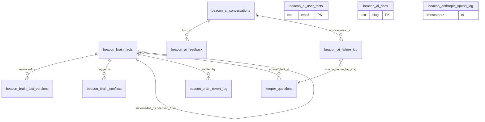
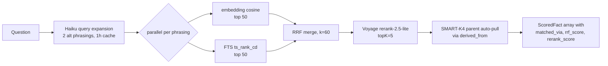
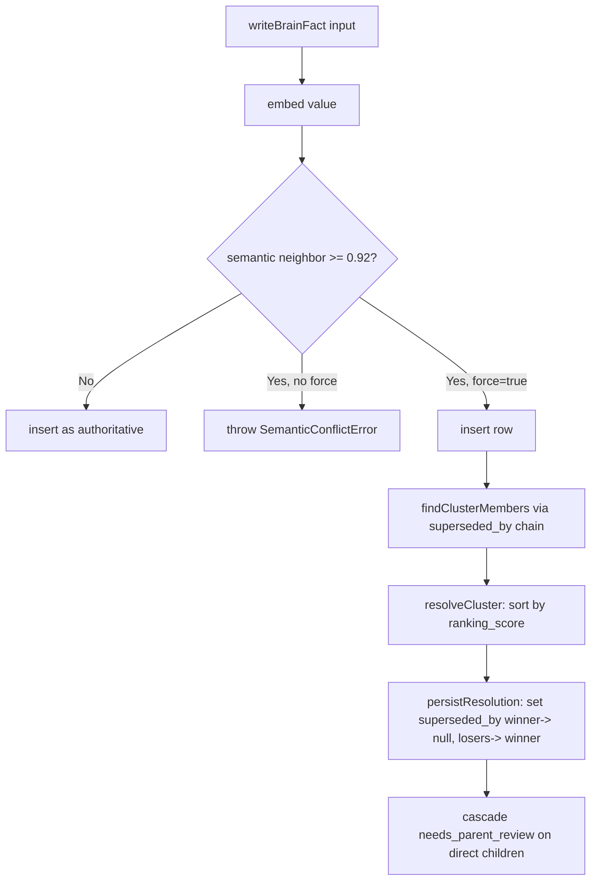
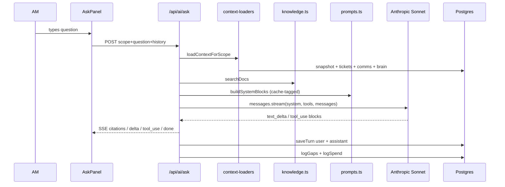
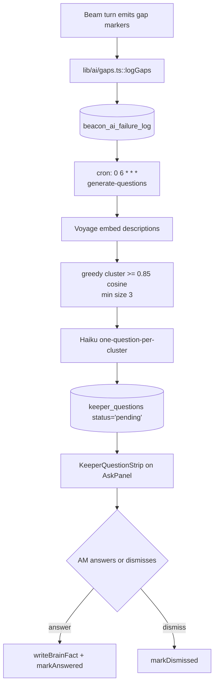

# Beam + Keeper — Engineering Reference

Repo canonical source of truth for the AI copilot (**Beam**) and its per-customer canonical-fact store (**Keeper**). Every path is relative to the `beacon/` repo root. Every function, table, column, env var and cron schedule below has been read out of the current code — cross-references are inline.

---

## 0. TL;DR

Beam is Beacon's in-app AI copilot: a single floating "Ask Beam" panel that follows the AM around the app, resolves scope from the URL (`lib/ai/scopes.ts::pathToScope`), builds a scope-specific system prompt with a tool registry (`lib/ai/prompts.ts` + `lib/ai/tools/index.ts`), streams a Sonnet response over SSE with prompt-caching (`app/api/ai/ask/route.ts`), and cites every claim back to a structured lookup (`lib/ai/citations.ts`).

Keeper is Beam's memory of the customer. It's a topic-clustered fact store — `beacon_brain_facts` in Postgres — with `vector(1024)` embeddings from Voyage AI, tsvector FTS, hybrid RRF retrieval, deterministic conflict resolution, an audit-preserving revert log, and a Validate inbox where AMs promote Haiku-extracted candidates to confirmed truth. Beam reads Keeper on every turn (`lib/brain/retrieval.ts::loadBrainForPrompt` for scope context, `lib/brain/retrieve.ts::retrieveFactsHybrid` for tool-triggered queries) and writes to it via three lanes: Haiku extraction from AM notes (`lib/brain/extract-from-notes.ts`), conversational teach (`lib/ai/tools/add-fact-to-brain.ts`), and voice teach (`lib/keeper/voice-extract.ts` + `KeeperMicButton`).

**One-sentence architecture:** Beam = Sonnet-4.6 with tool-use + prompt caching + citations; Keeper = a Postgres-backed, hybrid-retrieved, conflict-resolved fact store that Beam reads on every turn and writes into via three ingest lanes, with everything auditable and revertable.

---

## 1. Concepts

### Beam — the copilot
Beam is a chat surface, not a page. It mounts under the umbrella app root and follows the user across every scope (inbox, customer-360, customer-book, performance-report/landing, escalation-overview, post-payment-book/customer, miss-payment-overview, negative-keyword-overview). It uses Anthropic Sonnet-4.6 (`process.env.ANTHROPIC_ASK_MODEL ?? "claude-sonnet-4-6"`) via streaming Messages API, with:

- A **scope-aware system prompt** assembled in `lib/ai/prompts.ts::buildSystemPrompt`.
- A **per-scope tool allowlist** in `lib/ai/tools/index.ts::SCOPE_TOOL_ALLOWLIST`.
- A **two-stage tool router** (`lib/ai/tool-router.ts::routeTools`) that uses Haiku to narrow the exposed tool set per turn (SMART-B2).
- **Prompt caching (OPT-1)** on the identity/reasoning/scope-static prefix + the last tool entry — see §4.
- **Inline citation markers** `[cite:<key>]` and a per-turn lookup dict resolved client-side to `<CitationChip>` popovers.
- **Inline confidence markers** `<confidence: NN% — reason1 / reason2 / reason3>` rendered as a `<ConfidenceBadge>`.
- **Inline gap markers** `<gap: category — description>` stripped from render, parsed by `lib/ai/gaps.ts`, persisted to `beacon_ai_failure_log`, and later clustered into the Keeper **Question Bank**.

Beam speaks in the AM's first person on drafts, refuses claims it can't ground, and never invents customer identity. Every mutating tool (`snooze`, `pin`, `add_note`, `mark_contacted_today`, `add_fact_to_brain`, `draft_email_to_contact`, `draft_slack_message`) surfaces an `<ActionCard>` in the transcript — but currently auto-fires via `queueMicrotask` (see `AskPanel.tsx` and `lib/ai/action-state.ts::isResolvable`), so the pending approve/discard buttons are unreachable in practice as of 2026-06-13.

### Keeper — the fact store
Keeper is one per-customer canonical-truth store, keyed on `(customer_id, topic_subcategory, field_name)`. Every fact carries a topic-taxonomy classification (five categories × 21 subcategories × ~45 named fields; plus `"other"` for long-tail), a `confidence_state` (`candidate | confirmed`), a `source_type` (see §2 table), a 1024-dim Voyage embedding, provenance columns, versioning, sunset dates, staleness marks, a `derived_from` parent pointer, a `superseded_by` sibling pointer, and a `citation_count` for AM-feedback boost.

The design decisions live in `migrations/2026-06-04-beacon-brain-wave-1.sql` (the seed) and are extended by nine follow-on migrations. The taxonomy itself lives in `lib/brain/types.ts::FIELD_CATALOG`.

### Direction C — the brand kernel
Beam's UI uses the **flame** glyph (`BeaconMark`) in ember. Keeper's UI uses the **vault** glyph (`KeeperVault` — a brass safe with an ember dial) plus the **`KeeperChip`** label (`"K · topic"` in the current locked format, per `lib/keeper/chip-config.ts::KEEPER_CHIP_LABEL_FORMAT = "abbrev"`). The Watchfire palette — `--char: #2B1F14`, `--ember: #C8431D`, `--brass: #D9A441`, `--patina: #4A7C59`, `--parchment: #FBF8F1`, `--lapis: #1A2F4A` — is used across `AskPanel.tsx`, `BeamThinkingPill.tsx`, `KeeperChip.tsx`, `KeeperVault.tsx` and `CitationChip.tsx`.

---

## 2. Data model

### `beacon_brain_facts` — the Keeper table

Introduced in `migrations/2026-06-04-beacon-brain-wave-1.sql`, incrementally extended.

| Column | Type | Introduced | Meaning |
|---|---|---|---|
| `fact_id` | `UUID PK DEFAULT gen_random_uuid()` | Wave 1 | Canonical fact identity. Referenced by `derived_from`, `superseded_by`, `keeper_questions.answer_fact_id`, `beacon_brain_revert_log.reverted_(from|to)_fact_id`. |
| `customer_id` | `TEXT NOT NULL` | Wave 1 | Chargebee handle. Multi-location businesses share one Keeper. NOT `entity_id`. |
| `topic_category` | `TEXT NOT NULL` | Wave 1 | One of `identity`, `operational`, `behavioral`, `concerns`, `relationship` (last added Wave 1.1 in `types.ts`; no DB check constraint). |
| `topic_subcategory` | `TEXT NOT NULL` | Wave 1 | One of 21 subcategories enumerated in `FIELD_CATALOG`. |
| `field_name` | `TEXT NOT NULL` | Wave 1 | A named field within the subcategory, or the literal string `"other"` for long-tail. Uniqueness on named fields enforced by `beacon_brain_facts_unique_field_idx`. |
| `value` | `TEXT NOT NULL` | Wave 1 | The fact itself. |
| `value_numeric` | `INT NULL` | Wave 1.1 (2026-06-05) | Parsed leading integer for `NUMERIC_FIELDS = {staff_count, location_count, rebook_window_weeks}`. Populated by `parseLeadingInteger`. |
| `confidence_state` | `TEXT CHECK IN (candidate, confirmed)` | Wave 1 | `candidate` until an AM confirms via `/admin/brain/validate`, or auto-confirmed when written by a trusted source (bootstrap / manual / conversational). Only `confirmed` reaches Beam prompts. |
| `source_type` | `TEXT NOT NULL` | Wave 1 (+ `voice_teach` added Wave C) | One of `basesheet`, `chargebee`, `customer_note`, `beacon_ai_conversation`, `beacon_ai_extracted`, `manual`, `voice_teach`. Drives `sourceTrust()` weight. |
| `source_ref` | `TEXT NULL` | Wave 1 | Back-reference (note id, entity_id, invoice_id, `keeper_question:<id>`, or `note:<am_name>:<entity_id>::quote:<verbatim>` for extracted rows). |
| `owning_am_email` | `TEXT NULL` | Wave 1 | AM assigned at write time. Persists across AM transitions. |
| `confirmed_by_email` | `TEXT NULL` | Wave 1 | Set when the fact flips to `confirmed`. |
| `confirmed_at` | `TIMESTAMPTZ NULL` | Wave 1 | Timestamp of the confirm action. |
| `sunset_at` | `TIMESTAMPTZ NULL` | Wave 1 | Expiry; retrieval excludes past-sunset rows. |
| `current_version` | `INT DEFAULT 1` | Wave 1 | Bumped on every material change. |
| `created_at` / `updated_at` / `soft_deleted_at` | `TIMESTAMPTZ` | Wave 1 | Standard audit. Soft-delete = row is invisible to retrieval but preserved. |
| `embedding` | `vector(1024)` | Wave 2b (2026-06-05) | Voyage `voyage-3-lite` embedding of `${sub} / ${field}: ${value}`. Indexed with `ivfflat` cosine, `lists=100`. |
| `search_tsv` | `tsvector GENERATED ALWAYS AS ... STORED` | Wave-1 hybrid FTS (2026-06-10) | Weighted tsvector: `value(A) > field_name(B) > subcategory(C)`. GIN index scoped to live-confirmed. |
| `superseded_by` | `UUID NULL REFERENCES beacon_brain_facts(fact_id) ON DELETE SET NULL` | Wave 2 (2026-06-10) | When set, the row is a supersession loser; default retrieval excludes it. |
| `ranking_score` | `NUMERIC NULL` | Wave 2 | The persisted deterministic score used to pick the cluster winner. |
| `citation_count` | `INT DEFAULT 0` | SMART-K1 (2026-06-11) | Fire-and-forget bump per `recordCitation()` (Beam presentation counter). |
| `last_cited_at` | `TIMESTAMPTZ NULL` | SMART-K1 | Wall-clock of last bump. |
| `derived_from` | `UUID NULL REFERENCES beacon_brain_facts(fact_id) ON DELETE SET NULL` | SMART-K4 (2026-06-11) | Parent-child relationship (e.g. `owner_email` derived from `owner_info`). Same-customer enforced at write. |
| `needs_parent_review` | `BOOLEAN DEFAULT false` | SMART-K4 follow-up | Set when a parent gets superseded — surfaces the child in the Validate inbox. |
| `parent_review_reason` | `TEXT NULL` | SMART-K4 follow-up | Human-readable "parent X superseded by Y on DATE". |
| `is_stale` | `BOOLEAN DEFAULT false` | SMART-K2 (2026-06-11) | Nightly `stale-prune` cron flips when age ≥ 6 months and never cited. |
| `marked_stale_at` | `TIMESTAMPTZ NULL` | SMART-K2 | Distinct from `updated_at` so prune doesn't poison ranking recency. |

The **authoritative-only read filter** used across the code (`repo.getFactsForCustomer`, `retrieve.searchByEmbedding/searchByKeyword`, `searchFacts`) is:

```
soft_deleted_at IS NULL
AND (sunset_at IS NULL OR sunset_at > NOW())
AND superseded_by IS NULL
AND is_stale = false
AND confidence_state = 'confirmed'   -- most reads add this
```

### `beacon_brain_fact_versions` — append-only version log

`(id BIGSERIAL, customer_id, fact_id, version, value, confidence_state, source_type, source_ref, prior_value, changed_by_email, changed_at, change_reason)` with `change_reason IN (create, confirm, refine, edit, reject, conflict_resolved, restored, sunset, soft_delete)`. Emitted by every mutation in `lib/brain/repo.ts::writeVersion` and by `lib/brain/revert.ts` (with reason `restored`). See §3.

### `beacon_brain_conflicts` — semantic-conflict queue

Present since Wave 1 but partially superseded by Wave-2's `superseded_by` chain. Holds Haiku-adjudicated `differ | uncertain` rows for the legacy resolve-in-Validate-inbox flow.

### `beacon_brain_revert_log` — WAVE-A-2 audit

`migrations/2026-06-12-beacon-brain-revert-log.sql`. `(id, reverted_at, customer_id, reverted_from_fact_id UUID, reverted_to_fact_id UUID, actor_email, reason)`. Written by `lib/brain/revert.ts::revertSupersession` inside a single Neon transaction alongside two version-log rows.

### `keeper_questions` — WAVE-B Question Bank

`migrations/2026-06-13-keeper-questions.sql`. `(id BIGSERIAL, created_at, customer_id, entity_id, question_text, source_failure_log_ids BIGINT[], cluster_signature TEXT, category CHECK IN (data_missing, tool_insufficient, out_of_scope, assumption_unclear), status CHECK IN (pending, answered, dismissed), answered_at, answered_by, answer_fact_id UUID REFERENCES beacon_brain_facts(fact_id) ON DELETE SET NULL, dismissed_at, dismissed_by)`. Partial unique index on `(cluster_signature) WHERE status='pending'` prevents duplicate regeneration while a version is live.

### `beacon_ai_conversations` + turns

`migrations/2026-05-22-beacon-ai-memory.sql`. `(id, email, scope_key, role, content, metadata JSONB, ts)`. Beam persists both user + assistant turns via `lib/ai/memory.ts::saveTurn` on every ask. Assistant `metadata` carries `{model, audience, active_fact_ids, scope_key, tool_routing:{routed, cache_hit, picked, candidate_count, skip_reason}}`. Indexed on `(email, ts DESC)` and `(email, scope_key, ts DESC)`.

### `beacon_ai_user_facts` — USER PROFILE (per-AM style memory)

Distinct from Keeper — this is per-user style/tone/depth memory, NOT per-customer knowledge. `migrations/2026-05-22-beacon-ai-facts.sql` + `2026-05-25-beacon-ai-e12.sql` adds `scope_key`. Columns: `(id, email, fact TEXT, category, source, confidence NUMERIC(3,2), created_at, last_seen_at, reference_count, active, scope_key)`. Sources: `extracted` (Haiku cron every 12h, 0.85 → 1.00 on repeat), `explicit` (`/remember` slash, 1.00), `onboarding` (`/api/ai/onboarding` POST), `feedback` (adjustments via `adjustFactConfidence`).

### `beacon_ai_feedback` — thumbs signal

`migrations/2026-05-25-beacon-ai-e12.sql` + `2026-06-10-beacon-ai-feedback-confidence-tier.sql`. `(id, email, turn_id BIGINT, signal CHECK IN (up, down), reason TEXT, confidence_tier CHECK IN (high, medium, low, NULL), created_at)`. Unique on `(turn_id, signal)`. Feeds `adjustFactConfidence`: `+0.05` on up, `−0.15` on down, auto-deactivates below `0.30`.

### `beacon_ai_docs` — Knowledge Base

`migrations/2026-06-03-beacon-ai-knowledge.sql`. Markdown KB. `(id, slug UNIQUE, title, body, section, scope_tags TEXT[], version, last_edited_by, created_at, updated_at, search_vec tsvector GENERATED ALWAYS AS ... STORED)`. GIN index on `search_vec` plus GIN index on `scope_tags`. Read by every `/api/ai/ask` call via `lib/ai/knowledge.ts::searchDocs(question, scope, DEFAULT_KB_CHUNK_LIMIT=3)`.

### `beacon_ai_failure_log` — the gap tracker

`migrations/2026-06-03-beacon-ai-failure-log.sql`. `(id, occurred_at, scope, scope_meta JSONB, user_email, user_role, question, category CHECK IN (data_missing, tool_insufficient, out_of_scope, assumption_unclear), description, full_response, conversation_id BIGINT, resolved_at, resolved_by, resolution_note)`. Populated by `lib/ai/gaps.ts::logGaps` at the tail of every Beam ask.

### `beacon_anthropic_spend_log` + `beacon_anthropic_daily_alerts` — cost observability

`migrations/2026-06-11-anthropic-spend-log.sql`. Fire-and-forget per-call rows: `(feature, model, input_tokens, output_tokens, cache_read_tokens, cache_creation_tokens, cost_usd, scope, email)`. `beacon_anthropic_daily_alerts (alert_date, alert_threshold_usd)` dedupes the $5-per-day Slack alarm. See `lib/ai/spend-log.ts`.

### ERD



---

## 3. Keeper — full lifecycle

### 3.1 Ingest paths (five lanes)

| Lane | File | source_type | Auto-confirmed? |
|---|---|---|---|
| BaseSheet bootstrap (one-shot / batch) | `lib/brain/bootstrap.ts::bootstrapBrainFromSnapshot`, `lib/brain/metabase-bootstrap.ts::bootstrapKeeperForEntities` | `basesheet` / `chargebee` | Yes — `system+bootstrap@beacon.zoca` / `system+bootstrap-basesheet@beacon.zoca` |
| Metabase enrichment cron (weekly) | `lib/brain/metabase-enrichment.ts::runMetabaseEnrichment` | `basesheet` | Yes — `system+enrichment@beacon.zoca` |
| Haiku extraction from customer notes (daily) | `lib/brain/extract-from-notes.ts::runExtractionSince` | `beacon_ai_extracted` | **No** — lands as candidate |
| Conversational teach via Beam tool | `lib/ai/tools/add-fact-to-brain.ts::execute` | `beacon_ai_conversation` | Yes — confirmed_by_email = AM |
| Voice teach via mic | `lib/keeper/voice-extract.ts::extractFactFromTranscript` + `app/(customer)/api/keeper/voice-extract/confirm/route.ts` | `voice_teach` | Yes — confirmed_by_email = AM |

Two more implicit lanes: **manual Validate-inbox reclassify / edit** (`repo.editAndConfirmCandidateFact`, `repo.reclassifyCandidateFact`) and **Question Bank answer** (`app/(customer)/api/keeper/questions/[id]/answer/route.ts` → `writeBrainFact` with `source_type: "manual"`, `source_ref: keeper_question:<id>`).

### 3.2 Storage — `writeBrainFact` conflict resolution

The universal write path lives in `lib/brain/repo.ts::writeBrainFact(input: BrainFactWrite)`. It:

1. Validates category ↔ subcategory (`categoryForSubcategory`) and named-field-vs-`"other"` shape (`isNamedField`).
2. Computes `value_numeric` via `parseLeadingInteger` when `field_name ∈ NUMERIC_FIELDS`.
3. Rejects cross-customer `derived_from` (soft-fail — reads parent, checks `parent.customer_id === customer_id`).
4. Embeds `factEmbeddingText(sub, field, value)` = `` `${sub} / ${field}: ${value}` `` via `lib/brain/embeddings.ts::embedText` (Voyage `voyage-3-lite`, 1024-dim).
5. For non-named or `"other"` writes (true insert paths) and for named-field-with-no-existing rows: probes the semantic neighbor via SQL `SELECT fact_id, value, 1 - (embedding <=> vec::vector) AS similarity ... ORDER BY embedding <=> vec::vector LIMIT 1`. If `similarity >= SEMANTIC_DUPLICATE_THRESHOLD` (`W2B_DUP_THRESHOLD`, default `0.92`) **and** `force_semantic_conflict !== true`, throws `SemanticConflictError { conflicting_fact_id, conflicting_value, similarity, proposed_value }`.
6. On `force=true` conflict, inserts the row anyway and then invokes `applyConflictResolution({ new_fact, neighbor_fact_id })` (see §3.7).
7. Named-field upsert: idempotent no-op when `value + source_type` match (bumps `updated_at`); else `UPDATE ... value, value_numeric, source_type, source_ref, current_version = +1, embedding, derived_from = COALESCE(new, existing), confirmed_by_email = COALESCE(new, existing), confirmed_at = CASE WHEN new IS NOT NULL THEN NOW() ELSE confirmed_at END` and emits a `'edit'` version row.
8. Emits an `INSERT INTO beacon_brain_fact_versions` row per mutation.

### 3.3 Retrieval — hybrid pipeline

Beam has two Keeper read paths:

**Load-all-for-prompt** (`lib/brain/retrieval.ts::loadBrainForPrompt(customer_id)`) — every scope that has a customer bound to it (customer-360, performance-report) calls this. Returns a topic-clustered `prompt_block` capped at `MAX_FACTS_PER_CUSTOMER = 40` with a floor rule: `FLOOR_CATEGORIES = {identity, operational}` are always kept; the tail (behavioral + concerns + relationship + other) is sorted `confirmed_at DESC` and sliced to fit. Each value is annotated with the inline marker `[cite:fact:<fact_id>]` (WAVE-A-HOTFIX, 2026-06-13 — see §3.5). Also emits `currently_managed` = derived AM/AE/Pod/SP from `readLatestSnapshotV2()` (never stored; recomputed on every load; `DERIVED_ASSIGNMENT_FIELDS = [current_am, current_ae, current_pod, current_sp]`).

**Hybrid retrieval on demand** (`lib/brain/retrieve.ts::retrieveFactsHybrid`) — the model-facing search, invoked by `read_customer_brain` (when `question` present), `query_brain`, `get_full_customer_view`, and the Question Bank scheme:



Constants live in `lib/brain/retrieve.ts`: `RRF_K = 60`, default `candidatesPerStage = 50`, default `topK = 5`, `EXPANSION_CACHE_TTL_MS = 60*60*1000`. Rerank skipped when `candidates.length ≤ 1`. The original query (not expansions) is passed to the reranker so cross-attention signal isn't diluted. Parent auto-pull respects the same-customer scope, skips superseded / deleted parents, caps additive pulls at `topK * 2`.

### 3.4 Prompt injection

`loadBrainForPrompt` output is folded into the CONTEXT JSON of every customer-bound scope inside `lib/ai/context-loaders.ts::loadCustomer360Context`. The prompt block is a `{identity, operational, behavioral, concerns, relationship, other[]}` object keyed `${sub}.${field}` with `value + [cite:fact:<id>]` appended per row. The `fact_ids_for_citation` map is lifted via `buildBrainStaticCitations` into the `_citation_lookup` block so `[cite:fact:<id>]` chips resolve in the AskPanel.

### 3.5 Citation surfacing

There are two ways Keeper facts become clickable chips:

1. **Static** — `lib/ai/citations.ts::buildBrainStaticCitations(factIdsForCitation)` produces `{[cite:fact:<id>]: { label, value, category:"fact", raw:{...fact_slot}, source_type:"keeper_static" }}`. Added by every scope loader that includes a Keeper prompt block. This is what WAVE-A-HOTFIX (2026-06-13) fixed — before the hotfix, `loadBrainForPrompt` values had no inline marker, so any Keeper fact Beam parroted showed up as a dashed "(unverified)" chip.
2. **Provenance** — `lib/ai/citations.ts::buildBrainProvenanceCitations({facts, candidatePoolSize, query})` used after every hybrid retrieval. Attaches `provenance: {matched_via, rrf_score, rerank_score, rank, candidate_pool_size, query}` so the `<ProvenanceTrace>` in `CitationChip.tsx` can render the "why" bar. AskPanel lifts these into `extra_citations` on the tool-continuation ask so the chip resolves on the follow-up assistant turn.

### 3.6 Coverage / Memory Score

`lib/brain/coverage.ts` — WAVE-A-1. Enumerates `FIELD_CATALOG` (excluding `"other"` and derived assignment fields) into slots, weights per-category: `operational: 1.5, identity: 1.4, behavioral: 1.0, concerns: 1.0, relationship: 0.8`. `computeCoverage(customer_id)` returns `{percent, slotsFilled, slotsTotal, perCategory}`. `coverageConfidence(percent)`: `≥80 → high (brass)`, `50–79 → moderate (ember)`, `<50 → low (patina)`. Cached 5 minutes via `getCachedContext("keeper-coverage", ...)`. Surfaced as a `<KeeperChip topic="X% covered" confidence>` in the `V2BrainPanel` header. Reads `getFactsForCustomer(cid, {confirmedOnly: false})` — candidates count as coverage on the theory that "Keeper knows something".

### 3.7 Ranking / conflict resolution — Wave 2 supersede chain

`lib/brain/ranking.ts`. When `writeBrainFact` inserts under `force_semantic_conflict = true`, it hands off to `applyConflictResolution → findClusterMembers → resolveCluster → persistResolution`.

The score formula:

```
score = recencyWeight × confidenceMultiplier × sourceTrust × amFeedbackBoost
```

- `recencyWeight = 0.5 ^ (daysAgo / 60)` — 60-day half-life; future-dated = 1.0.
- `confidenceMultiplier = 1.0` when `confirmed`, `0.3` otherwise.
- `sourceTrust`: **basesheet = 1.0, chargebee = 1.0, manual = 0.95, voice_teach = 0.85, customer_note = 0.75, beacon_ai_extracted = 0.65, beacon_ai_conversation = 0.55**, default 0.5.
- `amFeedbackBoost = 1 + 0.3 · log10(1 + citation_count)` — 0→1.0×, 1→~1.09×, 10→~1.31×, 100→~1.60×.

Ties broken by `fact_id ASC` for stability. `persistResolution` sets the winner's `superseded_by = NULL, ranking_score = winnerScore` and each loser's `superseded_by = winner.fact_id, ranking_score = loserScore`. It intentionally **does not touch `updated_at`** so recency isn't poisoned on re-runs. Then it cascades SMART-K4: for each loser, `UPDATE beacon_brain_facts SET needs_parent_review = true, parent_review_reason = 'parent fact <loser> superseded by <winner> on <YYYY-MM-DD>' WHERE derived_from = loser` (direct children only — no grandchild cascade).



### 3.8 Validation — the Validate inbox

`/admin/brain/validate` — `app/admin/brain/validate/page.tsx` + `ValidateInboxView.tsx`. Any signed-in role sees this. It fetches `GET /api/v2/brain/validate?mine=1?` returning candidates grouped by AM → bizname. Four keyboard actions per row (J/K nav, C confirm, E edit, X reclassify, R reject) POST `/api/v2/brain/validate/${fact_id}` with `{action: "confirm" | "edit_confirm" | "reclassify" | "reject"}`. On the DB side these are `repo.confirmCandidateFact`, `editAndConfirmCandidateFact`, `reclassifyCandidateFact` (source rejected + target created), `rejectCandidateFact` (soft-delete with reason `'reject'`). Rows tagged `can_revert: true` (i.e. `EXISTS(superseded_by = fact_id)`) get an inline ↺ Revert button that POSTs to `/api/admin/keeper/revert`.

### 3.9 Revert / rollback

`lib/brain/revert.ts::revertSupersession(factId, actorEmail, reason?)`. Loads the currently-live fact, finds the most-recent ancestor via `superseded_by = factId ORDER BY updated_at DESC LIMIT 1`, then executes a 5-write Neon transaction: demote current (`superseded_by = ancestor, current_version++`), promote ancestor (`superseded_by = NULL, is_stale = false, marked_stale_at = NULL, current_version++`), append `beacon_brain_revert_log` row, and two `beacon_brain_fact_versions` rows both with `change_reason = 'restored'` and `source_ref = reason ? 'revert:${reason}' : 'revert'`. Cross-customer chains return `chain_broken`. Reason truncated to 500 chars. `canRevert(factId)` — the read-helper — returns true only if there's a live ancestor pointing at the fact.

### 3.10 Pruning — SMART-K2 auto-stale

`lib/brain/stale-prune.ts::runStalePrune({ageMonths = 6, dryRun = false})`. Nightly cron flips `is_stale = true` on rows where `updated_at < NOW() - '<n> months'::interval AND citation_count = 0 AND soft_deleted_at IS NULL AND is_stale = false`. Post-cron, the default read filter excludes stale rows. Slack sanity alert when marked > 100.

### 3.11 Derived_from — SMART-K4 parent/child

Wave-2b column added by `migrations/2026-06-11-beacon-brain-derived-from.sql`. Populated by AMs via `add_fact_to_brain.derived_from` or automatically when Haiku extraction recognizes a child pattern. `retrieveFactsHybrid` auto-pulls parents whenever a child lands in topK (see `expandWithParents`). Followup migration `2026-06-11-beacon-brain-needs-parent-review.sql` adds a flag that surfaces orphaned children in the Validate inbox after a supersede cascade.

---

## 4. Beam — full lifecycle

### 4.1 Scope resolution

`lib/ai/scopes.ts::pathToScope(pathname)`. Supported `AiScope` kinds: `inbox`, `customer-360 {entityId}`, `customer-book`, `performance-landing`, `performance-report {entityId}`, `escalation-overview`, `post-payment-book`, `post-payment-customer {cbCustomerId}`, `miss-payment-overview`, `negative-keyword-overview`, `hidden`. `scopeKey(scope)` produces a stable string incorporating IDs. `scopeQuickPrompts(scope)` returns 4 canned openers per scope for the empty-state chip grid in AskPanel.

### 4.2 Per-scope context loading

`lib/ai/context-loaders.ts::loadContextForScope(scope, {audience, amFilter, bypassCache})` dispatches per `.kind`. Each loader returns `{audience, blob, meta, citationLookup?}`. Constants: `AM_BOOK_TOP_N = 20` (trimmed from 80 for OPT-3), `TICKETS_TOP_N = 40`, `POSTPAYMENT_TOP_N = 50`, `SILENCE_THRESHOLDS = [30, 60, 90, 120]`.

- `loadInboxContext({amFilter})` — top 12 RED + 8 YELLOW customers by composite desc, plus ticket + silence rollups; per-entity comms perspectives; produces `_citation_lookup` keys for the sub-scores and buckets.
- `loadCustomer360Context(entityId, {bypassCache})` — parallel `Promise.allSettled` of `fetchEntityReportData`, `fetchTicketsForCustomer`, Chargebee `getCustomer`, `readPerspective`, `loadBrainForPrompt(sc.customer_id)`. Emits `signals`, `metrics`, `performance`, `escalations`, `post_payment`, `comms_perspective`, and `brain: brain.prompt_block`. Citations = base + comms + `buildBrainStaticCitations`.
- `loadCustomerBookContext({amFilter, bypassCache})` — top-20 at-risk, per-AM silence bucket rollups.
- `loadPerformanceLandingContext()` — total_active + median composite.
- `loadPerformanceReportContext(entityId)` — GBP peak/current/dip on COMPLETE months only (last idx = in-progress), top-30 keywords, lead source mix, forecast (WITHOUT surfacing `predicted_6_month_leads` per policy).
- `loadEscalationOverviewContext()` — top 40 tickets, per-classification aged14/aged30 rollups.
- `loadPostPaymentBookContext()`, `loadMissPaymentOverviewContext()`, `loadNegativeKeywordOverviewContext()` — verdict counts + top N lists with citation keys per row.

### 4.3 Prompt building

`lib/ai/prompts.ts::buildSystemPrompt(scope, contextBlob, memory?, userProfile?)` — one big switch on `scope.kind`. Every branch is:

```
${COMMON}\n\nSCOPE: ...\n\nTOOLS AVAILABLE: ...\n\nSCOPE-SPECIFIC HEURISTICS: ...\n\n${header}\n\n${profileSection}${memorySection}CONTEXT (JSON):\n${contextBlob}
```

`COMMON` composes `IDENTITY + REASONING + VOICE + PERSPECTIVE_INTERPRETATION + KNOWLEDGE_BASE_INTERPRETATION + TOOL_USE_CONTRACT + GAP_REPORTING` — every block is verbatim in the file. The tool-use contract enforces **ONE CUSTOMER PER TURN**, mandatory `bizname`, plan-before-chain, inline `<confidence: NN% — r1 / r2 / r3>`. The gap contract limits categories to 4 and descriptions to ≤80 chars.

**Prompt caching** (`buildSystemBlocks`) — splits the full system into `{common, scopeStatic, volatileTail}` at the `"Context generated at "` marker. The ask route wraps `common + scopeStatic` with `cache_control: { type: "ephemeral" }` and also caches the last tool entry. Cache hits show up in `logSpend({feature:"ask", cache_read_tokens, cache_creation_tokens, ...})`.

### 4.4 Tool registry

Every tool is a `BeaconTool { name, description, input_schema, execute(args, ctx) → ToolResult }` in `lib/ai/tools/*`. `ToolExecutionContext` provides `{amEmail, amName, role, customerId, customerName, cbCustomerId}`.

| Tool | Purpose |
|---|---|
| `read_customer_brain` | Keeper read for one customer — hybrid if `question` present, else full topic-clustered dump. Fires `recordCitation` on hits. |
| `query_brain` | Manager/admin cross-book Keeper search; hybrid + structured filter modes with pagination. |
| `add_fact_to_brain` | Write a new Keeper fact from Beam conversation. Handles `force` for semantic conflict + `derived_from` parent. |
| `read_customer_notes` | Private AM-notes reader; role-scoped (AM sees own, manager/admin sees all). |
| `get_chargebee_billing` | Direct Chargebee REST (customer, subscriptions, invoices, transactions) with a 12s abort. |
| `get_customer_performance` | GBP metrics (complete-months only), keyword count + top 3/10, YTD leads, review target. Never surfaces `predicted_6_month_leads`. |
| `get_booking_history` | `website.booking_enquiries` last 90d with utm mix + conversion rate. |
| `get_mixpanel_activity` | `mixpanelzocaappdata.export` on `"locationEntityId"` — app opens, session days, leads engagement, review actions, engagement tier. |
| `get_review_summary` | `reviews.reviews`; `rating` mapped from enum text; trend split via `TREND_DELTA = 0.2`. |
| `get_customer_from_metabase` | Self-healing BaseSheet fallback — pulls live row AND writes back into Keeper as `source_type = 'basesheet'`, `confirmed_by_email = 'system-metabase-fallback@beacon.zoca'`. |
| `get_full_customer_view` | Bundle-of-5 parallel loader (Keeper + comms perspective + performance + escalations + notes). |
| `lookup_customer` | Fuzzy 5-hit snapshot search with weighted scoring (biz match, cb match, entity_id prefix). |
| `query_customer_book` | Parameterized aggregate over snapshot: `metric × group_by × buckets (threshold/range/sum)` with citation-key synthesis. |
| `draft_email_to_contact` | Haiku draft in AM's voice using their style facts + top HubSpot contact. |
| `draft_slack_message` | Haiku draft for internal Slack, lowercase, no formalities. |
| `mark_contacted_today` | Writes an `am_actions` row with channel prefix in note body. |
| `snooze_customer` | Sets a snooze via `snoozeCustomer(amName, entity_id, days, ...)`. Duration ∈ {1,3,7,14,30}. |
| `pin_customer` | Idempotent pin/unpin. |
| `add_note` | Prepends new content to existing AM note, capped at 4000 chars. |

`SCOPE_TOOL_ALLOWLIST` per-scope subsets are enumerated verbatim in `lib/ai/tools/index.ts`. `getToolsForScope(kind)` returns the allowlisted array; the second-stage `routeTools` narrows further per turn.

### 4.5 Ask endpoint flow

`POST /api/ai/ask` — `app/api/ai/ask/route.ts`. `runtime = nodejs`, `dynamic = force-dynamic`, `maxDuration = 60`. Model: `ANTHROPIC_ASK_MODEL ?? "claude-sonnet-4-6"`, `MAX_TOKENS = 2400`, `MAX_HISTORY_TURNS = 6`.

1. Auth via `getServerSession` OR bearer `x-eval-runner-token = EVAL_RUNNER_TOKEN` (synthetic `eval-runner@zoca.ai`, admin).
2. Validate `{scope, question, history?, extra_citations?}`; caps: 2000 chars for humans, 16000 for tool-continuation strings starting with `[Beacon ran ` / `[Beacon's `.
3. `loadContextForScope(scope, {audience, amFilter})` — AM role gets `amFilter = user.am_name` on inbox/customer-book/negative-keyword-overview.
4. `searchDocs(question, scope, 3)` merges KB citation keys.
5. Load memory: `getScopeConversations(email, sKey, 30)`, `getRecentCrossScope(email, sKey, 18)`, `listFactsForUser(email, {scopeKey: sKey})` in parallel; render into system prompt.
6. Prompt-cache split via `buildSystemBlocks`; two `cache_control: {type:"ephemeral"}` markers on system, one on the last tool.
7. Two-stage tool routing (`routeTools`) narrows the tool array to 1–3; soft-fails to full scope subset. Bulk guard (`shouldAllowToolUse`) blocks multi-entity fan-out.
8. Stream via Anthropic Messages API. SSE frames:

| Frame | Payload |
|---|---|
| `data: {"citations": {...}}` | Once at stream start when non-empty. |
| `data: {"delta": "..."}` | Text tokens. |
| `data: {"tool_use": {id, name, input}}` | Per finalized tool_use block. |
| `data: {"error": "..."}` | Terminal on failure. |
| `data: {"done": true, "audience", "turn_id", "feedback_enabled": true}` | Terminal on success. |

9. Persist user + assistant turns via `saveTurn`; assistant `metadata = {model, audience, active_fact_ids, scope_key, tool_routing:{...}}`.
10. Parse `<gap:...>` markers → `logGaps(...)` writes to `beacon_ai_failure_log` with `conversation_id = assistantTurnId`.
11. `logSpend({feature:"ask", ...extractUsage(finalMessage), scope, email})`.
12. `logUmbrellaActivity("claude_asked", ...)`.



### 4.6 Tool execution

The AskPanel intercepts every `tool_use` SSE frame, wraps the payload in an `<ActionCard>` with `status: "approving"`, and immediately calls `resolveToolUse(turnIdx, id, "approve")` via `queueMicrotask` (auto-fire). The approve path POSTs `/api/ai/action/execute {tool_use_id, tool_name, args, customer_id}`, which routes to the correct `tools/*::execute`. On success the card flips to `"approved"` and `askWithToolResult(data, {ok:true, summary, data})` fires a follow-up ask containing a bracketed `[Beacon ran ...]` synthetic user message with the raw JSON inlined and per-tool formatting instructions (see `AskPanel.tsx::askWithToolResult` for the verbatim tail-instructions).

For `TOOLS_WITH_EXTRA_CITATIONS = {query_customer_book, read_customer_brain, query_brain}`, the client lifts `outcome.data.citations` into `extra_citations` on the continuation ask so the follow-up assistant turn's `[cite:*]` chips resolve.

`lib/ai/action-state.ts` — `ActionCardStatus` state machine. `RESOLVABLE_STATUSES = ["pending", "approving"]`. `TERMINAL_STATUSES = ["approved", "discarded", "error"]`. `isResolvable(status)` gates `resolveToolUse` — after 2026-06-11 hang bug caused by React-18 stale updaters, this is now the single guard.

### 4.7 UI transcript

`components/ai/AskPanel.tsx` (2089 lines). Floating "✨ Ask Beam" pill, 480px right-drawer, parchment background. `<Bubble>` renders per turn with SERIF assistant / char-bg user. `<BeamThinkingPill>` shows an in-flight spinner keyed by `getBeamThinkingState(toolName)` — **vault** for Keeper tools (`read_customer_brain`, `query_brain`, `add_fact_to_brain`) with an animated `<SpinningVault>` inline SVG, **flame** (`BeaconMark`) for everything else. `<ActionCard>` collapses on approve to a slim green `✓` bar, or renders `<DraftEmailResult>` / `<DraftSlackResult>` / `<LookupResult>` for rich-result tools. `<CitationChip>` delegates to `<KeeperChip>` when `entry.category === "fact"` — brand-consistent Keeper "K · topic" chip inline in prose.

### 4.8 Confidence

`components/ai/ConfidenceBadge.tsx` parses `<confidence: NN% — r1 / r2 / r3>` via `CONFIDENCE_PATTERN_SOURCE`. Tier: `≥80 → high (patina)`, `≥55 → medium (brass)`, else `low (ember)`. Renders as inline pill or ActionCard header. Click opens popover with per-reason bullets.

### 4.9 Suggestions

`POST /api/ai/suggest {scope}` → `SuggestedAction[]` via `lib/ai/suggest.ts`. Model: `ANTHROPIC_SUGGEST_MODEL ?? "claude-haiku-4-5-20251001"`, `MAX_TOKENS = 1500`. Cached 30 min via `getCachedContext("suggest:...", ...)` keyed on scope + snapshot_date + user. Kinds: `ask`, `draft` (auto-submits into AskPanel), `navigate`. Sanitized `href` restricted to internal paths or `https://linear.app/*`. Renders as `<SuggestedActions>` on Customer 360; Keeper-grounded suggestions inline a `<KeeperChip>`.

### 4.10 Failure logging

Every ask parses `<gap:...>` markers via `lib/ai/gaps.ts::parseGaps` (regex `GAP_PATTERN = /<gap:\s*([a-z_]+)\s*[—:\-]\s*([^>]+?)\s*>/gi`), dedupes by `category::lowerDescription`, strips them from render, then `logGaps({scope, scope_meta, user_email, user_role, question, full_response, conversation_id, gaps})` writes one `beacon_ai_failure_log` row per gap. That log feeds the Question Bank cron (§5) and the `/admin/beacon-ai-gaps` triage view.

### 4.11 Feedback loop

Thumbs UI on each assistant `<Bubble>` posts `POST /api/ai/feedback {turn_id, signal, confidence_tier}`. Server verifies ownership, dedup-inserts into `beacon_ai_feedback (turn_id, signal)` — vote flip = delete opposite then insert. On first insert, reads `metadata.active_fact_ids` and calls `adjustFactConfidence(email, ids, signal)`: `+0.05` up, `−0.15` down, auto-deactivates below `0.30`. `confidence_tier` powers the `/admin/anthropic-spend`-adjacent calibration table (per-tier hit rate). Telemetry `event_name: "claude_feedback"`.

---

## 5. Question Bank (WAVE-B)

The gap log accumulates thousands of unresolved `<gap:...>` markers over weeks. Question Bank clusters them and surfaces one canonical question per cluster back to the AM.



**Files:** `lib/keeper/question-cluster.ts` (`MIN_CLUSTER_SIZE = 3`, `cosineSimilarity`, `clusterGaps(threshold=0.85)`, `clusterSignature(ids)` = sha256 of sorted-ids sliced to 16 hex chars), `lib/keeper/question-generator.ts` (Haiku via `ANTHROPIC_KEEPER_QUESTION_MODEL ?? "claude-haiku-4-5-20251001"`, `MAX_QUESTION_WORDS = 60`, returns null when cluster incoherent), `lib/keeper/questions-repo.ts` (CRUD).

**Cron:** `GET /api/cron/keeper/generate-questions` at `0 6 * * *` (daily 06:00 UTC / ~11:30 IST). `maxDuration = 300`. Steps: pull last 30d unresolved gaps → drop already-referenced failure_log ids → embed each description via Voyage → cluster with threshold 0.85 → for each cluster call `pendingSignatureExists` short-circuit → `generateQuestion(...)` → `createQuestion(...)`. Hard cap `MAX_INSERTS_PER_RUN = 50`. Budget: ~$0.30/mo total.

**API routes:** `GET /api/keeper/questions?entity_id=|customer_id=&limit=3` (soft-fails to `[]`), `POST /api/keeper/questions/[id]/answer {answer_value, topic_subcategory, field_name, topic_category?}` (writes fact `source_type: "manual"`, `source_ref: "keeper_question:<id>"`, then `markAnswered`), `POST /api/keeper/questions/[id]/dismiss` (idempotent).

**UI:** `components/keeper/KeeperQuestionStrip.tsx` — mounted above the AskPanel composer, brass-bordered card with `<KeeperVault>` glyph and Georgia-italic question text; returns null when empty/loading/error (never renders an empty state). 409 semantic-conflict on answer shows inline warning; form stays open.

---

## 6. Voice teach (WAVE-C)

Both `KeeperMicButton` (on V2BrainPanel) and `BeamMicButton` (in AskPanel composer, enabled only for customer-360 / performance-report scopes) share the same pipeline:

1. `hooks/useVoiceTranscript.ts` — uses `window.SpeechRecognition ?? webkitSpeechRecognition`, `lang="en-US"`, `continuous=false`, `interimResults=true`. Exports `{supported, isListening, transcript, error, start, stop, reset}`. Firefox unsupported — surfaced as `supported=false`.
2. On stop, POST `/api/keeper/voice-extract {transcript, entity_id}`. Route soft-resolves bizname/customer_id, calls `lib/keeper/voice-extract.ts::extractFactFromTranscript` with `ANTHROPIC_KEEPER_VOICE_MODEL ?? "claude-haiku-4-5-20251001"`, `MAX_TOKENS = 600`, `maxRetries = 2`.
3. Haiku returns either `{topic_category, topic_subcategory, field_name, value, confidence}` or `{unparseable: true, reason}`. Category-subcategory mismatch is coerced via `categoryForSubcategory`. Unknown named field is coerced to `"other"`.
4. UI renders a `<VoiceFactCard>` (dropdowns for subcategory + field, textarea for value, confidence label).
5. On confirm, POST `/api/keeper/voice-extract/confirm {entity_id, topic_category, topic_subcategory, field_name, value, force?}`. Route resolves entity_id → customer_id (404 if unknown, 422 if no Chargebee handle), calls `writeBrainFact({..., source_type: "voice_teach", source_ref: user.email, owning_am_email: user.email, confirmed_by_email: user.email, force_semantic_conflict: force})`.
6. `SemanticConflictError` → 409 with `{conflict: {conflicting_fact_id, conflicting_value, similarity, proposed_value}}` and "Save anyway" button that re-POSTs with `force: true`.
7. `logUmbrellaActivity({agent:"customer", event_name:"keeper:voice_teach:confirm", ...})`.

---

## 7. UI surfaces

| Component | File | Where it renders | What data | Access role |
|---|---|---|---|---|
| AskPanel | `components/ai/AskPanel.tsx` | Global — right drawer under umbrella | Scope + turns + citations | Every signed-in user |
| ActionCard | `components/ai/ActionCard.tsx` | Inside AskPanel turn | Tool-use proposal + result | — |
| BeamThinkingPill | `components/ai/BeamThinkingPill.tsx` | In-flight bubble | `tool_name → vault | flame` | — |
| BeamMicButton | `components/ai/BeamMicButton.tsx` | AskPanel composer | Voice → voice-extract | AM/Manager/Admin, customer-360 or performance-report scope only |
| ConfidenceBadge | `components/ai/ConfidenceBadge.tsx` | Inline in assistant bubbles + on ActionCards | `<confidence: NN%>` marker | — |
| CitationChip | `components/ai/CitationChip.tsx` | Inline in prose | `_citation_lookup[key]` | — |
| SuggestedActions | `components/ai/SuggestedActions.tsx` | Customer 360 sidebar | `POST /api/ai/suggest` | Every user |
| KeeperChip | `components/keeper/KeeperChip.tsx` | Inline anywhere a Keeper fact is cited (also V2BrainPanel header) | `{topic, source?, confirmedAt?, confidence}` | — |
| KeeperVault | `components/keeper/KeeperVault.tsx` | Brand glyph inside Chip, MicButton, ThinkingPill | Static SVG | — |
| KeeperMicButton | `components/keeper/KeeperMicButton.tsx` | V2BrainPanel header | Voice → voice-extract | AM/Manager/Admin |
| KeeperQuestionStrip | `components/keeper/KeeperQuestionStrip.tsx` | Between transcript and composer in AskPanel | `GET /api/keeper/questions` | Every user |
| V2BrainPanel | `components/customer/v2/CustomerDetail/V2BrainPanel.tsx` | Customer 360 right rail | `GET /api/v2/brain/{entityId}` + coverage | AM/Manager/Admin |
| ValidateInboxView | `app/admin/brain/validate/ValidateInboxView.tsx` | `/admin/brain/validate` | Candidate list | Any signed-in |
| BrainSearchView | `app/admin/brain/search/BrainSearchView.tsx` | `/admin/brain/search` | Cross-book filter search | Manager + admin |
| RerankCompareView | `app/admin/brain/rerank-compare/RerankCompareView.tsx` | `/admin/brain/rerank-compare` | Voyage rerank A/B | Admin only |
| Reject-rate page | `app/admin/brain/reject-rate/page.tsx` | `/admin/brain/reject-rate` | `getCandidateOutcomeStats` | Manager + admin |
| Enrichment status page | `app/admin/keeper/enrichment-status/page.tsx` | `/admin/keeper/enrichment-status` | Cron docs + manual triggers | Manager + admin |
| Anthropic spend | `app/admin/anthropic-spend/page.tsx` | `/admin/anthropic-spend` | `buildSpendOverview` | Admin only |
| Beacon AI gaps | `app/admin/beacon-ai-gaps/page.tsx` | `/admin/beacon-ai-gaps` | `gapRollup` + `listGapRows` | Admin only |

---

## 8. Cron jobs

From `vercel.json`:

| Path | Schedule | Purpose | Cost |
|---|---|---|---|
| `/api/ai/cron/extract-facts` | `30 */12 * * *` | Haiku distills USER PROFILE facts from last-7-day conversations. | Haiku, ~$0.01/user/run |
| `/api/cron/brain/extract-from-notes` | `30 3 * * *` | Wave 1.5 Haiku extraction of candidate Keeper facts from `customer_notes`. | Haiku, budget-capped via `DEFAULT_LIMIT_ENTITIES = 20` |
| `/api/cron/brain/stale-prune` | `30 5 * * *` | SMART-K2 flips `is_stale = true` on unused-6mo facts. | zero LLM |
| `/api/cron/keeper/enrich-from-metabase` | `0 6 * * 0` (Sunday) | META-A4 weekly BaseSheet → Keeper enrichment (business_type / lead_source / integration_state). | zero LLM |
| `/api/cron/keeper/generate-questions` | `0 6 * * *` | WAVE-B Voyage-cluster + Haiku Question Bank generation. | ~$0.30/mo |

Manual one-shots (no schedule): `/api/cron/brain/backfill-embeddings` (Voyage batch fill of `embedding IS NULL` rows, max 2000/run) and `/api/cron/brain/backfill-owning-am` (data repair). Both accept `?dry_run=1`.

Cron auth: `Authorization: Bearer ${CRON_SECRET}` on every route via `requireCronAuth(req)`. `CRON_SECRET` required or route returns 401/503.

---

## 9. External dependencies

| Vendor | Use | Endpoint / model | Retries |
|---|---|---|---|
| **Anthropic** | Beam ask (Sonnet), Haiku extract / question-gen / drafts / suggest / voice-extract / comms-perspective / evaluators | `claude-sonnet-4-6`, `claude-haiku-4-5-20251001` via Messages API + streaming | `maxRetries: 2–3` per SDK client |
| **Voyage AI** | Fact embeddings + rerank | `POST /v1/embeddings` (voyage-3-lite, 1024-dim), `POST /v1/rerank` (rerank-2.5-lite, default topK=5) | Soft-fail (returns null / falls through to keyword-only) |
| **Metabase** | BaseSheet enrichment feed | Live CSV endpoints in `METABASE_ENDPOINTS.baseSheet`, `mixpanelzocaappdata.export`, `reviews.reviews`, `local_seo.rank`, `website.booking_enquiries` | none (soft-fail per row) |
| **Chargebee** | `get_chargebee_billing` tool | REST `https://zoca.chargebee.com/api/v2/*` basic auth `CHARGEBEE_API_KEY`, 12s abort | none |
| **Fireflies** | Video call summaries (comms feed) | Read through Metabase comms CSV, not direct API | — |
| **Postgres (Neon)** | Facts, versions, conversations, feedback, docs, failure log, spend log, questions, revert log | HTTP driver, template-tagged SQL, `sql.transaction([...])` for atomic writes; `pgvector` + `tsvector` extensions | — |

---

## 10. Environment variables

| Var | Used by | Default |
|---|---|---|
| `ANTHROPIC_API_KEY` | every LLM call | — (503 if missing on ask) |
| `ANTHROPIC_ASK_MODEL` | `/api/ai/ask` | `claude-sonnet-4-6` |
| `ANTHROPIC_SUGGEST_MODEL` | `lib/ai/suggest.ts` | `claude-haiku-4-5-20251001` |
| `ANTHROPIC_FACT_MODEL` | `lib/ai/facts.ts` | `claude-haiku-4-5-20251001` |
| `ANTHROPIC_KEEPER_VOICE_MODEL` | `lib/keeper/voice-extract.ts` | `claude-haiku-4-5-20251001` |
| `ANTHROPIC_KEEPER_QUESTION_MODEL` | `lib/keeper/question-generator.ts` | `claude-haiku-4-5-20251001` |
| `ANTHROPIC_DRAFT_MODEL` | `lib/ai/tools/draft-email.ts` + `draft-slack.ts` | `claude-haiku-4-5-20251001` |
| `W15_HAIKU_MODEL` | `lib/brain/extract-from-notes.ts` | `claude-haiku-4-5-20251001` |
| `VOYAGE_API_KEY` | Voyage calls | — |
| `VOYAGE_MODEL` | embeddings | `voyage-3-lite` |
| `VOYAGE_RERANK_MODEL` | rerank | `rerank-2.5-lite` |
| `W2B_DUP_THRESHOLD` | `SEMANTIC_DUPLICATE_THRESHOLD` | `0.92` |
| `CHARGEBEE_API_KEY` | billing tool | — |
| `CRON_SECRET` | every cron route | — (503 if missing) |
| `EVAL_RUNNER_TOKEN` | ask route bypass for eval harness | — |
| `POSTGRES_URL` / `DATABASE_URL` / `POSTGRES_URL_NON_POOLING` | `getSql()` + knowledge KB | — |
| `SLACK_WEBHOOK_URL` | spend alerts, prune alerts, enrichment alerts | — |
| `VERCEL_URL` | absolute URL construction in spend log | — |

---

## 11. Cost model

Beam is budgeted at **$100–$120/month hard cap**. Observability at `/admin/anthropic-spend` reads `beacon_anthropic_spend_log` (one row per Anthropic call, populated fire-and-forget from every call site via `lib/ai/spend-log.ts::logSpend`). `DAILY_SLACK_ALERT_THRESHOLD_USD = 5` fires an atomic-deduped Slack alert via `beacon_anthropic_daily_alerts`.

Pricing per MTok baked into `spend-log.ts`:
- Sonnet 4.5 / 4.6: `input $3.00, output $15.00`
- Haiku 4.5: `input $1.00, output $5.00`
- Opus 4.5 / 4.6: `input $15.00, output $75.00`
- `CACHE_READ_MULTIPLIER = 0.1`, `CACHE_WRITE_MULTIPLIER = 1.25`

Voyage: `voyage-3-lite` at ~$0.02/M tokens embeddings, `rerank-2.5-lite` at ~$0.05/1K queries. Question Bank cron budget ~$0.30/mo total. Extract-facts cron is per-user Haiku, budget bounded by `EXTRACTION_MIN_TURNS = 6` gating.

---

## 12. Recent shipping timeline (past 30 days)

Chronological, from migration dates + memory:

- **2026-06-04** — Wave 1 schema (`beacon_brain_facts`, versions, conflicts) shipped; the initial per-customer canonical truth store.
- **2026-06-05** — Wave 1.1 (`value_numeric` for staff/location counts). Wave 2b — pgvector 1024-dim embeddings + ivfflat index.
- **2026-06-08** — Beacon comms architecture pivot: per-entity Metabase → one perspective row per customer. Retire bulk `comms_events` ingest and Stage B comms cron.
- **2026-06-09** — Shadow verdict day 1: 99% engine-GREEN / LLM-RED disagreement finding.
- **2026-06-10** — Wave-1 hybrid FTS migration (`search_tsv` generated column + GIN index). Wave-2 conflict resolution columns (`superseded_by`, `ranking_score`) and authoritative partial index. Voyage vendor decision locked in (over Haiku-as-judge).
- **2026-06-11** — META-A5 Anthropic spend log. SMART-K1 citation-count columns. SMART-K4 `derived_from`. SMART-K4 follow-up `needs_parent_review`. SMART-K2 stale-prune columns.
- **2026-06-12** — WAVE-A-1 Memory Score (`coverage.ts`) shipped. WAVE-A-2 self-service revert (`revert.ts` + `beacon_brain_revert_log` + `/api/admin/keeper/revert` + Validate-inbox button).
- **2026-06-13** — WAVE-B Question Bank shipped end-to-end (migration + cluster + generator + repo + cron + 3 API routes + strip UI). WAVE-C voice teach shipped (extract + confirm routes + `KeeperMicButton` + `BeamMicButton` + `useVoiceTranscript` hook). WAVE-A-HOTFIX: `loadBrainForPrompt` now appends `[cite:fact:<id>]` inline, and `buildBrainStaticCitations` lifts the map into `_citation_lookup` so Keeper chips resolve as brass rather than dashed "(unverified)". BEAM-THINKING: vault/flame `<BeamThinkingPill>` with animated `<SpinningVault>` inline SVG. `chip-config.ts` locked at `"abbrev"` for the "K · topic" format.

---

## 13. Known gaps / roadmap

- **Wave 2d** (per V2BrainPanel comment): "add-via-panel (manual entry without going through Beam)" is deferred; V2BrainPanel is currently read-only.
- **PDF ingestion** for `beacon_ai_docs` deferred (`lib/ai/knowledge-upload.ts`, per code comment "Returns a clear 'not supported yet' error").
- **Wave 1.5 embedding-based relevance ranking** for the simple prompt loader (`lib/brain/retrieval.ts` code comment "Wave 2b (deferred): embedding-based relevance ranking over the …") — currently uses the deterministic floor + tail slice.
- **BaseSheet integration_state data bug** flagged in project memory ("Zoca" → wrong integration state some rows) — the enrichment cron passes the value verbatim, so the fix belongs at the BaseSheet layer.
- **AskPanel auto-fire** — approve/discard buttons currently unreachable because every tool auto-fires. Any real approval-required flow would need to flip a per-tool policy; the state machine (`isResolvable`) already supports pending.
- **Wave B `dismiss_reason` column** — `keeper_questions` has no `dismiss_reason` yet; the dismiss route reads `reason` only for telemetry.
- **`reclassify` change reason** — `beacon_brain_fact_versions.change_reason` has no `"reclassify"` enum value; `reclassifyCandidateFact` emits `'reject'` on source and `'create'` on target. Reject-rate stat `reclassified` is always 0.
- **Validate-inbox admin marking gaps resolved** — the `/admin/beacon-ai-gaps` UI is currently read-only per the page copy.
- **Anthropic usage-report API cross-check** — spend log is Plan B (per-call rows); Plan A cross-check tracked in "META-A5 followups".

---

## 14. Debugging recipes

**"Beam isn't finding a fact I know is there"**
1. Confirm the fact is `confirmed_state = 'confirmed' AND soft_deleted_at IS NULL AND superseded_by IS NULL AND is_stale = false AND (sunset_at IS NULL OR sunset_at > NOW())` — this is the read filter.
2. Check `embedding IS NOT NULL`. Run `/api/cron/brain/backfill-embeddings?limit=500` (protected by `CRON_SECRET`) if 100+ rows are `NULL`.
3. Check `VOYAGE_API_KEY` set and Voyage endpoints reachable — `retrieve.ts` soft-fails to keyword-only when embed fails.
4. Check FTS GIN index — `EXPLAIN` the `plainto_tsquery('english', ...) @@ search_tsv` query; may need `ANALYZE beacon_brain_facts`.
5. Try `retrieveFactsHybrid(question, {customer_id, skipRerank: true})` in the admin rerank-compare view — if the fact shows up pre-rerank but not post, it's a rerank recall problem.

**"The vault chip shows '(unverified)'"**
1. Check `_citation_lookup` in the SSE `citations` frame in DevTools — the fact_id must appear as a key. Missing = the ask route dropped it.
2. `loadBrainForPrompt` must have run — check the scope has customer binding (`sc.customer_id`).
3. WAVE-A-HOTFIX ensures `[cite:fact:<id>]` is inline in every value. Grep the SSE deltas — if the marker never appears, Beam didn't cite. Not a bug — model choice.
4. Verify `buildBrainStaticCitations` was called in the loader (grep `citations = [...base, ...buildBrainStaticCitations(...)]`).

**"Facts landing as candidate never getting confirmed"**
1. `/admin/brain/validate` — role-gated to any signed-in user; if the AM's email doesn't map via `getRoleForEmail`, they see nothing.
2. `owning_am_email` may be NULL on `beacon_ai_extracted` rows — run `/api/cron/brain/backfill-owning-am` for a one-shot fill.
3. `/admin/brain/reject-rate` — if per-AM reject rate > 30% Haiku is over-generating; loosen the extraction system prompt in `lib/brain/extract-from-notes.ts` or drop `MAX_TOKENS`.

**"Question Bank not generating"**
1. Cron ran? Check Vercel logs for `/api/cron/keeper/generate-questions` at `0 6 * * *`.
2. `beacon_ai_failure_log` has >3 similar unresolved rows in last 30d? Query `SELECT category, COUNT(*) FROM beacon_ai_failure_log WHERE resolved_at IS NULL AND occurred_at > NOW() - '30d'::interval GROUP BY category;`.
3. Voyage embed failing? Check `embedFailures` in the cron response.
4. Cluster signature already pending? Only one live question per cluster — check `SELECT * FROM keeper_questions WHERE status = 'pending' AND cluster_signature = '...'`.
5. `MAX_INSERTS_PER_RUN = 50` hard cap — the cron won't generate more than 50/day even if 200 clusters exist.

**"Voice teach silently fails on Firefox"**
Expected. `hooks/useVoiceTranscript.ts::supported = false` — no shim, no polyfill. UI shows a disabled mic with error text.

---

## 15. File map (appendix)

```
lib/brain/
  types.ts                     — Taxonomy + FIELD_CATALOG + numeric fields + derived list
  embeddings.ts                — Voyage client (embeddings + rerank + batch) + threshold
  retrieval.ts                 — loadBrainForPrompt (simple loader with floor + tail, 40 cap, [cite:fact] markers)
  retrieve.ts                  — retrieveFactsHybrid (Haiku expand → embed + FTS → RRF → rerank → parent auto-pull)
  repo.ts                      — All facts CRUD, writeBrainFact conflict gate, Validate-inbox triage, recordCitation, candidate stats
  ranking.ts                   — Wave-2 cluster resolution (recency × confidence × source_trust × citation boost)
  revert.ts                    — WAVE-A-2 self-service supersede rollback (atomic transaction, revert log)
  coverage.ts                  — WAVE-A-1 Memory Score (0–100 per customer, category-weighted)
  bootstrap.ts                 — Wave 1 snapshot-driven auto-confirmed seed of 4 fields
  metabase-bootstrap.ts        — META-A2 batch BaseSheet seed keyed on Stage A G3 diff
  metabase-enrichment.ts       — META-A4 weekly BaseSheet enrichment cron (business_type / lead_source / integration_state)
  extract-from-notes.ts        — Wave 1.5 Haiku extraction from customer_notes → candidates
  stale-prune.ts               — SMART-K2 nightly is_stale flip on 6mo-uncited facts
  spearman.ts                  — Rerank A/B helper (correlation over orderings)

lib/keeper/
  voice-extract.ts             — Wave C Haiku voice draft (no write)
  question-cluster.ts          — Wave B greedy cosine clusterer (min 3, threshold 0.85)
  question-generator.ts        — Wave B Haiku one-question-per-cluster
  questions-repo.ts            — keeper_questions CRUD
  chip-config.ts               — KeeperChip label format (locked "abbrev")

lib/ai/
  scopes.ts                    — Client-side pathname → AiScope
  prompts.ts                   — Per-scope system prompt assembly with cache-block split
  context-loaders.ts           — 11 per-scope server loaders + citation lookup builders
  context-cache.ts             — Process-scoped Map cache (5min TTL, invalidateBeamContextCaches)
  facts.ts                     — beacon_ai_user_facts CRUD + Haiku 7-day extraction cron
  memory.ts                    — beacon_ai_conversations turn store + render helpers
  gaps.ts                      — <gap:...> parser + logGaps writer + admin listGapRows
  citations.ts                 — Per-scope citation lookup builders + Keeper static + Keeper provenance
  action-state.ts              — ActionCardStatus state machine + isResolvable / isTerminal
  tool-thinking-states.ts      — Per-tool vault/flame mapping for BeamThinkingPill
  knowledge.ts                 — beacon_ai_docs FTS search + admin CRUD
  knowledge-upload.ts          — Doc upload (PDF deferred)
  suggest.ts                   — Haiku 2–3 proactive actions per scope
  spend-log.ts                 — logSpend + priceUsd + $5/day Slack alert
  spend-overview.ts            — buildSpendOverview for /admin/anthropic-spend
  tool-router.ts               — SMART-B2 Haiku two-stage tool narrower
  bulk-guard.ts                — extractEntityIdFromToolInput + shouldAllowToolUse (one-customer-per-turn)
  calibration.ts               — Confidence-tier calibration helpers
  proactive-beacon.ts          — Weekly briefing + daily digest agents
  eval-harness.ts              — Weekly Beam eval cron internals

lib/ai/tools/
  index.ts                     — Tool registry + SCOPE_TOOL_ALLOWLIST + toAnthropicTools
  read-customer-brain.ts       — Keeper read (hybrid + full-dump) + citation bump
  query-brain.ts               — Cross-book Keeper search (manager/admin)
  add-fact-to-brain.ts         — Keeper conversational write with force + derived_from
  read-customer-notes.ts       — AM notes reader (role-scoped)
  get-chargebee-billing.ts     — Direct Chargebee REST bundle
  get-customer-performance.ts  — GBP + keywords + leads (no predictions)
  get-booking-history.ts       — website.booking_enquiries
  get-mixpanel-activity.ts     — mixpanelzocaappdata.export (join via "locationEntityId")
  get-review-summary.ts        — reviews.reviews (rating enum → int)
  get-customer-from-metabase.ts — Live BaseSheet fallback + writeback (self-healing)
  get-full-customer-view.ts    — Bundle-of-5 parallel loader
  lookup-customer.ts           — Fuzzy 5-hit snapshot lookup
  query-customer-book.ts       — Parameterized aggregate over snapshot (metric × group × buckets)
  draft-email.ts               — Haiku draft in AM voice + top HubSpot contact
  draft-slack.ts               — Haiku Slack draft (lowercase, no formalities)
  snooze.ts / pin.ts / mark-contacted.ts / add-note.ts — mutators

components/ai/
  AskPanel.tsx                 — Floating Ask Beam drawer + SSE stream + tool auto-fire
  ActionCard.tsx               — Tool-use card + rich results (draft email / slack / lookup)
  BeamThinkingPill.tsx         — In-flight pill with vault/flame animated glyph
  BeamMicButton.tsx            — Composer mic (customer-360 / performance-report only)
  ConfidenceBadge.tsx          — <confidence: NN%> parser + tier styling
  CitationChip.tsx             — [cite:key] resolver with popover + provenance trace
  SuggestedActions.tsx         — /api/ai/suggest strip on Customer 360
  StyleOnboarding.tsx          — Working-style capture on empty AskPanel

components/keeper/
  KeeperVault.tsx              — Brand SVG glyph (brass safe + ember dial)
  KeeperChip.tsx               — Inline trust marker with delegated onClick
  KeeperMicButton.tsx          — V2BrainPanel voice mic
  KeeperQuestionStrip.tsx      — Pending WAVE-B questions above AskPanel composer

components/customer/v2/CustomerDetail/
  V2BrainPanel.tsx             — Read-only Keeper panel with coverage chip + revert

hooks/
  useVoiceTranscript.ts        — SpeechRecognition wrapper

app/api/ai/
  ask/route.ts                 — Streaming SSE ask endpoint (Sonnet + prompt caching + tools + gaps)
  suggest/route.ts             — Proactive actions
  memory/route.ts              — Conversation history GET/DELETE
  facts/route.ts               — /remember + list + deactivate
  feedback/route.ts            — Thumbs + fact confidence adjust
  onboarding/route.ts          — Style capture
  cron/extract-facts/route.ts  — 12h Haiku user-fact extraction cron

app/(customer)/api/keeper/
  voice-extract/route.ts                        — Haiku draft (no write)
  voice-extract/confirm/route.ts                — writeBrainFact + conflict handling
  questions/route.ts                            — GET pending strip
  questions/[id]/answer/route.ts                — Answer → writeBrainFact + markAnswered
  questions/[id]/dismiss/route.ts               — Idempotent dismiss

app/(customer)/api/cron/
  keeper/enrich-from-metabase/route.ts          — Weekly BaseSheet enrichment
  keeper/generate-questions/route.ts            — WAVE-B daily question generation
  brain/extract-from-notes/route.ts             — Wave 1.5 daily Haiku extraction
  brain/backfill-embeddings/route.ts            — One-shot Voyage backfill
  brain/backfill-owning-am/route.ts             — One-shot data repair
  brain/stale-prune/route.ts                    — SMART-K2 nightly staleness

app/admin/brain/
  validate/                    — Validate inbox for AM confirm/edit/reclassify/reject
  search/                      — Cross-book filter search (manager/admin)
  rerank-compare/              — Voyage rerank A/B (admin only)
  reject-rate/                 — Per-window + per-AM reject-rate stats

app/admin/keeper/
  enrichment-status/           — META-A4 cron doc + Run Now + Bootstrap buttons

app/admin/
  anthropic-spend/             — MTD + projected EOM + per-feature + per-model + 30-day bars
  beacon-ai-gaps/              — Gap rollup + open list

migrations/
  2026-05-22-beacon-ai-memory.sql             — beacon_ai_conversations
  2026-05-22-beacon-ai-facts.sql              — beacon_ai_user_facts
  2026-05-25-beacon-ai-e12.sql                — scope_key + beacon_ai_feedback
  2026-05-26-beacon-ai-comms-perspective.sql  — beacon_ai_comms_perspective
  2026-06-03-beacon-ai-failure-log.sql        — beacon_ai_failure_log
  2026-06-03-beacon-ai-knowledge.sql          — beacon_ai_docs
  2026-06-04-beacon-brain-wave-1.sql          — beacon_brain_facts + versions + conflicts
  2026-06-05-beacon-brain-wave-1-1.sql        — value_numeric
  2026-06-05-beacon-brain-wave-2b-embeddings.sql — vector(1024) + ivfflat
  2026-06-10-beacon-ai-feedback-confidence-tier.sql — feedback.confidence_tier
  2026-06-10-beacon-brain-wave-1-hybrid-fts.sql   — search_tsv + GIN
  2026-06-10-beacon-brain-wave-2-ranking.sql      — superseded_by + ranking_score
  2026-06-11-anthropic-spend-log.sql          — beacon_anthropic_spend_log + daily_alerts
  2026-06-11-beacon-brain-citation-tracking.sql — citation_count + last_cited_at
  2026-06-11-beacon-brain-derived-from.sql    — derived_from FK
  2026-06-11-beacon-brain-needs-parent-review.sql — parent review flags
  2026-06-11-beacon-brain-stale-prune.sql     — is_stale + marked_stale_at
  2026-06-12-beacon-brain-revert-log.sql      — beacon_brain_revert_log
  2026-06-13-keeper-questions.sql             — keeper_questions Question Bank
```
