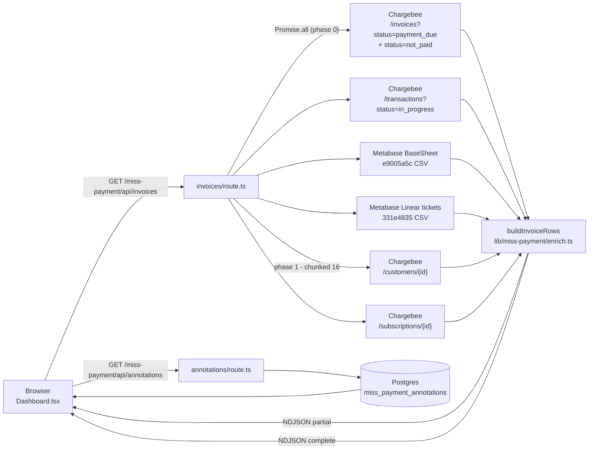

# Miss Payment Beacon — engineering deep dive

*A companion doc to `docs/beacon.md` (§7.5) that reads only the Miss Payment layer of the umbrella. Cross-links to `docs/beam-keeper.md` for the Beam/Keeper stack and `docs/activity-and-slack.md` for the activity-log + Slack pipeline.*

---

## 0. TL;DR

Miss Payment Beacon is the umbrella's live unpaid-invoice tracker for Zoca's Finance/AM ops. Every row is a Chargebee invoice in `payment_due` or `not_paid` status, enriched with the entity/AM/phone context that a rep needs to actually chase it — pulled the moment the page opens, not read from a snapshot. It replaces the standalone "Missed Invoice Tracker" the Finance team used to run out of a Python script (the daily 4pm IST Excel-report cron in the private CLAUDE.md memory) and gives the same audience an interactive dashboard with per-invoice annotations, KPI drill-downs, Linear ticket join-outs, and Excel export.

Architecturally it is the odd one out among the six Beacons: no `dashboard_snapshots` row, no Stage-A/B/C/D refresh, no cron-driven materialization for the invoice list. The page's server route (`/miss-payment/api/invoices`) does a NDJSON-streamed live pull directly from Chargebee, Metabase (BaseSheet + tickets CSV), and Postgres (annotations) on every request. A single cron (`/api/cron/miss-payment-warm`, `30 2 * * *` UTC) just warms the in-memory 5-min cache once a day.

Three things it does end to end:

- **Surfaces** every unpaid Chargebee invoice (both `payment_due` and `not_paid`) with an ACH-in-flight badge when a Chargebee transaction in `in_progress` is linked to the invoice.
- **Enriches** each invoice with entity_id / bizname / AM / phone from the lean BaseSheet CSV, prefers `sub.cf_entity_id` over `customer_id` so multi-location customers (Sky Dental, Asili Hair) get the right location per row, and joins the most-recent active Finance Linear ticket per entity.
- **Lets any signed-in Zoca user annotate** the row (caller, connection status, AM comment, comments, old comments) with blur-to-save inline edits persisted to `miss_payment_annotations` in Postgres.

## 1. Concept

"Missed payment" at Zoca means a Chargebee invoice whose collection status is either `payment_due` (the customer's card was tried but declined) or `not_paid` (nothing was ever attempted, e.g. auto-collection off). Both count: they are the two Chargebee status values the fetcher walks in `lib/miss-payment/chargebee.ts::fetchOpenInvoices`.

The Beacon exists to give the AM night shift — historically Shakthi and Joshi calling US-hours customers whose payments are behind — a single working surface that combines the Chargebee truth (who owes what, and whether Chargebee is currently retrying via ACH), the BaseSheet truth (which AM owns the account, what phone number to call, which entity it maps to), and the Linear truth (is there already a Finance ticket open for this customer). The Excel-based Missed Payments Report the same team distributed via cron before the port is documented in the private CLAUDE.md memory — the Beacon dashboard is its interactive counterpart, and the Excel export button (`_components/export-button.tsx`) writes the same eight-sheet shape (Miss-payment Sheet + monthly sub-sheets + date-stamped clones + Multi-month) with the same conditional-format fills the Finance team already recognizes.

Branding is Direction C ("Watchfire") — the Beacon uses the ember/brass/lapis palette shared across the umbrella. `miss-payment.css` scopes every dashboard style under `.miss-payment-scope`, ports V1's pink/blue/violet gradient title into a Watchfire ramp (`#C8431D → #D9A441 → #2A4D5C`), and the page is wrapped in `BeaconPageShell` (see `docs/beacon.md`) so it inherits the ambient flame layer, Georgia serif headings, and `.live-dot` pulse.

## 2. Access + auth

Before 2026-06-12 the page was restricted to `admin + manager` — the framing was a Finance-ops surface. Commit `3b23b8f` widened access to `admin + manager + am`, and the page's comment records the reason: sign-in is already gated by the domain allowlist (`zoca.com` + `zoca.ai`) via the NextAuth `signIn` callback under Phase-33.B strict-allowlist mode, so any user who reaches these handlers is by definition a Zoca employee, and AMs shared the same visibility with their managers on caller assignment / multi-month chase decisions.

Concretely, four call sites carry the widened `requireRole(user, "admin", "manager", "am")`:

- Page shell — `app/(miss-payment)/miss-payment/page.tsx` gates on `getServerSession(authOptions)` and redirects to `/auth/signin` if the session is missing. Role gate was widened by dropping the pre-2026-06-12 admin+manager check; the current server component only checks for an authenticated session, and delegates any finer role gating to the API routes.
- `GET /miss-payment/api/invoices` — dual-auth: bearer `Authorization: Bearer ${CRON_SECRET}` bypasses the session gate (used by the warm cron), otherwise `requireRole(user, "admin", "manager", "am")`.
- `GET /miss-payment/api/annotations` — same three-role gate.
- `POST /miss-payment/api/annotations` — same three-role gate. Every role that can read can also write; there is no manager-only mutation escalation.

The role helpers live in `lib/customer/api-auth.ts` (`getApiUser`, `requireRole`, `requireAmScope`). Because Miss Payment is a book-level surface, no `requireAmScope()` call is made — every reader sees the full unpaid book, not just their own AM slice.

## 3. Data model

Postgres is used for exactly one thing on this Beacon: persisting the rep annotations. Everything else — invoices, transactions, customers, subscriptions, BaseSheet mapping, tickets — is pulled live per request.

**`miss_payment_annotations`** (`migrations/2026-06-02-miss-payment-annotations.sql`):

| Column | Type | Notes |
|---|---|---|
| `invoice_number` | `TEXT PRIMARY KEY` | The Chargebee invoice id (e.g. `INV12345`). Natural PK — unique across the customer base, no need to key by customer + invoice. |
| `data` | `JSONB NOT NULL DEFAULT '{}'::jsonb` | Payload of the current annotation state. Keys today: `amComment`, `caller`, `connectionStatus`, `comments`, `oldComments`, `tickets`. The migration comment notes it's JSONB so the shape can evolve (e.g. `callback_at`, `ticket_followup_url`) without a schema migration. |
| `updated_at` | `TIMESTAMPTZ NOT NULL DEFAULT now()` | Set on every upsert. Migration comment flags a future "recent edits" widget as the reason for keeping a real column. |

**Indexes** — one: `miss_payment_annotations_updated_at_idx ON (updated_at DESC)`.

No `dashboard_snapshots` row is ever written for Miss Payment. No cron materializes the invoice list into any table. The 5-minute cache is entirely in-memory in the Node process serving `/miss-payment/api/invoices`. The mental model: annotations are the only durable state this Beacon owns — every other datum on the dashboard is a projection of live external systems.

## 4. Data flow

The page is a Server Component that renders the client `Dashboard` shell; the client component fires two fetches on mount (`loadInvoices()` and `loadAnnotations()`) and stitches the result together.

`GET /miss-payment/api/invoices` is a NDJSON stream. Two phases:

1. **Phase 0 — parallel `Promise.all`:** invoices (`fetchOpenInvoices` — walks `payment_due` + `not_paid` with pagination), ACH transactions (`fetchInProgressTransactions`), BaseSheet CSV (`fetchBaseSheet` — 10-min TTL), and active Linear tickets (`fetchActiveTickets` — 5-min TTL, fault-tolerant `.catch(() => [])`). This lands in ~2-3s and produces a `{ type: "partial", rows }` NDJSON line — enough for the AM to see bizname, AM, invoice number, amount, and ticket badge.
2. **Phase 1 — per-customer + per-subscription enrichment:** `fetchCustomers(customerIds)` and `fetchSubscriptions(subIds)` are called in parallel, each with a `chunked(items, 16, fn)` concurrency wrapper. This is what adds `first_name`, `email`, `auto_collection`, `subscription.status`, `subscription.cancelled_at`, and — critically for the multi-location fix — `sub.cf_entity_id`. Emits `{ type: "complete", rows, fetchedAt, cached: false }` and closes.

The cache: `let cache: { data, ts } | null = null` at module scope. TTL from `INVOICES_CACHE_TTL` env (default 300 seconds). Cache hit paths emit a single `{ type: "complete", ..., cached: true }` line and close immediately. `?refresh=1` busts the cache.



The client-side parser (`Dashboard::loadInvoices`) reads the response, splits by `\n`, and calls `setRows(msg.rows)` on both `partial` and `complete` frames. It also honors non-NDJSON `content-type` (plain JSON) as a compatibility path.

## 5. Enrichment logic

`lib/miss-payment/enrich.ts::buildInvoiceRows` is the join. It takes five inputs — the raw Chargebee invoices, the per-customer and per-subscription lookup maps, the ACH transactions, the indexed BaseSheet, and the tickets-by-entity map — and returns `InvoiceRow[]` sorted by invoice date desc, then amount desc.

### The `cf_entity_id` multi-location fix (MP-MULTILOC-BUG, commit `0ef6cad`, 2026-06-12)

The pre-fix code resolved each invoice's BaseSheet row via `customer_id` only, using `byCustomerId.get(customerId)`. Because `indexBaseSheet` writes each BaseSheet row into `byCustomerId` with last-write-wins semantics, multi-location customers — one Chargebee `customer_id`, many BaseSheet rows, one per location — collapsed to whichever location was indexed last. Sky Dental Clinic (`customer_id: AzqiDcUsc1CPC3TEI`, three locations: Sahakar Nagar / Koramangala / Rajarajeswari Nagar) surfaced all three unpaid invoices as the Rajarajeswari Nagar row. Asili Hair Care Center (four locations) had the same bug. Every multi-loc customer did.

The fix: read `sub.cf_entity_id` (a Chargebee subscription custom field that binds a subscription to exactly one entity), then look up the entity-specific BaseSheet row via `byEntityId`. Fall back to the customer-level `byCustomerId` row when the subscription has no `cf_entity_id` — rare, legacy subs predating the binding rollout. The `entityId` emitted on the row prefers `cfEntityId || bs.entity_id || ""`, so the sub binding wins over the BaseSheet field if the two drift.

The Customer Beacon side of the codebase already used the same field via `lib/customer/chargebee.ts::fetchLiveActiveEntityIds` and `fetchAllLiveSubsWithEntityMap`; Miss Payment was just ignoring it until this fix.

### ACH matching

`fetchInProgressTransactions` returns Chargebee transactions in `in_progress` status. Each has a `linked_invoices` array; for each linked entry, the enricher accumulates `link.invoice_id` into `achInvoiceIds: Set<string>`. When a row is built, `achStatus` becomes `"In Progress"` if `achInvoiceIds.has(inv.id)`, otherwise `""`. `failed` transactions are ignored — only `in_progress` matters for the ACH column, matching the private CLAUDE.md rule.

### Auto-debit derivation

Read straight off `customer.auto_collection`: `"on"` → `"On"`, otherwise `"Off"`, empty string if the customer object is missing. This is a proxy for "will Chargebee retry this without a rep touching it" — an `Off` value plus a high balance is the manual-chase priority list (Beam has a dedicated `auto_debit_off_high_balance_top_15` in the context blob).

### Fallback chain

For each field, the enricher tries the most specific source first:

- `entityId` — `sub.cf_entity_id` → BaseSheet `bs.entity_id` → empty.
- `bizName` — `bs.bizname` → Chargebee `customer.company` → empty.
- `amName` — `bs.am_name` → empty (BaseSheet is the only source of AM ownership; the standalone script has a longer fallback chain into `cx.am_mapping` + `entities.employees`, but the Beacon does not).
- `customerEmail` — Chargebee `customer.email` → BaseSheet `bs.app_email` → empty.
- `phoneNumber` — BaseSheet `bs.phone_number` → Chargebee `customer.phone` → empty.
- `customerCompany` — Chargebee `customer.company` → BaseSheet `bs.bizname` → empty.

### Ticket join

Ticket entity_id from the Metabase CSV is normalized to lowercase in `indexTicketsByEntity` (`row.entity_id.trim().toLowerCase()`). The enricher looks up `ticketsByEntity.get(entityId.toLowerCase())`, so any casing drift between the sub's `cf_entity_id` and the ticket's `entity_id` is neutralized. The join yields `latestTicket = { id: identifier, title, url }` — the most-recent-created active ticket per entity (Todo / In Progress / In Review only). Titles starting with `write off`, `write-off`, `writeoff`, or `refund` are filtered out at ingest — those describe accounting actions, not customer issues.

### Multi-month detection

`multiMonthCustomerIds(rows: InvoiceRow[]): Set<string>` groups by `entityId || customerId`, collects each key's set of `invoiceMonth` values, and emits the key when the set size is `>= 2`. The dashboard uses this same predicate inline in a `useMemo` (`multiMonthSet`) so the "Multi-month only" filter and the row highlight are computed off the same set. Preferring `entityId` first means a multi-location customer with two locations owing different months does NOT flag as multi-month unless one location itself owes two months (correct behavior — a location that's paying on time isn't multi-month just because a sister location is late).

## 6. UI components

Every client-side file lives under `app/(miss-payment)/miss-payment/_components/`.

### Tabs

Defined at the top of `dashboard.tsx`:

```ts
type Tab = "All" | "July" | "June" | "May";
const TABS: Tab[] = ["All", "July", "June", "May"];
```

Four tabs total. `MP-JULY-TAB` (commit `d8c8dae`, 2026-07-01) added July when July invoices started landing; `MP-DROP-Q1` (commit `c9a9bdf`, same day) removed April and March once nothing active remained in those months. The client-side `tabFiltered` useMemo filters rows by `r.invoiceMonth === activeTab` for anything other than `"All"`. `tabCounts` iterates rows once and increments per matching month for the badge next to each tab.

### Filters

`_components/filters.tsx` renders one flex row of controls that write into a single `FilterState`:

| Control | State key | Options | Notes |
|---|---|---|---|
| Search box | `q` | free text | Substring match across `bizName + amName + customerId + invoiceNumber + customerEmail + customerCompany` (lowercased) |
| AM select | `am` | `""`, plus distinct `amName` values from current rows sorted asc | `"All AMs"` when empty |
| Status select | `status` | `""`, `payment_due`, `not_paid` | The two Chargebee statuses fetched |
| Month select | `month` | `""`, plus distinct `invoiceMonth` values in current rows | Independent from the tab (tab is a separate axis) |
| ACH select | `ach` | `""`, `in_progress`, `none` | `in_progress` matches `achStatus === "In Progress"`; `none` matches empty ACH status |
| Auto-debit select | `autoDebit` | `""`, `On`, `Off` | Matches the derived `autoDebit` field |
| Multi-month checkbox | `multiOnly` | boolean | Applies `multiMonthSet.has(entityId || customerId)` |

That's seven filter axes. The state lives in `Dashboard` (`filters: FilterState`), is passed down as `value`+`onChange`, and applied inside `userFiltered` useMemo.

### KPI cards

`_components/kpi-cards.tsx` renders six click-to-filter tiles. Each has a click predicate that the dashboard applies via `activeKpi`:

| Tile | Key | Label | Value formula | Subtitle | Predicate when active |
|---|---|---|---|---|---|
| Outstanding | `outstanding` | `"Outstanding"` | `$` sum of `amountDue` across `userFiltered` rows | `"N high-value ≥ $500"` where N is `rows.filter(r => amountDue >= 500).length` | keep only rows with `amountDue >= HIGH_VALUE_THRESHOLD` (500) |
| Invoices | `invoices` | `"Invoices"` | `rows.length` | `"N from repeat businesses"` where N is invoices whose customerId appears in 2+ userFiltered rows | keep only rows whose `customerId` is in `repeatBusinessSet` |
| ACH in flight | `ach` | `"ACH in flight"` | `rows.filter(r => r.achStatus === "In Progress").length` | `"collection in progress"` | keep only rows with `achStatus === "In Progress"` |
| Multi-month | `multi` | `"Multi-month"` | unique `entityId || customerId` in `multiMonthSet` | `"overdue ≥ 2 cycles"` | keep only rows whose `entityId || customerId` is in `multiMonthSet` |
| Tickets matched | `tickets` | `"Tickets matched"` | `rows.filter(r => r.latestTicket).length` | `"linked Linear issues"` | keep only rows with a `latestTicket` |
| Annotations | `annotations` | `"Annotations"` | annotation keys whose value has any non-empty field | `"notes saved by reps"` | keep only rows for which `annotationHasNotes(inv)` is true |

All six carry a `CLICK TO FILTER` pill and toggle `activeKpi` — click again to clear. The `activeKpi === outstanding` and `activeKpi === invoices` filters do NOT surface as a chip in the status row (the assumption: the KPI's subtitle already tells you what the filter is doing, and the row-count "Showing N / M" reflects it); the other four DO surface a chip using `KPI_LABELS`. See `MP-KPI-INTERACTIVE` (commit `cf7a7df`) and `MP-KPI-RESPECT-FILTERS` (commit `f031e90`) below.

The critical two-layer filter split: `userFiltered` applies the top filter row (search + AMs + statuses + months + ACH + auto-debit + multi-only) but NOT the KPI predicate. `filtered` layers the KPI predicate on top of `userFiltered`. KpiCards receives `userFiltered` so the counts respond to top-row filter changes (pick an AM → the tiles recompute against that AM's slice) without double-counting the KPI predicate. The table + charts receive `filtered` — the KPI filter shrinks what's rendered but doesn't shrink the KPI totals themselves.

### Column set

The dashboard table renders 21 columns (`_components/invoices-table.tsx`), sortable via `header(...)` on every Chargebee-sourced field. In display order: Customer Id, Entity Id, Biz name, AM, Sub status, Cancelling at, Invoice #, ACH, Auto debit, AM Comment, Date, First Name, Email, Phone, Company, Amount Due, Caller, Connection, Comments, Old comments, Tickets. The first 16 mirror the standalone Excel report's column set; the last 5 are the Miss-Payment-specific annotation columns.

### Row rendering

- `bizName` renders in `text-zoca-text` bold.
- `phoneNumber` is plain text (no `tel:` link — deliberate, the AM-facing table isn't a click-to-dial surface).
- `AM Comment`, `Comments`, `Old comments` are `EditableText` inputs with blur-to-save.
- `Caller` is an `EditableSelect` with `["Shakthi", "Joshi"]` options and a per-value style function (`callerStyle`) that swaps the pill fill: Shakthi → light-red on crimson, Joshi → light-green on patina.
- `Connection` is an `EditableSelect` with `["Connected", "VM", "Not connected"]` — Connected → patina, VM → lapis, Not connected → crimson.
- `Tickets` renders either a Linear badge (identifier + 2-line-clamped title, external link to `latestTicket.url`) or "No tickets".
- Status pill: `payment_due` is a warm brass on parchment, `not_paid` is crimson on light-crimson.
- ACH pill: lapis on light-lapis.
- Multi-month rows get the `multi-month` CSS class on the `<tr>` (scoped highlight defined in `miss-payment.css`).

### Annotation UI

State lives at the `Dashboard` level (`annotations: AnnotationsMap`). On mount, `loadAnnotations()` hits `GET /miss-payment/api/annotations` and populates the map. `saveAnnotation(invoiceNumber, patch)` applies the patch optimistically (`setAnnotations(prev => ({ ...prev, [invoiceNumber]: { ...(prev[invoiceNumber] || {}), ...patch } }))`), then POSTs to `/miss-payment/api/annotations` with `{ invoiceNumber, patch }`. There is no rollback on failure — the fetch is a fire-and-forget `try {} catch {}`. The blur-to-save fires on `EditableText`'s `onBlur` when the value changed, and on `EditableSelect`'s `onChange` immediately.

### Export button

`_components/export-button.tsx` dynamically imports `xlsx-js-style` and builds a workbook with:

- **Miss-payment Sheet** — every visible (`filtered`) row.
- **June / May / April / March** — month-bucketed sheets. Note the array includes April and March even though those tabs are no longer surfaced — the export retains the historical shape.
- **`<Mon> <ord> <yyyy>`** — date-stamped clones of the four month sheets (e.g. `"June 30th 2026"`, truncated at 31 chars).
- **`Multi-month <ord> <yyyy>`** — the multi-month set (`entityId || customerId ∈ multiMonthSet`).

All sheets use 21 columns via `HEADERS`. Row values are pulled via `rowValues(r, ann)`. Header cells get the `HEADER_STYLE` (white text on `FF1F0843`, Arial 11 bold, centered). The Caller and Connection columns get per-cell fills (Shakthi red / Joshi green / Connected green / VM blue / Not connected red). Column widths are set per header. Every sheet is frozen at row 1 and has an autofilter over its range.

## 7. API routes

### `GET /miss-payment/api/invoices`

Auth: dual — cron bearer OR `admin/manager/am` session (see §2). Query param: `?refresh=1` busts the cache.

Response: `Content-Type: application/x-ndjson; charset=utf-8`. Frames:

- `{ type: "partial", rows: InvoiceRow[] }` — after Phase 0.
- `{ type: "complete", rows: InvoiceRow[], fetchedAt: ISO8601, cached: boolean }` — after Phase 1 (or immediately on cache hit).
- `{ type: "error", error: string }` — on failure.

Header `X-Accel-Buffering: no` hints proxies (Vercel) not to buffer the stream. `Cache-Control: no-store`.

Function limits (per `vercel.json`): `memory: 1024`, `maxDuration: 120`.

### `POST /miss-payment/api/annotations`

Body: `{ invoiceNumber: string, patch: InvoiceAnnotation }`. Returns `{ ok: true, annotation: merged }` or `{ error: string }`. Upsert semantics — `setAnnotation(invoiceNumber, patch)` reads the current row, merges patch onto the existing JSONB, and writes back via `INSERT ... ON CONFLICT (invoice_number) DO UPDATE SET data = EXCLUDED.data, updated_at = now()`. `updated_at` is bumped on every write.

### `GET /miss-payment/api/annotations`

Returns `{ annotations: AnnotationsMap }` where the map is keyed by invoice number and each value is the current `InvoiceAnnotation`. No pagination — the annotation set is small enough (bounded by open invoices).

## 8. Cron

**`/api/cron/miss-payment-warm`** — `schedule: "30 2 * * *"` (UTC) per `vercel.json`. Function limits `memory: 1024`, `maxDuration: 120`.

Purpose: warm the invoice-route cache before the finance shift starts. It calls `${origin}/miss-payment/api/invoices?refresh=1`, forwarding `Authorization: Bearer ${CRON_SECRET}` and — when set — the Vercel Protection Bypass header `x-vercel-protection-bypass: ${VERCEL_PROTECTION_BYPASS_TOKEN}` plus `x-vercel-set-bypass-cookie: false`. Without the bypass header, the inner fetch lands on Vercel's Deployment Protection auth wall and returns the 401 HTML page instead of our route's NDJSON — commit `9f06b15` (2026-06-02) added the header after this exact regression.

The cadence `30 2 * * *` UTC is 08:00 IST — the private CLAUDE.md memory records the same daily cadence as the standalone Missed Invoice Tracker Python script (which runs at 4:00 PM IST for its own Excel-report send). The Beacon dashboard's warm cron sits on the *morning* end of the workday, not the report-send end, because the value is a fast page load when reps arrive.

The daily 4pm IST Excel-report generator that the CLAUDE.md memory describes runs entirely outside the Beacon — it lives in the standalone `missed_payments_report.py` script and is scheduled separately. The Beacon has an Excel export button (the same shape) but does not currently subsume the scheduled report.

## 9. Beam integration

Everything Beam does with Miss Payment routes through the `miss-payment-overview` scope (`AiScope["kind"] = "miss-payment-overview"`). See `docs/beam-keeper.md` for the copilot fundamentals; the Miss-Payment-specific pieces below.

### Scope resolution

`lib/ai/scopes.ts::pathToScope("/miss-payment/*")` returns `{ kind: "miss-payment-overview" }`. `scopeLabel` = `"the missed-invoice book"`. `scopeQuickPrompts` returns four canned openers: "Who's hit the hardest right now?" / "Multi-month repeat offenders" / "ACH already in flight vs not" / "Auto-debit Off but high balance".

### Context loader

`lib/ai/context-loaders.ts::loadMissPaymentOverviewContext()` (Phase F-polish-AI). Mirrors the page route's Promise.all — invoices + ACH transactions + BaseSheet + tickets + annotations, then per-customer + per-subscription enrichment via `buildInvoiceRows`. Runs the full Phase-1 pull synchronously because Beam needs `autoDebit` + `subscriptionStatus` in scope to answer "which auto-debit-Off accounts have the highest balance" — the page can stream partial-then-complete but Beam cannot.

The loader aggregates:

- **`totals`** — `total_outstanding_usd`, `open_invoice_count`, `unique_customer_count`, `ach_in_flight_count`, `multi_month_repeat_customer_count`, `auto_debit_off_balance_usd`, `auto_debit_on_balance_usd`, `active_recovery_effort_invoice_count`, `recovery_coverage_pct`, `invoices_with_any_rep_note_count`, `invoices_marked_contacted_count`.
- **`by_am_top_8`** — top 8 AMs by outstanding balance, with `invoice_count` and `customer_count`.
- **`by_month`** — per-month rollup sorted by balance desc.
- **`aging_buckets`** — `0-30d / 31-60d / 61-90d / 90d+ / unknown` with `invoice_count` and `balance` each.
- **`auto_debit_off_high_balance_top_15`** — the prioritized manual-chase list (auto-debit Off + amount ≥ $500), top 15 by amount, with phone / email / ticket / subscription status.
- **`multi_month_repeat_customers`** — top 12 by total outstanding, with months + invoice_count.
- **`top_invoices_by_amount`** — top 30 by amount desc, with `rep_annotation` and `latest_ticket` shorthand.

Two constants tune the shape: `MISS_PAYMENT_TOP_N = 30` and `HIGH_BALANCE_THRESHOLD = 500`.

### Recovery-coverage predicate

`recovery_coverage_pct = round(activeRecoverySet.size / invoiceCount * 100)`. An invoice enters `activeRecoverySet` if either (a) `achStatus === "In Progress"` OR (b) it has an annotation with `caller` set OR `connectionStatus ∈ {"Connected", "VM"}`. The union avoids double-counting. Framed to the model in the prompt as "active collection effort coverage", not a payment success rate — the Beacon has no historical settled-vs-issued data window.

### Prompt

`lib/ai/prompts.ts` (case `"miss-payment-overview"`) tells Beam the CONTEXT is REAL and freshly-pulled from Chargebee + Metabase + Linear. It enumerates the standard questions Beam is expected to answer and the citation keys to use (`[cite:count:missed_invoice_total_balance_usd]`, `[cite:count:missed_invoice_balance_by_am:NAME]`, `[cite:count:missed_invoice_recovery_coverage_pct]`, `[cite:billing:multi_month:KEY]`, etc.). The system prompt guardrail: never ask the user to paste numbers, share a screenshot, or describe the dashboard — the model has the data.

### Citation lookup

`lib/ai/citations.ts::buildMissPaymentOverviewLookup()` emits chips for every KPI total, per-AM rollup row (`missed_invoice_balance_by_am:${am_name}`), top-30 invoice (`invoice:${invoice_number}`, category `billing`, with raw metadata), and multi-month key (`multi_month:${key}`). The `recovery_coverage_pct` chip carries a `raw.meaning` explaining what the number represents.

### Tools

`lib/ai/tools/index.ts` binds `"miss-payment-overview"` to six tools: `lookupCustomer`, `queryCustomerBook`, `getChargebeeBilling`, `getCustomerFromMetabase`, `draftEmailToContact`, `draftSlackMessage`. No Miss-Payment-specific tool exists — the mutation surface for annotations is not exposed to Beam (annotations are still a human-only surface today).

### Proactive Slack lines

`lib/ai/proactive-beacon.ts::pullMissPaymentByAm()` (Phase F-polish-AI-5) does the full unpaid-book pull once per cron and indexes into `Map<amName, MissPaymentAmSummary>`. Each summary carries `open_invoice_count`, `total_outstanding_usd`, `multi_month_customer_count`, `auto_debit_off_high_balance_count`, and `top_3_invoices`. Fails-open — a Chargebee outage returns `null` and the briefing renders without the section.

- **Monday briefing** — `lib/ai/proactive-prompts.ts::buildMondayBriefingPrompt` accepts an optional `missPayment` slice; when `open_invoice_count > 0` the prompt renders a `MISS PAYMENT — open unpaid invoices in ${amName}'s book:` block with the four totals + top-3 JSON, and the model is told to weave a single closing-line reference when the total is material (≥ $500 or any multi-month repeat).
- **Daily digest** — `lib/ai/proactive-prompts.ts::buildDailyDigestPrompt` (Phase F-polish-AI-5b) accepts the same slice as a book-level snapshot; the opener line may reference the outstanding total ("3 score drops, $2,140 still outstanding across 4 invoices — here's the cut").

Both crons live in `docs/activity-and-slack.md` (§Slack) — see the Monday briefing entry at `30 2 * * 1` and the daily digest at `30 2 * * *`.

## 10. External integrations

### Chargebee — `lib/miss-payment/chargebee.ts`

Base URL: `https://${CHARGEBEE_SITE}.chargebee.com/api/v2` (`CHARGEBEE_SITE` defaults to `"zoca"`). Auth: HTTP Basic with `${CHARGEBEE_API_KEY}:` base64-encoded. Every request carries a hard `AbortController` timeout of `CHARGEBEE_REQUEST_TIMEOUT_MS` (default 12000). Pagination via `next_offset` cursor at `limit=100`.

Endpoints hit:

- `GET /invoices?status[is]=payment_due` — full pagination walk. `fetchOpenInvoices`.
- `GET /invoices?status[is]=not_paid` — full pagination walk. Same function, results concatenated.
- `GET /transactions?status[is]=in_progress` — full pagination walk. `fetchInProgressTransactions`.
- `GET /customers/{id}` — one at a time, wrapped in `chunked(items, 16, fn)` for 16-way concurrency. `fetchCustomers`.
- `GET /subscriptions/{id}` — one at a time, wrapped in `chunked(items, 16, fn)` for 16-way concurrency. `fetchSubscriptions`.

Failures on individual customer/subscription lookups swallow to `null` — the row still renders, just without the enriched fields.

Env: `CHARGEBEE_SITE`, `CHARGEBEE_API_KEY`, optional `CHARGEBEE_REQUEST_TIMEOUT_MS`. Shared with Customer / Escalation / Post-Payment Beacons — no duplicate credentials.

### Metabase BaseSheet — `lib/miss-payment/basesheet.ts`

Default CSV: `https://metabase.zoca.ai/public/question/e9005a5c-4b5c-405d-af35-a69063c996e5.csv` (the lean BaseSheet, BS-2, migrated 2026-06-10). Overridable via `METABASE_BASESHEET_URL`. `fetchBaseSheet` uses a 10-minute module-scope cache and parses with `papaparse` (header:true). `indexBaseSheet(rows)` builds two `Map` lookups: `byCustomerId` (last-write-wins on customer_id) and `byEntityId` (one row per entity). Only identity/contact fields are read here — `customer_id`, `entity_id`, `bizname`, `am_name`, `app_email`, `phone_number` — all present in the lean CSV, so no supplement fetch is needed on this Beacon.

### Linear tickets via Metabase — `lib/miss-payment/tickets.ts`

Default CSV: `https://metabase.zoca.ai/public/question/331e4835-e163-4981-877e-14592f71741d.csv`. Overridable via `METABASE_TICKETS_URL`; timeout `METABASE_TICKETS_TIMEOUT_MS` default 15000. AbortController-guarded fetch, 5-minute module-scope cache. Row filters:

- `state_name` must be one of `{"Todo", "In Progress", "In Review"}`.
- Title (lowercased) must NOT start with `write off`, `write-off`, `writeoff`, or `refund`.
- `entity_id` must be non-empty (lowercased at parse time).
- `linear_url` must be non-empty.

Identifier extracted via regex `/linear\.app\/[^/]+\/issue\/([A-Z]+-\d+)/i` from the URL. `indexTicketsByEntity` sorts by `createdAt` asc and writes each ticket into the map — last-write-wins gives us "newest per entity".

### Vercel Protection Bypass on warm cron

Env `VERCEL_PROTECTION_BYPASS_TOKEN`. Only used by `/api/cron/miss-payment-warm` to bypass Vercel Deployment Protection when the cron fetches the internal invoices route. The pattern mirrors `lib/ai/eval-harness.ts`.

## 11. Recent changes (chronological)

| Date | Commit | What |
|---|---|---|
| 2026-06-02 | `a166fc9` | `feat(miss-payment): port Missed Invoice Tracker into Beacon umbrella (Phase F)` — the initial port from the standalone tracker. Ships `page.tsx`, all `_components`, `lib/miss-payment/*`, `migrations/2026-06-02-miss-payment-annotations.sql`, and the warm cron. |
| 2026-06-02 | `9f06b15` | `fix(miss-payment): forward Vercel Protection Bypass on warm cron internal fetch` (F-9 hotfix) — adds `x-vercel-protection-bypass` header to the internal fetch. |
| 2026-06-03 | `fca976c` | `fix(miss-payment-ai): replace stub loader with rich Chargebee + annotations context` — F-polish-AI-1: `loadMissPaymentOverviewContext` becomes the full 30-invoice/per-AM/multi-month rollup instead of a stub. |
| 2026-06-03 | `1e92bb8` | `feat(beacon-ai): consolidate sentiment rules + add miss-payment to Monday briefing` (F-polish-AI-5) — `pullMissPaymentByAm` + Monday briefing block. |
| 2026-06-03 | `403122d` | `feat(beacon): streaming V2 fetcher + miss-payment in daily digest` (F-polish-AI-5b) — book-level miss-payment snapshot on the daily digest opener. |
| 2026-06-10 | `e9a254e` | `Migrate Beacon BaseSheet to lean e9005a5c + supplement 385231ff` (BS-2) — Miss Payment moved to the lean BaseSheet URL (`e9005a5c`); no supplement needed here because the Beacon only reads identity/contact fields. |
| 2026-06-12 | `3b23b8f` | `access: open Miss Payment Beacon to any Zoca user` (MISS-PAYMENT-OPEN) — role gate widened from `admin + manager` to `admin + manager + am` on page.tsx + both API routes. |
| 2026-06-12 | `cf7a7df` | `ux: all 6 Miss Payment KPI cards now click-to-filter` (MP-KPI-INTERACTIVE) — Outstanding + Invoices tiles become click-to-filter with real predicates (high-value ≥ $500 / repeat-business ≥ 2 invoices). |
| 2026-06-12 | `f031e90` | `ux: Miss Payment KPI cards now respect the top filter row` (MP-KPI-RESPECT-FILTERS) — split `filtered` into `userFiltered` + `filtered` so KpiCards recomputes against the top-filter set. |
| 2026-06-12 | `0ef6cad` | `fix: Miss Payment Beacon now resolves each invoice to its correct location entity for multi-location customers` (MP-MULTILOC-BUG) — the `cf_entity_id` fix. Sky Dental / Asili Hair. |
| 2026-07-01 | `d8c8dae` | `MP-JULY-TAB: add July month tab to Miss Payment Beacon` — Tab union expanded. |
| 2026-07-01 | `c9a9bdf` | `MP-DROP-Q1: remove April + March tabs from Miss Payment (no active invoices)` — Tab union pruned to `["All", "July", "June", "May"]`. |

Phase F-1 through F-8 (discovery + scaffold + typecheck fixes in 2026-05) are captured in the `a166fc9` port commit — the git log doesn't have per-sub-phase commits for them.

## 12. Env vars

Grep-verified list, per-file. All read at request time (no build-time bake).

| Var | Read at | Default | Purpose |
|---|---|---|---|
| `POSTGRES_URL` | `lib/miss-payment/annotations.ts` | — | Primary DB URL for annotations. |
| `DATABASE_URL` | `lib/miss-payment/annotations.ts` | — | Fallback DB URL. |
| `POSTGRES_URL_NON_POOLING` | `lib/miss-payment/annotations.ts` | — | Second fallback. |
| `CHARGEBEE_SITE` | `lib/miss-payment/chargebee.ts` | `"zoca"` | Chargebee subdomain. |
| `CHARGEBEE_API_KEY` | `lib/miss-payment/chargebee.ts` | `""` | Basic-auth secret. Throws if missing. |
| `CHARGEBEE_REQUEST_TIMEOUT_MS` | `lib/miss-payment/chargebee.ts` | `12000` | Per-request abort timeout. |
| `METABASE_BASESHEET_URL` | `lib/miss-payment/basesheet.ts` | lean `e9005a5c` CSV | Override the BaseSheet source. |
| `METABASE_TICKETS_URL` | `lib/miss-payment/tickets.ts` | Linear-active `331e4835` CSV | Override the tickets source. |
| `METABASE_TICKETS_TIMEOUT_MS` | `lib/miss-payment/tickets.ts` | `15000` | Tickets fetch abort timeout. |
| `INVOICES_CACHE_TTL` | `api/invoices/route.ts` | `300` (seconds) | In-memory response cache TTL. |
| `CRON_SECRET` | invoices + warm cron routes | — | Bearer for cron-triggered calls; presence-gated. |
| `VERCEL_PROTECTION_BYPASS_TOKEN` | warm cron route | — | Forwards `x-vercel-protection-bypass` on internal fetches. |
| `VERCEL_URL` | warm cron route | — | Preferred origin for the internal fetch. |
| `NEXTAUTH_URL` | warm cron route | — | Fallback origin. |

## 13. Debug + runbooks

**"Sky Dental's 3 locations show the same entity_id"** — the classic MP-MULTILOC-BUG symptom. Verify `sub.cf_entity_id` is populated on the Chargebee subscription for each of the customer's subs — the enricher requires it to disambiguate. If some subs have `cf_entity_id` and others don't, the fallback (BaseSheet by customer_id) will still surface last-write-wins on the ones that fall back. Fix: either backfill the missing `cf_entity_id` in Chargebee or accept that legacy subs will share a location.

**"KPI count differs from row count"** — expected behavior post-MP-KPI-RESPECT-FILTERS. The KPI tiles show counts on `userFiltered` (top filters, no KPI); the table + charts show `filtered` (KPI applied on top). If you clicked "Outstanding" and see 12 rows but the tile shows 24 invoices, the tile is counting all high-value invoices in the current top-filter slice; the 12 rows are the high-value subset AFTER any additional overlap with active predicates. Confirm via the "Showing N / M" status line above the tabs.

**"Chargebee timeout"** — bump `CHARGEBEE_REQUEST_TIMEOUT_MS`. Default 12000 is tight for pathological pagination or a slow subscription lookup. Check the error message: `Chargebee timeout on /path after Xms` comes from the `AbortError` catch in `cbGet`.

**"Warm cron 401s"** — the Vercel Protection Bypass token wasn't set. Check `VERCEL_PROTECTION_BYPASS_TOKEN`. Without it, the internal `fetch(${origin}/miss-payment/api/invoices?refresh=1)` lands on the Vercel auth wall and the cron returns `{ ok: false, status: 401, body: "<!DOCTYPE html>..." }`.

**"Annotation didn't save"** — check the POST hit `/miss-payment/api/annotations` (200), then confirm the user's role is one of `admin/manager/am` (`requireRole` returns a 403 JSON otherwise). If POST is 200 but the annotation isn't reflected on reload, verify `POSTGRES_URL` is set — the `setAnnotation` helper throws `"POSTGRES_URL not set — annotations cannot be persisted"` if no DB URL is present. The `updated_at` bump on upsert confirms the write via `SELECT invoice_number, updated_at FROM miss_payment_annotations ORDER BY updated_at DESC LIMIT 5`.

**"Ticket badge missing"** — the join is on `entityId.toLowerCase()`. Verify (a) the row has a non-empty `entityId` (multi-loc bug regression check), (b) the ticket CSV's `entity_id` for that customer is present and non-empty, and (c) the ticket's `state_name` is one of Todo / In Progress / In Review. Write-off / refund titles are filtered — check `EXCLUDED_TITLE_PREFIXES` in `tickets.ts`.

**"Stream ended with no rows"** — the client-side parser throws this when neither a `partial` nor a `complete` frame carried an array. Check the server logs for the `[miss-payment] tickets fetched=...` line; if the stream errored, the frame is `{ type: "error", error }` and the client re-throws the message.

## 14. Known limits / gaps

- **BaseSheet vs Chargebee name drift** — private CLAUDE.md memory notes 8 customer business names differ slightly between the two sources. The enricher prefers BaseSheet's `bizname`; falls back to Chargebee `company`. No reconciliation UI.
- **Per-customer + per-subscription fetches are one-by-one** — 16-way concurrency via `chunked` mitigates the wall time but on a large book it is still N sequential batches. Chargebee has no bulk-fetch-by-ids endpoint that would collapse this cleanly; a per-invoice `include` expansion would need a different endpoint model.
- **No annotation history** — the `miss_payment_annotations` row is upserted in place. There's no audit trail of prior `caller` / `connectionStatus` / `comments` values. `updated_at` reveals only the last-write time.
- **No dismiss reason** — annotations track state but not the reason a row was worked on and set aside (Escalation Beacon's dismiss-with-reason pattern is not mirrored here).
- **Excel export retains April + March sheets** — the display tabs dropped those (MP-DROP-Q1) but `export-button.tsx` still writes `["June", "May", "April", "March"]` sheets. When those months hold zero rows the sheets are empty. Left in for the Finance-team-familiar shape.
- **Standalone Excel-report cron is out-of-tree** — the daily 4pm IST Missed Payments Report is generated by a separate Python script; the Beacon does not schedule or replace it. Ownership + schedule live outside the Beacon repo.

## 15. File map appendix

```
app/(miss-payment)/
├── miss-payment/
│   ├── page.tsx                            ← Server component. Auth gate + BeaconPageShell wrap.
│   ├── miss-payment.css                    ← Scoped Watchfire palette overrides for the dashboard.
│   ├── _components/
│   │   ├── MissPaymentHeader.tsx           ← ZOCA wordmark + BeaconMark header.
│   │   ├── dashboard.tsx                   ← Client shell. NDJSON parser, filter state, KPI toggle,
│   │   │                                      annotation cache, tab wiring.
│   │   ├── filters.tsx                     ← Top filter row (7 filter axes).
│   │   ├── kpi-cards.tsx                   ← 6 click-to-filter KPI tiles.
│   │   ├── charts.tsx                      ← 4 Recharts panels (by AM, by month, aging, sub status).
│   │   ├── invoices-table.tsx              ← 21-column sortable table w/ inline editors + ticket badge.
│   │   └── export-button.tsx               ← xlsx-js-style workbook builder (8 sheets).
│   └── api/
│       ├── invoices/route.ts               ← NDJSON stream. 2-phase Chargebee pull, 5-min cache.
│       └── annotations/route.ts            ← GET all + POST upsert.
└── api/cron/miss-payment-warm/route.ts     ← Daily 02:30 UTC cache warmer w/ Vercel bypass token.

lib/miss-payment/
├── chargebee.ts                            ← 5 endpoints. Basic auth, AbortController, chunked concurrency.
├── basesheet.ts                            ← Lean BaseSheet CSV fetcher + Map indexer.
├── tickets.ts                              ← Metabase Linear-active CSV fetcher, 5-min cache.
├── enrich.ts                               ← buildInvoiceRows + multiMonthCustomerIds.
├── annotations.ts                          ← Neon SQL helpers over miss_payment_annotations.
└── types.ts                                ← InvoiceStatus, InvoiceRow, InvoiceAnnotation, AnnotationsMap,
                                              InvoicesResponse, LatestTicket.

migrations/
└── 2026-06-02-miss-payment-annotations.sql ← Table + updated_at index.

lib/ai/                                    ← Beam integration (Miss-Payment-scoped slices only)
├── scopes.ts                               ← Path resolver + quick prompts for miss-payment-overview.
├── context-loaders.ts                      ← loadMissPaymentOverviewContext (Phase F-polish-AI).
├── prompts.ts                              ← Case "miss-payment-overview" system prompt.
├── citations.ts                            ← buildMissPaymentOverviewLookup for chip lookups.
├── suggest.ts                              ← Miss-Payment scope guidance for the suggest surface.
├── tools/index.ts                          ← Tool binding for the scope (6 tools, no MP-specific tool).
├── proactive-beacon.ts                     ← pullMissPaymentByAm + Monday/daily wiring.
└── proactive-prompts.ts                    ← MissPaymentAmSummary type + prompt blocks.

vercel.json                                 ← Cron entry + function memory/duration for miss-payment routes.
```
